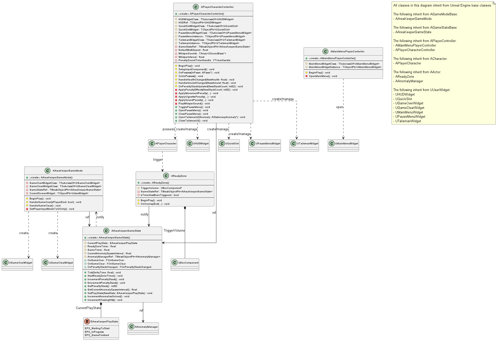

## 3.1 Core Game System
본 절은 게임의 전반적인 흐름, 상태, 규칙을 관리하는 핵심 클래스를 다룬다. EAreaKeeperPlayState와 같은 게임 상태를 관리하는 AAreaKeeperGameState, 게임 오버/클리어 로직을 처리하는 AAreaKeeperGameMode, 준비 구역 타이머를 시작하는 AReadyZone, 메인 메뉴 로직을 담당하는 AMainMenuPlayerController, 그리고 인게임 플레이어 입력을 처리하고 UI를 관리하는 APlayerCharacterController의 상세 내용을 기술한다.

본 절의 클래스 다이어그램에는 다음 시스템의 클래스들이 참조로 포함될 수 있으며, 해당 클래스들의 상세 기술서는 명시된 세부 절에 작성되어 있다.
- 3.2 Character: APlayerCharacter
- 3.3 Anomaly System: AAnomalyManager
- 3.6 UI System: UHUDWidget, UQuickSlot, UGameOverWidget, UGameClearWidget, UMainMenuWidget, UPauseMenuWidget, UTalismanWidget

***

### AAreaKeeperGameState
#### 클래스 개요
게임의 전체 상태를 관리하는 클래스이다. AGameStateBase를 상속받는다. Tick에서 ReadyZoneTimer(준비 시간)와 GameTimer(게임 클리어 시간)를 관리하며, GameTimer에 따라 이상 현상 스폰 주기를 20초에서 15초로 선형 보간(Lerp)한다. AReadyZone의 호출(StartReadyZoneTimer)을 받아 게임을 InProgress 상태로 변경하고 AAnomalyManager의 스폰을 시작시킨다. AStationaryAnomaly의 요청에 따라 패널티 스택을 증감(IncrementPenaltyStack, DecrementPenaltyStack)시키며, 최대 스택 도달 또는 APlayerCharacter의 사망 시 GameOver를 호출한다. OnPenaltyStackChanged, OnGameOver, OnGameClear 델리게이트를 통해 상태 변경을 외부로 브로드캐스트 한다.
#### 멤버 변수
| 이름 | 타입 | 가시성 | 설명 |
|:---:|:---:|:---:|:---:|
| OnGameOver | FOnGameOver | public | 게임 오버 시 BP GameMode가 바인딩할 델리게이트이다. (BlueprintAssignable) |
| OnGameClear | FOnGameClear | public | 게임 클리어 시 BP GameMode가 바인딩할 델리게이트이다. (BlueprintAssignable) |

#### 멤버 함수
| 이름 | 타입 | 가시성 | 설명 |
|:---:|:---:|:---:|:---:|
| AAreaKeeperGameState |  | public | 생성자이다. PrimaryActorTick.bCanEverTick을 true로 설정하고 상태 변수들을 초기화한다. |
| GetCurrentAnomalySpawnInterval | float | public | CurrentAnomalySpawnInterval 값을 반환한다. (BlueprintPure) |

***

### AAreaKeeperGameMode
#### 클래스 개요
게임의 핵심 규칙(시작, 종료, UI 관리)을 담당하는 게임 모드이다. AGameModeBase를 상속받는다. BeginPlay 시 AAreaKeeperGameState의 참조를 캐시하고, OnGameOver 및 OnGameClear 델리게이트에 HandleGameOver, HandleGameClear 함수를 바인딩한다. 게임 오버 또는 클리어 신호를 수신하면, APlayerCharacterController의 인게임 HUD와 퀵슬롯을 제거하고, GameOverWidgetClass 또는 GameClearWidgetClass 위젯을 생성하여 뷰포트에 표시하며 입력 모드를 UI 전용으로 변경한다.
#### 멤버 변수
| 이름 | 타입 | 가시성 | 설명 |
|:---:|:---:|:---:|:---:|
| GameOverWidgetClass | TSubclassOf<UGameOverWidget> | protected | 게임 오버 시 생성할 C++ 기반 UGameOverWidget의 블루프린트 클래스이다. (EditDefaultsOnly) |
| GameClearWidgetClass | TSubclassOf<UGameClearWidget> | protected | 게임 클리어 시 생성할 C++ 기반 UGameClearWidget의 블루프린트 클래스이다. (EditDefaultsOnly) |
| GameStateRef | TWeakObjectPtr<AAreaKeeperGameState> | private | BeginPlay 시 캐시된 AAreaKeeperGameState의 참조이다. |
| CurrentScreenWidget | TObjectPtr<UUserWidget> | private | 현재 화면에 표시된 게임 오버 또는 게임 클리어 위젯의 인스턴스이다. |
| SetPlayerInputModeToUIOnly | void | protected | 플레이어 컨트롤러의 입력 모드를 FInputModeUIOnly로 설정하고 마우스 커서를 표시한다. |

#### 멤버 함수
| 이름 | 타입 | 가시성 | 설명 |
|:---:|:---:|:---:|:---:|
| AAreaKeeperGameMode |  | public | 생성자이다. |
| BeginPlay | void | protected | GameStateRef를 캐시하고 OnGameOver 및 OnGameClear 델리게이트에 함수를 바인딩한다. (Override) |
| HandleGameOver | void | protected | GameStateRef->OnGameOver 델리게이트에 의해 호출된다. 인게임 UI를 제거하고 GameOverWidgetClass를 생성, InitializeWidget(bPlayerDied) 호출 후 뷰포트에 표시한다. |
| HandleGameClear | void | protected | GameStateRef->OnGameClear 델리게이트에 의해 호출된다. 인게임 UI를 제거하고 GameClearWidgetClass를 생성, InitializeWidget(통계 전달) 호출 후 뷰포트에 표시한다. |
| SetPlayerInputModeToUIOnly | void | protected | 플레이어 컨트롤러의 입력 모드를 FInputModeUIOnly로 설정하고 마우스 커서를 표시한다. |

***

### APlayerCharacterController
#### 클래스 개요
인게임 플레이어 컨트롤러이다. APlayerController를 상속받는다. BeginPlay 시 DefaultMappingContext를 설정하고 HUDWidgetClass와 QuickSlotWidgetClass의 인스턴스를 생성하여 뷰포트에 추가한다. OnPossess 시 BindToPawnDelegates를 호출하여 UAttributeComponent의 델리게이트(OnHealthChanged, OnTalismanChanged)에 HUD 업데이트 함수(HandleHealthChanged, HandleAmuletChanged)를 바인딩한다. 또한, 퀵슬롯(1, 2키) 및 일시 정지 메뉴(ESC) 입력을 처리하고, APlayerCharacter의 요청을 받아 '소지' UI(TalismanWidgetClass)를 열고 게임을 일시 정지시키는 등의 UI 관리자 역할을 수행한다.
#### 멤버 변수
| 이름 | 타입 | 가시성 | 설명 |
|:---:|:---:|:---:|:---:|
| HUDWidgetClass | TSubclassOf<UHUDWidget> | protected | 뷰포트에 생성할 HUD 위젯 블루프린트 클래스이다. (EditDefaultsOnly) |
| HUDRef | TObjectPtr<UHUDWidget> | protected | BeginPlay 시 생성된 HUDWidgetClass의 인스턴스 참조이다. |
| BoundAttribute | TObjectPtr<UAttributeComponent> | protected | 현재 Possess한 Pawn의 UAttributeComponent 참조이다. 델리게이트 바인딩에 사용된다. |
| DefaultMappingContext | TObjectPtr<UInputMappingContext> | protected | 인게임 플레이어가 사용할 기본 입력 매핑 컨텍스트이다. (EditAnywhere, BlueprintReadOnly) |
| QuickSlotWidgetClass | TSubclassOf<UQuickSlot> | protected | 뷰포트에 생성할 퀵슬롯 위젯 블루프린트 클래스이다. (EditAnywhere) |
| QuickSlotWidget | UQuickSlot* | protected | BeginPlay 시 생성된 QuickSlotWidgetClass의 인스턴스 참조이다. |
| IA_ToggleSettingsMenu | UInputAction* | protected | 일시 정지 메뉴(ESC)에 바인딩된 입력 액션이다. (EditAnywhere, BlueprintReadOnly) |
| PauseMenuWidgetClass | TSubclassOf<UPauseMenuWidget> | protected | 일시 정지 시 생성할 설정 메뉴 위젯 블루프린트 클래스이다. (EditDefaultsOnly) |
| PauseMenuInstance | TObjectPtr<UPauseMenuWidget> | protected | OpenPauseMenu 시 생성된 PauseMenuWidgetClass의 인스턴스 참조이다. |
| TalismanWidgetClass | TSubclassOf<UTalismanWidget> | protected | '소지' 시 생성할 위젯 블루프린트 클래스이다. (EditDefaultsOnly) |
| TalismanInstance | TObjectPtr<UTalismanWidget> | protected | OpenTalismanUI 시 생성된 TalismanWidgetClass의 인스턴스 참조이다. |
| HideCenterTextTimerHandle | FTimerHandle | private | ShowAutoText(0) 호출 시 중앙 텍스트를 숨기기 위한 타이머 핸들이다. |
| HideTimeTextTimerHandle | FTimerHandle | private | ShowAutoText(1) 호출 시 시간 텍스트를 숨기기 위한 타이머 핸들이다. |
| GameStateRef | TWeakObjectPtr<AAreaKeeperGameState> | private | AAreaKeeperGameState의 캐시된 참조이다. |
| DefaultWalkSpeed | float | private | 패널티 적용 시 이동 속도를 복원하기 위해 BeginPlay 시 캐시하는 값이다. |
| PenaltySoundTimerHandle | FTimerHandle | private | 2스택 패널티 사운드를 주기적으로 재생하기 위한 타이머 핸들이다. |
| WhisperSounds | TArray<TObjectPtr<USoundBase>> | private | 2스택 패널티일 때 재생할 속삭임 사운드 목록이다. (EditDefaultsOnly) |
| WhisperInterval | float | private | 속삭임 사운드의 재생 주기(초)이다. (기본값: 15.0) (EditDefaultsOnly) |

#### 멤버 함수
| 이름 | 타입 | 가시성 | 설명 |
|:---:|:---:|:---:|:---:|
| BeginPlay | void | protected | DefaultMappingContext를 추가하고, HUDRef와 QuickSlotWidget을 생성 및 뷰포트에 추가하며 델리게이트를 바인딩한다. (Override) |
| SetupInputComponent | void | protected | 퀵슬롯(1, 2키) 입력과 IA_ToggleSettingsMenu 입력을 SelectSlot1, SelectSlot2, TogglePauseMenu 함수에 바인딩한다. (Override) |
| OnPossess | void | protected | InPawn에 빙의할 때 호출된다. BindToPawnDelegates를 호출한다. (Override) |
| OnUnPossess | void | protected | 빙의가 해제될 때 호출된다. UnbindFromPawnDelegates를 호출한다. (Override) |
| BindToPawnDelegates | void | protected | InPawn의 UAttributeComponent를 찾아 OnHealthChanged, OnTalismanChanged 델리게이트에 함수를 바인딩한다. |
| UnbindFromPawnDelegates | void | protected | BoundAttribute에 바인딩된 모든 델리게이트를 해제한다. |
| HandleHealthChanged | void | protected | BoundAttribute->OnHealthChanged에 의해 호출된다. HUDRef->UpdateHealth를 호출하여 UI를 갱신한다. |
| HandleAmuletChanged | void | protected | BoundAttribute->OnTalismanChanged에 의해 호출된다. HUDRef->UpdateAmulet를 호출하여 UI를 갱신한다. |
| SelectSlot1 | void | protected | 1번 키 입력 시 호출된다. APlayerCharacter::SelectQuickSlot(0)을 호출한다. |
| SelectSlot2 | void | protected | 2번 키 입력 시 호출된다. APlayerCharacter::SelectQuickSlot(1)을 호출한다. |
| TogglePauseMenu | void | public | IA_ToggleSettingsMenu 입력 시 호출된다. SettingsMenuInstance의 존재 여부에 따라 OpenPauseMenu 또는 ClosePauseMenu를 호출한다. |
| OpenPauseMenu | void | public | SettingsMenuInstance를 생성 및 뷰포트에 추가하고, 입력을 GameAndUI 모드로 변경하며 게임을 일시 정지(SetPause(true))한다. |
| OpenTalismanUI | void | public | APlayerCharacter에 의해 호출된다. TalismanInstance를 생성 및 뷰포트에 추가하고, 입력을 GameAndUI 모드로 변경하며 게임을 일시 정지(SetPause(true))한다. |
| CloseTalismanUI | void | public | APlayerCharacter에 의해 호출된다. TalismanInstance를 뷰포트에서 제거하고, 입력을 GameOnly 모드로 변경하며 게임을 재개(SetPause(false))한다. (BlueprintCallable) |
| ClosePauseMenu | void | public | SettingsMenuInstance를 뷰포트에서 제거하고, 입력을 GameOnly 모드로 변경하며 게임을 재개(SetPause(false))한다. (BlueprintCallable) |
| ShowText | void | public | HUDRef의 중앙(0) 또는 시간(1) 텍스트를 보이게 한다. (BlueprintCallable) |
| ShowAutoText | void | public | ShowText를 호출한 뒤, Seconds 후에 HideText를 호출하도록 타이머를 설정한다. (BlueprintCallable) |
| HideText | void | public | HUDRef의 중앙(0) 또는 시간(1) 텍스트를 숨기고 타이머를 초기화한다. (BlueprintCallable) |
| UpdateText | void | public | HUDRef의 중앙(0) 또는 시간(1) 텍스트 내용을 Text로 갱신한다. (BlueprintCallable) |
| GetHideHandle | FTimerHandle& | private | TextLocation(0 또는 1)에 따라 HideCenterTextTimerHandle 또는 HideTimeTextTimerHandle의 참조를 반환한다. |
| GetHUDWidget | UHUDWidget* | public | HUDRef의 참조를 반환한다. |
| GetQuickSlotWidget | UQuickSlot* | public | QuickSlotWidget의 참조를 반환한다. |
| OnPenaltyStackUpdated | void | protected | GameStateRef->OnPenaltyStackChanged에 의해 호출된다. ApplyPenaltyEffects를 호출하여 패널티 효과를 적용한다. |
| ApplyPenaltyEffects | void | protected | NewStackCount에 따라 이동 속도, 비네트, 사운드 패널티를 각각 적용한다. |
| ApplySoundPenalty | void | protected | 2스택 이상일 때 PenaltySoundTimerHandle을 시작/정지하여 PlayWhisperSound를 주기적으로 호출한다. |
| ApplyVignettePenalty | void | protected | 3스택 이상일 때 PlayerChar의 ViewCamera에 비네트 효과를 적용/제거한다. |
| ApplyMovementPenalty | void | protected | 4스택 이상일 때 PlayerChar의 이동 속도를 DefaultWalkSpeed의 80%로 감소/복원한다. |
| PlayWhisperSound | void | protected | WhisperSounds 배열에서 랜덤한 사운드를 PlaySound2D로 재생한다. |

### AMainMenuPlayerController
#### 클래스 개요
메인 메뉴 레벨의 플레이어 컨트롤러이다. APlayerController를 상속받는다. BeginPlay 시 MainMenuWidgetClass에 지정된 위젯을 생성(OpenMainMenu)하고 뷰포트에 표시하며, 입력 모드를 GameAndUI로 설정하고 마우스 커서를 표시한다.
#### 멤버 변수
| 이름 | 타입 | 가시성 | 설명 |
|:---:|:---:|:---:|:---:|
| MainMenuWidgetClass | TSubclassOf<UMainMenuWidget> | protected | BeginPlay 시 생성할 메인 메뉴 위젯의 블루프린트 클래스이다. (EditDefaultsOnly) |
| MainMenuWidgetInstance | TObjectPtr<UMainMenuWidget> | protected | OpenMainMenu 호출 시 생성된 메인 메뉴 위젯의 인스턴스 참조이다. (VisibleInstanceOnly) |

#### 멤버 함수
| 이름 | 타입 | 가시성 | 설명 |
|:---:|:---:|:---:|:---:|
| BeginPlay | void | protected | OpenMainMenu 함수를 호출하여 메인 메뉴 UI를 연다. (Override) |
| OpenMainMenu | void | protected | MainMenuWidgetClass를 기반으로 위젯을 생성하고 뷰포트에 추가한다. 입력 모드를 GameAndUI로 설정하고 마우스 커서를 표시한다. |

### AReadyZone
#### 클래스 개요
플레이 준비 구역을 정의하는 액터이다. AActor를 상속받는다. TriggerVolume을 이용해 플레이어(APlayerCharacter)가 이 구역을 나가는 시점을 감지(OnOverlapEnd)하여, AAreaKeeperGameState의 StartReadyZoneTimer 함수를 한 번만 호출하는 역할을 한다.
#### 멤버 변수
| 이름 | 타입 | 가시성 | 설명 |
|:---:|:---:|:---:|:---:|
| TriggerVolume | UBoxComponent* | protected | 이 구역의 범위를 나타내는 트리거 볼륨이다. (VisibleAnywhere, BlueprintReadOnly) |
| GameStateRef | TWeakObjectPtr<AAreaKeeperGameState> | private | AAreaKeeperGameState의 캐시된 참조이다. |
| bTimerHasBeenTriggered | bool | private | StartReadyZoneTimer가 중복 호출되는 것을 방지하기 위한 플래그이다. |

#### 멤버 함수
| 이름 | 타입 | 가시성 | 설명 |
|:---:|:---:|:---:|:---:|
| AReadyZone |  | public | 생성자이다. TriggerVolume을 생성하고 루트 컴포넌트로 설정하며 bTimerHasBeenTriggered를 false로 초기화한다. |
| BeginPlay | void | protected | GameStateRef를 캐시하고 TriggerVolume의 OnComponentEndOverlap 델리게이트에 OnOverlapEnd 함수를 바인딩한다. (Override) |
| OnOverlapEnd | void | protected | TriggerVolume에서 액터가 나갈 때 호출된다. OtherActor가 APlayerCharacter이고 bTimerHasBeenTriggered가 false이면 GameStateRef->StartReadyZoneTimer()를 호출하고 플래그를 true로 설정한다. |
