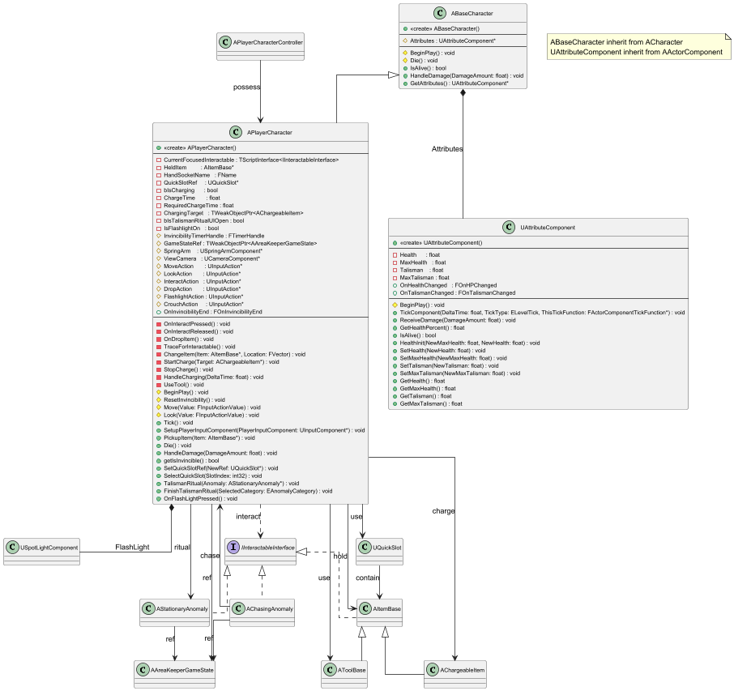

## 3.2 Character
본 절은 ACharacter를 상속받는 모든 캐릭터의 기본 구조를 다룬다. 모든 캐릭터의 공통 부모로서 피격(HandleDamage) 및 죽음(Die) 로직을 정의하는 ABaseCharacter, 플레이어가 조작하며 1초 무적 로직과 상호작용(OnInteractPressed)을 처리하는 APlayerCharacter, 그리고 이들 캐릭터에 부착되어 체력(Health)과 지방(Talisman)을 관리하는 UAttributeComponent의 상세 내용을 기술한다.

본 절의 클래스 다이어그램에는 다음 시스템의 클래스들이 참조로 포함될 수 있으며, 해당 클래스들의 상세 기술서는 명시된 세부 절에 작성되어 있다.
- 3.1 Core Game System: AAreaKeeperGameState, APlayerCharacterController
- 3.3 Anomaly System: AStationaryAnomaly, AChasingAnomaly
- 3.4 Item & Interaction System: IInteractableInterface, AItemBase, AToolBase, AChargeableItem
- 3.6 UI System: UQuickSlot

***

### ABaseCharacter
#### 클래스 개요
플레이어(APlayerCharacter)와 적(예: AChasingAnomaly)의 공통 부모 클래스이다. ACharacter를 상속받는다. 모든 캐릭터가 공통으로 가지는 UAttributeComponent를 소유하며, 생존 여부(IsAlive), 피격(HandleDamage), 죽음(Die) 처리에 대한 기본 로직을 정의한다.
#### 멤버 변수
| 이름 | 타입 | 가시성 | 설명 |
|:---:|:---:|:---:|:---:|
| Attributes | UAttributeComponent* | protected | 체력 및 지방 등의 속성을 관리하는 컴포넌트이다. (VisibleAnywhere, BlueprintReadOnly) |

#### 멤버 함수
| 이름 | 타입 | 가시성 | 설명 |
|:---:|:---:|:---:|:---:|
| ABaseCharacter |  | public | 생성자이다. Attributes 컴포넌트를 생성하고, 1인칭 스타일의 캐릭터 무브먼트 회전 설정을 초기화한다. |
| IsAlive | bool | public | AttributeComponent의 체력이 0보다 큰지(생존 여부)를 반환한다. (BlueprintPure) |
| HandleDamage | void | public | AttributeComponent에 피해를 전달하고, 사망 시(IsAlive가 false 반환) Die()를 호출한다. |
| BeginPlay | void | protected | 게임 시작 시 호출된다. (Override) |
| Die | void | protected | 캐릭터가 죽었을 때(HandleDamage에 의해) 호출된다. 충돌을 비활성화하고 로그를 남긴다. (Virtual) |
| GetAttributes | UAttributeComponent* | public | Attributes 컴포넌트의 포인터를 반환한다. |

***

### APlayerCharacter
#### 클래스 개요
플레이어가 직접 조작하는 1인칭 캐릭터이다. ABaseCharacter를 상속받는다. 플레이어의 모든 입력(이동, 시점, 상호작용, 버리기, 웅크리기)을 처리하며, IInteractableInterface 객체를 탐지하고 상황에 맞는 상호작용(도구 사용, 소지, 충전, 줍기)을 수행한다.
#### 멤버 변수
| 이름 | 타입 | 가시성 | 설명 |
|:---:|:---:|:---:|:---:|
| OnInvincibilityEnd | FOnInvincibilityEnd | public | 무적 시간이 종료될 때 브로드캐스트된다. (BlueprintAssignable) |
| bIsInvincible | bool | protected | 현재 1초 무적 상태인지 여부를 나타낸다. |
| InvincibilityTimerHandle | FTimerHandle | protected | 무적 시간 해제를 위한 타이머 핸들이다. |
| GameStateRef | TWeakObjectPtr<AAreaKeeperGameState> | protected | AAreaKeeperGameState의 캐시된 참조이다. |
| SpringArm | USpringArmComponent* | protected | 카메라를 플레이어에 연결하고 거리를 유지하는 스프링 암이다. (VisibleAnywhere) |
| ViewCamera | UCameraComponent* | protected | 플레이어의 시점을 담당하는 메인 카메라이다. (VisibleAnywhere) |
| MoveAction | UInputAction* | protected | 이동(WASD)에 바인딩된 입력 액션이다. (EditAnywhere) |
| LookAction | UInputAction* | protected | 시점(마우스)에 바인딩된 입력 액션이다. (EditAnywhere) |
| InteractAction | UInputAction* | protected | 상호작용(E키 짧게 누르기/홀드)에 바인딩된 입력 액션이다. (EditAnywhere) |
| DropAction | UInputAction* | protected | 아이템 버리기(G키)에 바인딩된 입력 액션이다. (EditAnywhere) |
| FlashlightAction | UInputAction* | protected | 손전등(F키)에 바인딩된 입력 액션이다. (EditAnywhere) |
| CrouchAction | UInputAction* | protected | 웅크리기(Ctrl키)에 바인딩된 입력 액션이다. (EditAnywhere) |
| CurrentFocusedInteractable | TScriptInterface<IInteractableInterface> | private | TraceForInteractable에 의해 갱신되는, 현재 바라보고 있는 상호작용 가능 객체의 참조이다. (UPROPERTY) |
| HeldItem | AItemBase* | private | 현재 플레이어가 손에 들고 있는 아이템의 참조이다. (VisibleAnywhere) |
| HandSocketName | FName | private | HeldItem이 부착될 스켈레탈 메시의 소켓 이름이다. (기본값: RightHandSocket) (EditDefaultsOnly) |
| QuickSlotRef | UQuickSlot* | private | 퀵슬롯 UI 위젯(WBP_HUD 내)에 대한 참조이다. |
| bIsCharging | bool | private | 현재 지방 충전(E키 홀드) 중인지 나타내는 플래그이다. |
| ChargeTime | float | private | 현재까지 충전이 진행된 시간이다. |
| RequiredChargeTime | float | private | 지방 충전을 완료하는 데 필요한 홀드 시간이다. (기본값: 2.0초) (EditAnywhere) |
| ChargingTarget | TWeakObjectPtr<AChargeableItem> | private | 현재 충전 중인 대상(AChargeableItem)의 참조이다. |
| bIsTalismanRitualUIOpen | bool | private | '소지' UI가 열려있는 동안 Tick 로직을 차단하기 위한 플래그이다. |

#### 멤버 함수
| 이름 | 타입 | 가시성 | 설명 |
|:---:|:---:|:---:|:---:|
| APlayerCharacter |  | public | 생성자이다. SpringArm, ViewCamera 컴포넌트를 생성하고 캡슐의 충돌 설정을 변경한다. |
| Tick | void | public | bIsTalismanRitualUIOpen이 false일 때 HandleCharging과 TraceForInteractable을 매 틱 실행한다. (Override) |
| SetupPlayerInputComponent | void | public | 플레이어 입력 컴포넌트에 MoveAction, LookAction, InteractAction, DropAction을 바인딩한다. (Override) |
| PickupItem | void | public | ItemBase::Interact에 의해 호출된다. HeldItem을 교체하고 QuickSlotRef에 아이템을 할당한다. |
| Die | void | public | ABaseCharacter::Die를 재정의한다. GameStateRef->GameOver(true)를 호출하여 게임 오버를 알린다. (Override) |
| HandleDamage | void | public | ABaseCharacter::HandleDamage를 재정의한다. 무적 상태가 아닐 때만 피해를 받고 1초 무적 상태로 진입한다. (Override) |
| getIsInvincible | bool | public | 현재 bIsInvincible 상태를 반환한다. |
| BeginPlay | void | protected | PlayerCharacter 태그를 추가하고, AttributeComponent의 체력/지방을 초기화하며 GameStateRef를 캐시한다. (Override) |
| ResetInvincibility | void | protected | InvincibilityTimerHandle에 의해 1초 후 호출되어 bIsInvincible 상태를 false로 되돌리고 OnInvincibilityEnd 델리게이트를 방송한다. |
| Move | void | protected | MoveAction 입력에 따라 컨트롤러의 전후/좌우로 이동 입력을 추가한다. |
| Look | void | protected | LookAction 입력에 따라 컨트롤러의 Yaw/Pitch 회전 입력을 추가한다. |
| OnInteractPressed | void | private | InteractAction (Started)에 호출된다. 바라보는 대상의 타입에 따라 도구 사용, 충전 시작, 소지 시작, 아이템 줍기 로직으로 분기한다. |
| OnInteractReleased | void | private | InteractAction (Completed/Canceled)에 호출된다. StopCharge를 호출하여 충전을 중단한다. |
| OnDropItem | void | private | DropAction (G키)에 호출된다. 현재 HeldItem을 QuickSlotRef에서 제거하고 ChangeItem을 호출하여 바닥에 버린다. |
| TraceForInteractable | void | private | 매 틱(Tick) 호출된다. 카메라 시점 전방으로 라인 트레이스를 수행하여 IInteractableInterface를 구현한 객체를 감지하고 CurrentFocusedInteractable을 갱신 및 하이라이트 처리한다. |
| ChangeItem | void | private | 대상 Item을 소켓에서 분리하고 OnDropped을 호출한 뒤 지정된 Location에 내려놓는다. |
| SetQuickSlotRef | void | public | QuickSlotRef 변수에 UQuickSlot 위젯 참조를 설정한다.  |
| SelectQuickSlot | void | public | QuickSlotRef의 현재 슬롯을 변경하고 해당 슬롯의 아이템을 HeldItem으로 장착/해제(숨김)한다.  |
| TalismanRitual | void | public | AStationaryAnomaly에 의해 호출된다. 지방이 있는지 확인 후, APlayerCharacterController::OpenTalismanUI를 호출하고 게임을 일시 정지한다. |
| FinishTalismanRitual | void | public | '소지' UI 위젯에서 호출된다. 게임을 재개하고, 지방을 1개 소모하며, AStationaryAnomaly::OnTalismanRitualFinished를 호출하여 결과를 전달한다. (BlueprintCallable) |
| StartCharge | void | private | OnInteractPressed에 의해 호출된다. AChargeableItem을 대상으로 충전을 시작한다. |
| StopCharge | void | private | OnInteractReleased 또는 HandleCharging에 의해 호출된다. 충전을 중단하고 UI 텍스트를 숨긴다. |
| HandleCharging | void | private | bIsCharging이 true일 때 매 틱 실행된다. 충전 대상(ChargingTarget)을 계속 바라보는지, 쿨타임 중인지 확인하고, RequiredChargeTime 도달 시 AChargeableItem::OnCharged를 호출하며 UAttributeComponent::SetTalisman으로 지방을 가득 채운다. |
| UseTool | void | private | OnInteractPressed에 의해 호출된다. HeldItem이 AToolBase인지 확인하고, 대상 AChasingAnomaly에 UseTool을 실행하고 성공 시 아이템을 파괴(소모)한다. |
| GetViewCamera | UCameraComponent* | public | UCameraComponent를 반환한다. |

***

### UAttributeComponent
#### 클래스 개요
캐릭터의 핵심 속성(체력, 지방)을 관리하는 액터 컴포넌트이다. UActorComponent를 상속받는다. 체력(Health)과 지방(Talisman) 값의 변경 사항을 감지하여 OnHealthChanged, OnTalismanChanged 이벤트를 통해 외부(예: UI)로 브로드캐스트한다.
#### 멤버 변수
| 이름 | 타입 | 가시성 | 설명 |
|:---:|:---:|:---:|:---:|
| Health | float | private | 현재 체력 값이다. (EditAnywhere) |
| MaxHealth | float | private | 최대 체력 값이다. (EditAnywhere) |
| Talisman | float | private | 현재 소지한 지방(부적)의 개수이다. (EditAnywhere) |
| MaxTalisman | float | private | 소지 가능한 지방의 최대 개수이다. (EditAnywhere) |
| OnHealthChanged | FOnHPChanged | public | 체력(Health) 값이 변경될 때 브로드캐스트된다. (BlueprintAssignable) |
| OnTalismanChanged | FOnTalismanChanged | public | 지방(Talisman) 개수가 변경될 때 브로드캐스트된다. (BlueprintAssignable) |

#### 멤버 함수
| 이름 | 타입 | 가시성 | 설명 |
|:---:|:---:|:---:|:---:|
| UAttributeComponent |  | public | 생성자이다. PrimaryComponentTick.bCanEverTick을 true로 설정한다. |
| TickComponent | void | public | 매 프레임 호출된다. (Override) |
| BeginPlay | void | protected | 게임 시작 시 호출된다. OnHealthChanged와 OnTalismanChanged를 방송하여 UI를 초기화한다. (Override) |
| ReceiveDamage | void | public | DamageAmount만큼 Health를 감소(Clamp)시키고 OnHealthChanged 이벤트를 방송한다. |
| GetHealthPercent | float | public | 현재 체력 비율(Health / MaxHealth)을 반환한다. |
| IsAlive | bool | public | Health가 0보다 큰지(생존 여부)를 반환한다. |
| HealthInit | void | public | MaxHealth와 Health 값을 동시에 설정한다. |
| SetHealth | void | public | Health 값을 NewHealth로 설정(Clamp)하고 이벤트를 방송한다. |
| SetMaxHealth | void | public | MaxHealth 값을 NewMaxHealth로 설정한다. |
| SetTalisman | void | public | Talisman 값을 NewTalisman으로 설정(Clamp)하고 이벤트를 방송한다. (지방 충전 시 사용) |
| SetMaxTalisman | void | public | MaxTalisman 값을 NewMaxTalisman으로 설정한다. |
| GetHelath | float | public | 현재 Health 값을 반환한다. |
| GetMaxHelath | float | public | MaxHealth 값을 반환한다. |
| GetTalisman | float | public | 현재 Talisman 값을 반환한다. |
| GetMaxTalisman | float | public | MaxTalisman 값을 반환한다. |
