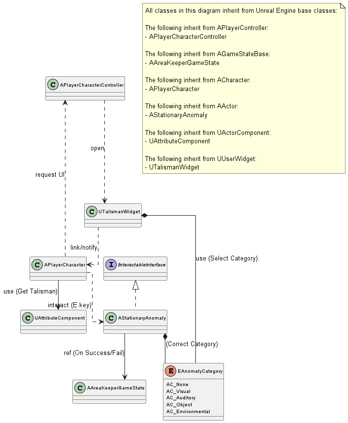

## 3.5 Talisman Ritual System
본 절은 '소지(Talisman Ritual)' 기능의 상호작용을 다룬다. 이 절에서 새롭게 기술하는 클래스는 없으며, 대신 APlayerCharacter(3.2절)가 AStationaryAnomaly(3.3절)와 상호작용하여 APlayerCharacterController(3.1절)를 통해 UTalismanWidget(3.6절)을 여는 일련의 과정을 다이어그램으로 기술한다.

본 절의 클래스 다이어그램에는 다음 시스템의 클래스들이 참조로 포함되며, 해당 클래스들의 상세 기술서는 명시된 세부 절에 작성되어 있다.
- 3.1 Core Game System: APlayerCharacterController, AAreaKeeperGameState
- 3.2 Character: APlayerCharacter, UAttributeComponent
- 3.3 Anomaly System: AStationaryAnomaly, EAnomalyCategory
- 3.6 UI System: UTalismanWidget

