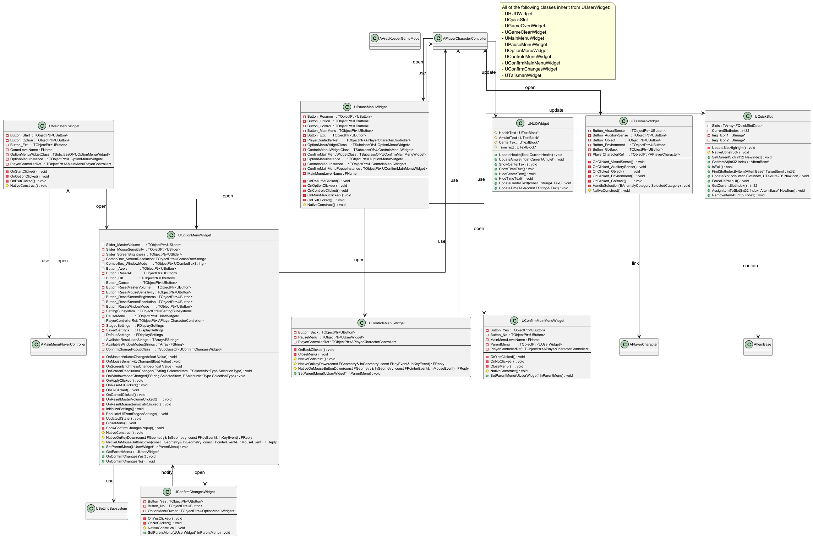
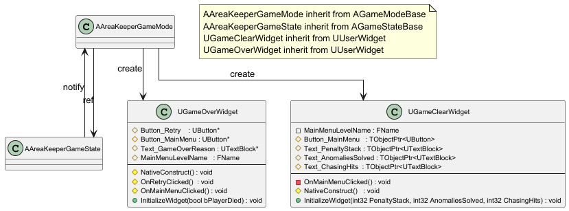

## 3.6 UI System
본 절은 C++ 기반 위젯과 블루프린트 위젯을 포함한 모든 사용자 인터페이스(UI)를 다룬다. 인게임 정보를 표시하는 UHUDWidget과 아이템 슬롯을 관리하는 UQuickSlot을 기술한다. 또한, UMainMenuWidget, UPauseMenuWidget, UTalismanWidget, UOptionMenuWidget, UControlsMenuWidget, UConfirmMainMenuWidget, UConfirmChangesWidget, UGameOverWidget, UGameClearWidget의 상세 내용을 기술한다.

본 절의 클래스 다이어그램에는 다음 시스템의 클래스들이 참조로 포함될 수 있으며, 해당 클래스들의 상세 기술서는 명시된 세부 절에 작성되어 있다.
- 3.1 Core Game System: APlayerCharacterController, AMainMenuPlayerController, AAreaKeeperGameMode, AAreaKeeperGameState
- 3.2 Character: APlayerCharacter
- 3.4 Item & Interaction System: AItemBase
- 3.7 Settings & Saving System: USettingSubsystem

UHUDWidget

클래스 개요

인게임 플레이 중에 표시되는 메인 HUD 위젯이다. `UUserWidget`을 상속받는다. `APlayerCharacterController`와 `AAreaKeeperGameState`로부터 호출되어 체력, 지방(Amulet), 시간, 상호작용 텍스트 등 실시간 정보를 화면에 표시한다.

| 이름 | 타입 | 가시성 | 설명 |
|:---:|:---:|:---:|:---:|
| UpdateHealth | void | public | HealthText의 내용을 CurrentHealth 값으로 갱신한다. (BlueprintCallable) |
| UpdateAmulet | void | public | AmuletText의 내용을 CurrentAmulet 값으로 갱신한다. (BlueprintCallable) |
| ShowCenterText | void | public | CenterText를 보이도록 설정한다. (BlueprintCallable) |
| HideCenterText | void | public | CenterText를 숨기도록 설정한다. (BlueprintCallable) |
| UpdateCenterText | void | public | CenterText의 내용을 Text로 갱신한다. (BlueprintCallable) |
| ShowTimeText | void | public | TimeText를 보이도록 설정한다. (BlueprintCallable) |
| HideTimeText | void | public | TimeText를 숨기도록 설정한다. (BlueprintCallable) |
| UpdateTimeText | void | public | TimeText의 내용을 Text로 갱신한다. (BlueprintCallable) |
