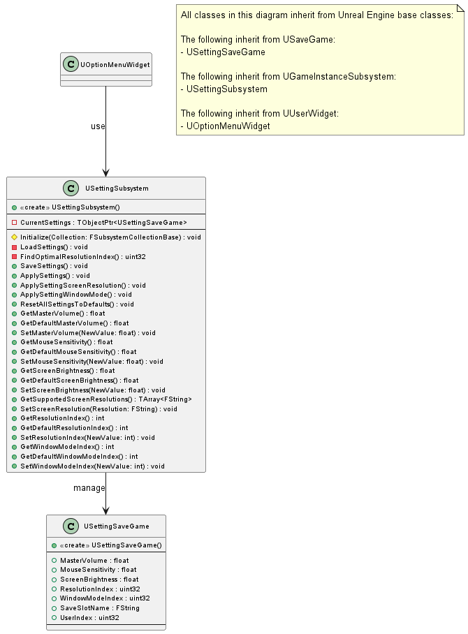

## 3.7 Settings & Saving System
본 절은 게임의 설정값을 디스크에 저장하고 불러오는 클래스들을 다룬다. 실제 설정 데이터(볼륨, 해상도 등)를 저장하는 USaveGame 객체인 USettingSaveGame과, 이 데이터를 로드(LoadSettings), 적용(ApplySettings), 저장(SaveSettings)하는 USettingSubsystem의 상세 내용을 기술한다.

본 절의 클래스 다이어그램에는 다음 시스템의 클래스들이 참조로 포함될 수 있으며, 해당 클래스들의 상세 기술서는 명시된 세부 절에 작성되어 있다.
- 3.6 UI System: UOptionMenuWidget

USettingSaveGame

클래스 개요

게임의 설정 값(사운드, 마우스 감도, 화면 설정 등)을 저장하고 불러오기 위한 클래스이다. Unreal Engine의 USaveGame 클래스를 상속받아 구현된다.

멤버 변수
| 이름 | 타입 | 가시성 | 설명 |
|:---:|:---:|:---:|:---:|
| MasterVolume | float | public | 전체 사운드 볼륨 설정 값 |
| MouseSensitivity | float | public | 마우스 감도 설정 값 |
| ScreenBrightness | float | public | 화면 밝기 설정 값 |
| ResolutionIndex | uint32 | public | 화면 해상도 설정 인덱스 값 |
| WindowModeIndex | uint32 | public | 창 모드 설정 인덱스 값(0: 전체 화면, 1: 테두리 없는 창모드, 2: 창 모드). |
| SaveSlotName | FString | public | 저장 슬롯의 이름 정보 |
| UserIndex | uint32 | public | 저장 시스템에서 사용하는 사용자 인덱스 정보 |

멤버 함수
| 이름 | 타입 | 가시성 | 설명 |
|:---:|:---:|:---:|:---:|
| USettingSaveGame |  | public | 생성자이다. 게임의 기본 설정값으로 초기화한다. |

USettingSubsystem

클래스 개요

게임의 설정을 관리하는 서브시스템이다. `UGameInstanceSubsystem`을 상속받아 게임 인스턴스 생명주기 동안 설정을 로드, 적용, 저장하는 중앙 관리자 역할을 한다. UI(위젯 블루프린트)와 실제 게임 설정(오디오, 입력, 비디오) 간의 인터페이스를 제공한다.

멤버 변수
| 이름 | 타입 | 가시성 | 설명 |
|:---:|:---:|:---:|:---:|
| CurrentSettings | TObjectPtr<USettingSaveGame> | private | 현재 게임에 적용된 설정값을 담고 있는 USettingSaveGame 객체 포인터이다. |

멤버 함수
| 이름 | 타입 | 가시성 | 설명 |
|:---:|:---:|:---:|:---:|
| Initialize | void | public | 서브시스템 초기화 시 호출되며, LoadSettings()를 호출하여 저장된 설정을 불러온다. (Override) |
| SaveSettings | void | public | CurrentSettings의 현재 설정 값들을 디스크(Save Game 파일)에 저장한다. (BlueprintCallable) |
| ApplySettings | void | public | CurrentSettings에 저장된 모든 설정 값들을 실제 게임 시스템(오디오, 입력, 화면)에 적용한다. (BlueprintCallable) |
| ApplySettingScreenResolution | void | private | CurrentSettings의 해상도 값을 실제 게임 화면에 적용한다. |
| ApplySettingWindowMode | void | private | CurrentSettings의 창 모드 값을 실제 게임 화면에 적용한다. |
| GetMasterVolume | float | public | 현재 마스터 볼륨 값을 반환한다. (BlueprintPure) |
| GetDefaultMasterVolume | float | public | 기본 마스터 볼륨 값을 반환한다. (BlueprintPure) |
| SetMasterVolume | void | public | CurrentSettings의 마스터 볼륨 값을 NewValue로 설정한다. (BlueprintCallable) |
| GetMouseSensitivity | float | public | 현재 마우스 감도 값을 반환한다. (BlueprintPure) |
| GetDefaultMouseSensitivity | float | public | 기본 마우스 감도 값을 반환한다. (BlueprintPure) |
| SetMouseSensitivity | void | public | CurrentSettings의 마우스 감도 값을 NewValue로 설정한다. (BlueprintCallable) |
| GetScreenBrightness | float | public | 현재 화면 밝기 값을 반환한다. (BlueprintPure) |
| GetDefaultScreenBrightness | float | public | 기본 화면 밝기 값을 반환한다. (BlueprintPure) |
| SetScreenBrightness | void | public | CurrentSettings의 화면 밝기 값을 NewValue로 설정한다. (BlueprintCallable) |
| GetSupportedScreenResolutions | TArray<FString> | public | 현재 시스템에서 지원하는 해상도 목록을 반환한다. (BlueprintCallable) |
| SetScreenResolution | void | public | 문자열로 받은 해상도를 CurrentSettings에 적용한다. (BlueprintCallable) |
| GetResolutionIndex | int | public | 현재 해상도 인덱스 값을 반환한다. (BlueprintPure) |
| GetDefaultResolutionIndex | int | public | 기본 해상도 인덱스 값을 반환한다. (BlueprintPure) |
| SetResolutionIndex | void | public | CurrentSettings의 해상도 인덱스 값을 NewValue로 설정한다. (BlueprintCallable) |
| GetWindowModeIndex | int | public | 현재 창 모드 인덱스 값을 반환한다. (BlueprintPure) |
| GetDefaultWindowModeIndex | int | public | 기본 창 모드 인덱스 값을 반환한다. (BlueprintPure) |
| SetWindowModeIndex | void | public | CurrentSettings의 창 모드 인덱스 값을 NewValue로 설정한다. (BlueprintCallable) |
| ResetAllSettingsToDefaults | void | public | CurrentSettings의 모든 값을 기본값으로 되돌린다. (BlueprintCallable) |
| LoadSettings | void | private | 디스크(Save Game 파일)에서 설정 값을 불러와 CurrentSettings에 로드한다. 파일이 없으면 기본값으로 CurrentSettings를 생성한다. |
| FindOptimalResolutionIndex | uint32 | private | 현재 PC 환경에 가장 적합한 해상도 옵션의 인덱스를 찾아 반환한다. |
