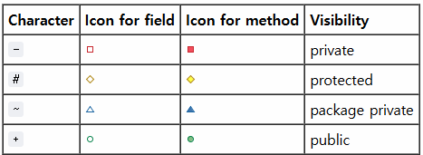

# 3. Class Diagram
이번 장은 'Area Keeper' 게임 시스템의 정적 구조를 나타내는 Class diagram과 각 클래스에 대한 설명을 기술한다. 본 문서의 Class diagram은 이전에 정의된 게임 기획서와 기능 요구사항(SRS)을 기반으로 설계되었다.
Class diagram 작성 시 다음과 같은 Unreal Engine C++ 코딩 표준 네이밍 컨벤션을 준수한다:
- 클래스/구조체/열거형/인터페이스: 특정 접두사 (A, U, S, F, I, T, E) + PascalCase
- 멤버 변수/멤버 함수: PascalCase (Boolean 변수는 b 접두사 사용)
- 상수/매크로: ALL_CAPS_SNAKE_CASE

블루프린트는 C++ 코딩 표준과 다른 네이밍 컨벤션을 가지며, 다음과 같은 네이밍 컨벤션을 준수한다: 
- 블루프린트 에셋 (클래스): 접두어(WBP, BP, ABP 등) + 언더스코어(_) + 에셋 이름으로 구성된다. (예: WBP_PauseMenu, BP_AnomalyManager)
- UI관련 컴포넌트 변수: 블루프린트 에디터의 '디자이너' 탭에서 추가된 UI 컴포넌트 변수는 PascalCase 또는 언더스코어(_)를 포함하는 이름을 가질 수 있다. (예: Button_Resume)
- 멤버 변수/멤버 함수: PascalCase (Boolean 변수는 b 접두사 사용)

본 장의 Class diagram 및 각 클래스에 대한 기술서를 이해할 때 고려해야 할 추가적인 사항은 다음과 같다:
- 기본적으로 표준 UML 표기법을 따르지만 PlantUML 툴을 이용하여 다이어그램을 작성하기 때문에 조금 씩 다를 수 있다. 자세한 내용은 9.Reference.md PlantUML 관련 문헌을 참고하여 알 수 있다.
- Class Diagram에서는 PlantUML에서 사용하는 접근 지정자 표기법을 따르며, 자세한 내용은 아래 사진과 같다.
  
    

- Unreal Engine 지정자: 클래스 기술서의 Operations 항목 Description 란에는, 해당 함수의 Unreal Engine 내 역할을 명확히 하기 위해 (BlueprintCallable), (BlueprintPure), (Override) 등의 C++ 지정자를 괄호 안에 표기한다.
- 구조: 시스템의 이해를 돕기 위해 주요 기능 및 시스템별로 Class diagram을 나누어 설명한다. (예: 플레이어 관련 클래스, 이상 현상 관리 클래스 등)
- 중복 방지: 각 절에서 한 번 정의된 클래스나 구조체는 다른 다이어그램에서 다시 상세히 정의하지 않고 이름만 참조한다.

이어지는 절에서 게임의 핵심 시스템을 구성하는 주요 클래스들과 그 관계를 다이어그램과 설명을 통해 상세히 기술한다.
