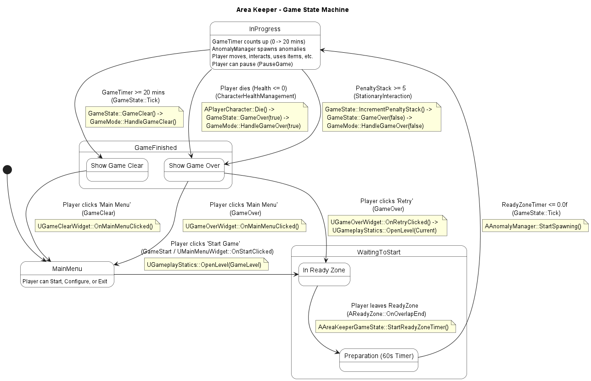

# 5. State machine diagram

**[그림 5-1]**

 [그림 5-1]은 'Area Keeper' 게임의 전체 상태 흐름을 나타내는 State Machine Diagram이다. 이 다이어그램은 AAreaKeeperGameState의 EAreaKeeperPlayState 열거형을 기반으로 하며, 게임 시작부터 종료까지의 모든 주요 상태 전환을 보여준다.
1. MainMenu (메인 메뉴) 상태 게임 애플리케이션 실행 시 진입하는 첫 번째 상태이다. ([*] --> MainMenu) 이 상태에서 플레이어는 '게임 시작', '설정', '게임 종료'를 선택할 수 있다.
2. WaitingToStart (게임 준비) 상태 플레이어가 MainMenu에서 '시작하기' 버튼을 누르면(UMainMenuWidget::OnStartClicked), UGameplayStatics::OpenLevel을 통해 게임 레벨이 로드되고 WaitingToStart 상태로 진입한다. 이 상태는 내부적으로 두 개의 하위 상태로 나뉜다.
    - "In Ready Zone" (준비 구역): MainMenu에서 진입하는 첫 번째 하위 상태이다. 플레이어가 스폰되고 아이템을 정비하는 공간이다.
    - "Preparation (60s Timer)" (준비 시간): 플레이어가 준비 구역을 나가면(AReadyZone::OnOverlapEnd), AAreaKeeperGameState::StartReadyZoneTimer가 호출되어 'Preparation' 하위 상태로 전환된다. 이 상태에서는 60초 타이머가 카운트다운된다.
3. InProgress (게임 진행) 상태 WaitingToStart 상태의 60초 타이머가 0에 도달하면(GameState::Tick), AAnomalyManager::StartSpawning이 호출되며 InProgress 상태로 전환된다. 이 상태는 핵심 게임 플레이가 진행되는 구간으로, 20분의 게임 클리어 타이머(GameTimer)가 작동하고 AnomalyManager가 주기적으로 이상 현상을 스폰한다. 플레이어는 이 상태에서 이동, 상호작용, 아이템 사용 등 모든 핵심 유스케이스를 수행하며, PauseGame 유스케이스를 통해 게임을 일시 정지할 수 있다.
4. GameFinished (게임 종료) 상태 InProgress 상태는 세 가지 경로 중 하나가 충족되면 GameFinished 상태로 전환된다.
    - 플레이어 사망 (경로 A): CharacterHealthManagement 유스케이스에서 플레이어 체력이 0이 되면, APlayerCharacter::Die()가 GameState::GameOver(true)를 호출한다.
    - 패널티 5 스택 (경로 B): StationaryInteraction 유스케이스에서 패널티 스택이 5에 도달하면, GameState::IncrementPenaltyStack 내부에서 GameState::GameOver(false)를 호출한다.
    - 20분 생존 (경로 C): GameState::Tick에서 GameTimer가 20분을 초과하면, GameState::GameClear()를 호출한다.

    GameFinished 상태는 GameOver(true/false)에 의해 Show Game Over 하위 상태로 진입하거나, GameClear()에 의해 Show Game Clear 하위 상태로 진입하여 각각의 UI를 표시한다.

5. 최종 전환 (게임 종료 이후) GameFinished 상태에서는 플레이어의 선택에 따라 두 가지 경로로 나뉜다.
    - 메인 메뉴로 (경로 7): GameOver 또는 GameClear UI에서 '메인 메뉴로' 버튼을 클릭하면(OnMainMenuClicked), MainMenu 상태로 복귀한다.
    - 재시도 (경로 8): GameOver UI에서 '재시도' 버튼을 클릭하면(OnRetryClicked), UGameplayStatics::OpenLevel(Current)을 통해 현재 레벨을 다시 로드하여 WaitingToStart 상태 (정확히는 그 하위 상태인 "In Ready Zone")로 복귀한다.

