# 6. User interface prototype
본 장은 'Area Keeper' 게임의 사용자 인터페이스(UI) 프로토타입을 시각 자료와 함께 설명한다. 
UI는 플레이어에게 게임 정보를 전달하고 원활한 상호작용을 지원하는 것을 목표로 설계되었다. 프로토타입으로 추후 디자인은 변경될 수 있으나, 구성은 및 기능은 동일하다.

## 6.1 메인 메뉴 및 설정 (Main Menu & Settings)

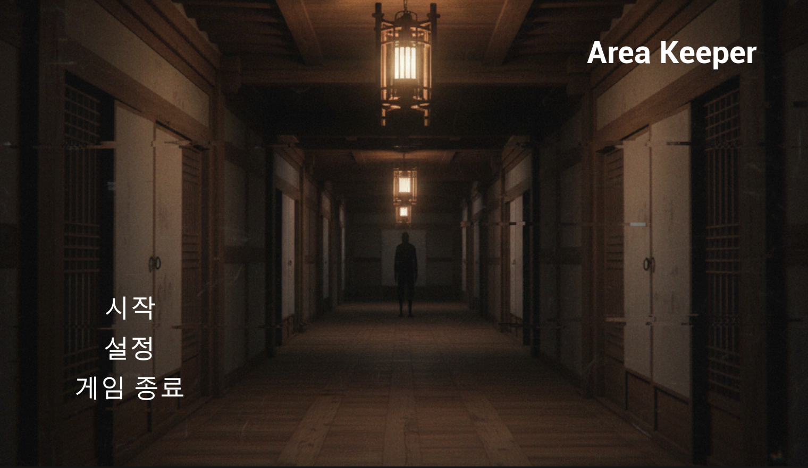

**[그림 6-1]**

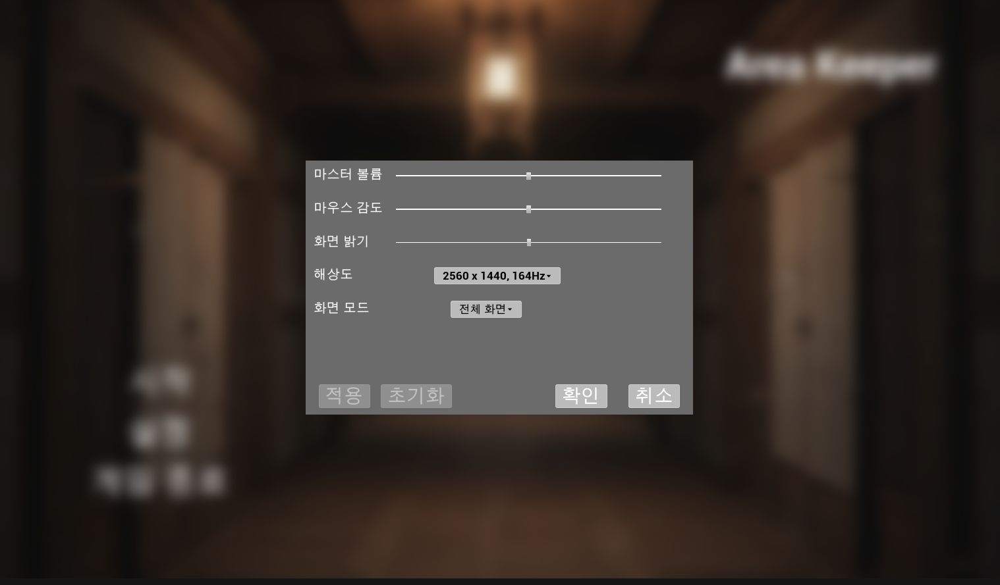

**[그림 6-2]**

게임 실행 시 표시되는 초기 화면이다. 플레이어는 [시작], [설정], [게임 종료]를 선택할 수 있다. [그림 6-1]은 이를 나타낸다.
[설정] 버튼 클릭 시 [그림 6-2]와 같은 화면을 볼 수 있다. 게임의 볼륨, 마우스 감도, 해상도, 화면 모드 등을 조작할 수 있는 옵션 메뉴가 표시된다.

## 6.2 인게임 UI 및 메뉴 (In-Game UI & Menus)

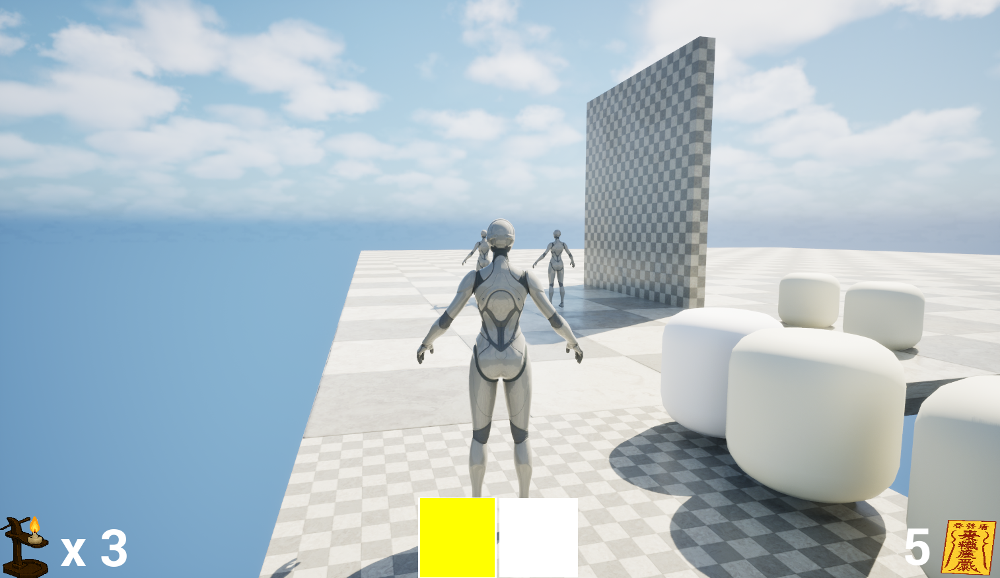

**[그림 6-3]**

[그림 6-3]은 게임 플레이 중 표시되는 기본 UI (HUD)를 보여준다. 좌측 하단에 체력, 우측 하단에 지방(소지 횟수), 중앙 하단에 퀵슬롯이 배치되어 핵심 자원 상태를 보여준다.

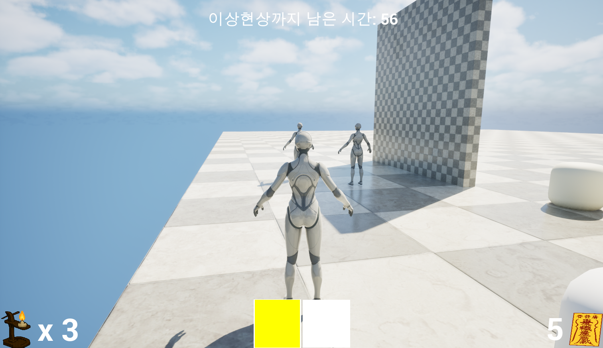

**[그림 6-4]**

게임 시작 직후 '준비 구역'을 이탈하면, 화면 상단에 60초 준비 시간 타이머가 일시적으로 표시된다. [그림 6-4]는 이를 나타낸다.

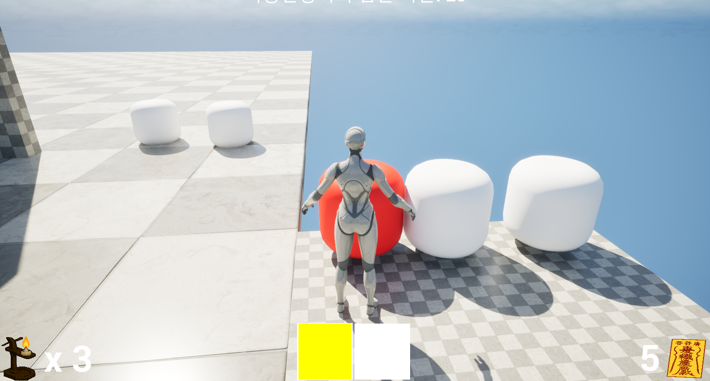

**[그림 6-5]**

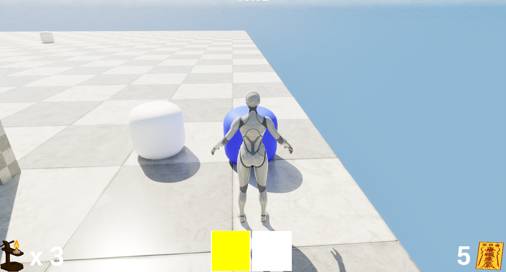

**[그림 6-6]**

[그림 6-5], [그림 6-6]은 상호 작용이 가능한 물건 앞에 있을 시 변경되는 UI를 나타낸다. 여기서 상호 작용이 가능한 물건이란 도구 및 소지가 가능한 ‘정지된 이상현상’이다.

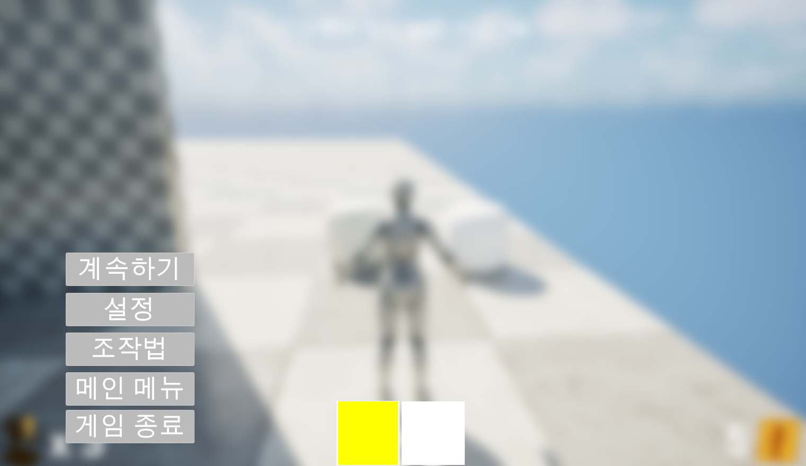

**[그림 6-7]**

게임 플레이 중 ESC 키를 누르면 [그림 6-5]와 같은 일시 정지 메뉴가 활성화된다. 게임이 일시 정지되며 [계속하기], [설정], [조작법], [메인 메뉴], [게임 종료] 버튼을 제공한다.

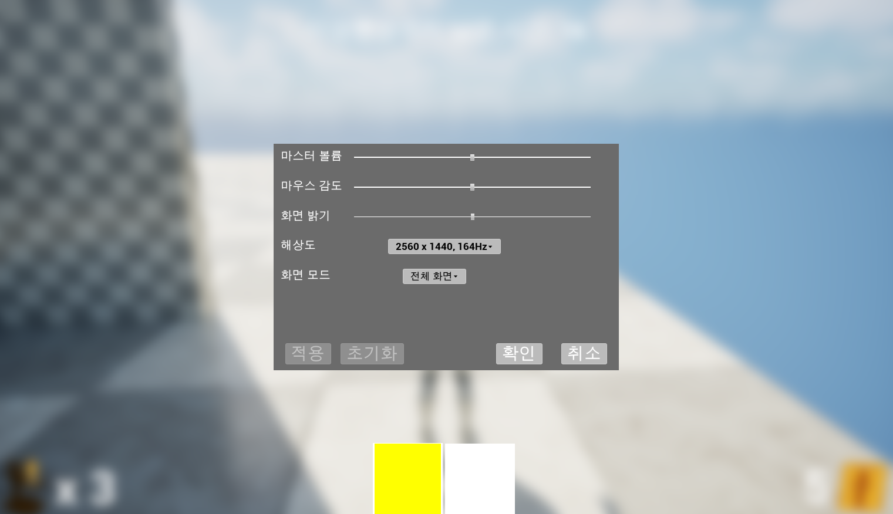

**[그림 6-8]**

[그림 6-8]은 [설정] 버튼을 눌렀을 시에 대한 UI를 나타낸다. 일시 정지 메뉴의 설정 버튼과 6.1절의 설정 버튼은 동일한 역할을 한다.

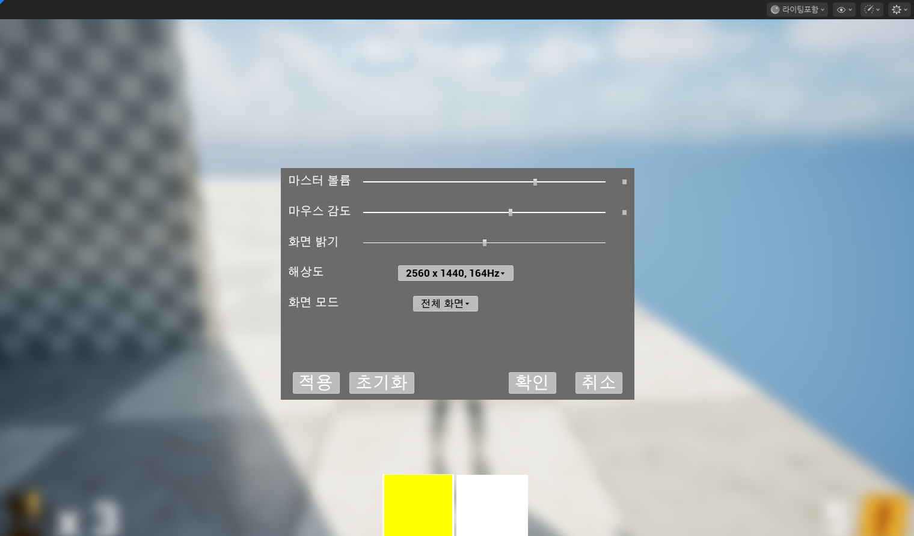

**[그림 6-9]**

[그림 6-9]은 값 변경 시 개별 초기화 버튼이 나타나는 것을 나타내는 그림이다. 
해당 버튼을 누를시 개별 옵션이 초기화 된다. 또한 값 변경이 일어날 시 적용 및 초기화 버튼이 활성화 된다.

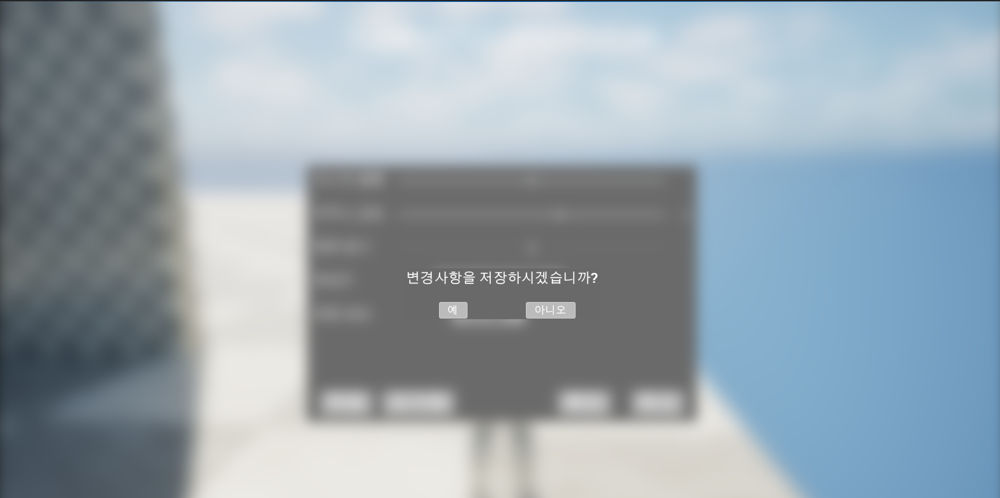

**[그림 6-10]**

 [그림 6-10]은 값 변경 이후 적용하지 않고 확인 버튼을 누를 시 저장 여부에 대한 UI를 나타낸다.

 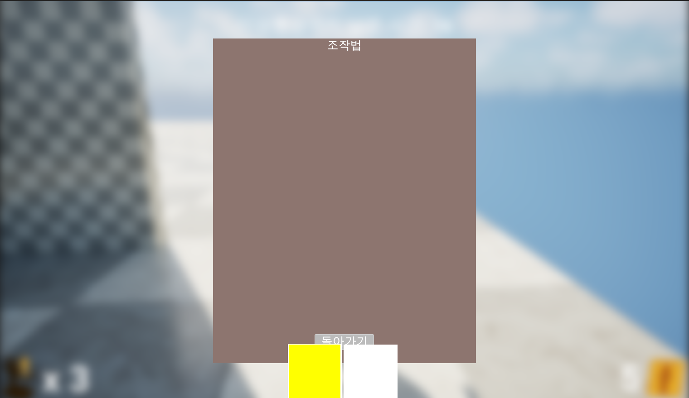

**[그림 6-11]**

 [그림 6-11]는 조작법 버튼을 클릭 시 생성되는 UI이다.

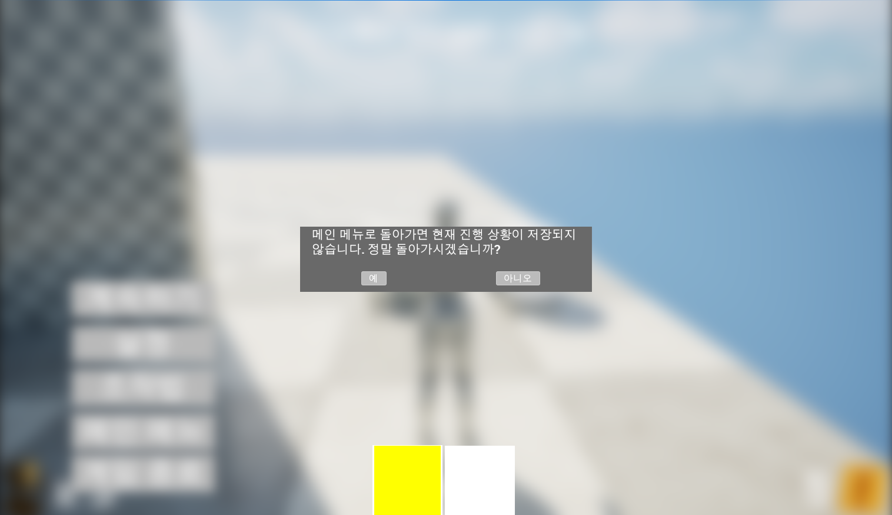

**[그림 6-12]**

[그림 6-12]은 [메인 메뉴로] 버튼을 누를 시 경고창에 대한 UI이다.

## 6.3 소지 UI (Talisman Ritual UI)

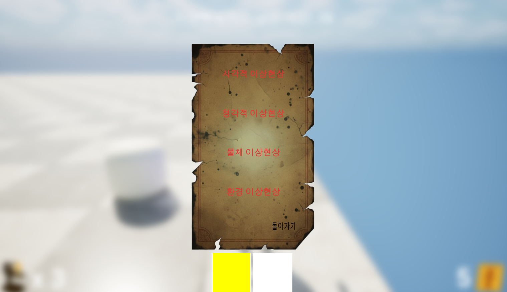

[그림 6-13]’정지된 이상현상’과 상호작용할 때 표시되는 UI이다. (TalismanRitual 유스케이스 참고) 게임이 일시 정지되며, 플레이어는 4가지 이상현상 범주 중 하나를 선택하거나 [돌아가기]를 눌러 ‘소지’를 취소할 수 있다.

## 6.4 게임 종료 UI (Game Over / Game Clear)

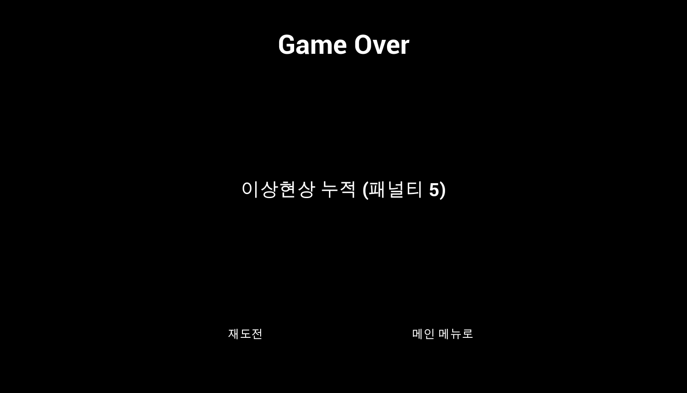

**[그림 6-13]**

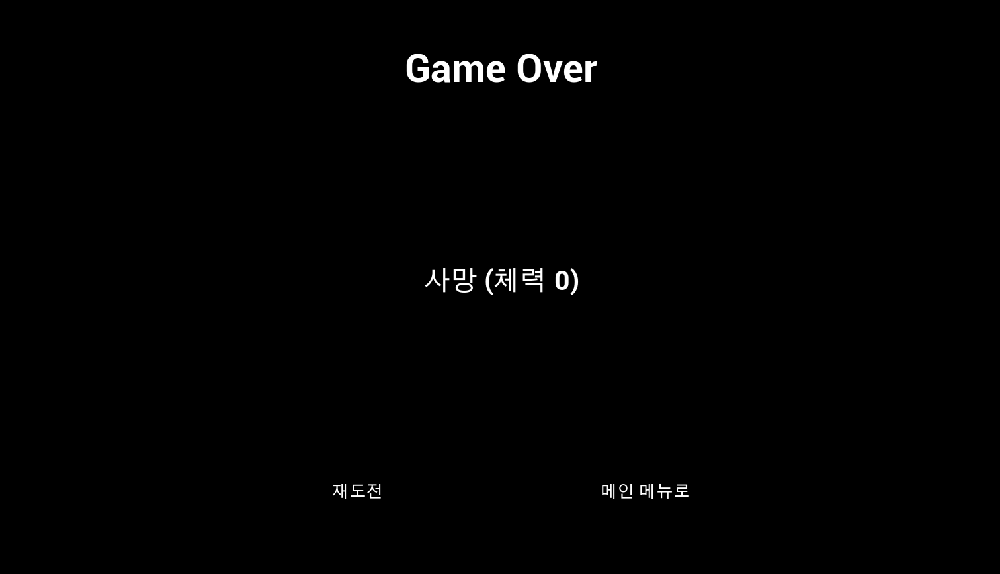

**[그림 6-14]**

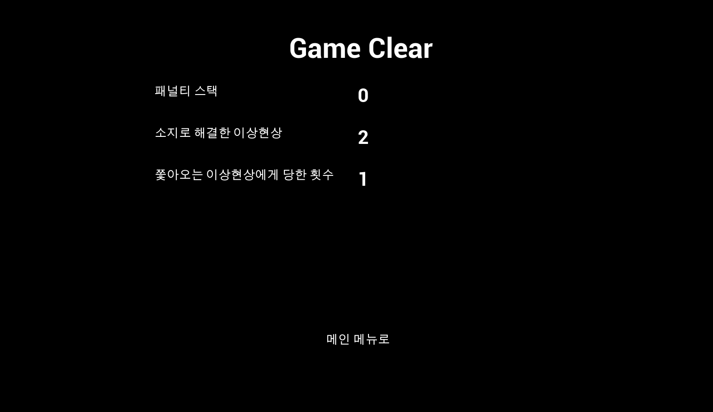

**[그림 6-15]**

[그림 6-12], [그림 6-13], [그림 6-14]는 게임이 종료되었을 때(사망, 패널티 5개, 20분 생존) 표시되는 UI이다. 게임 오버시에 사망 원인과 함께 [재시도], [메인 메뉴로] 버튼이 표시된다. 게임 클리어시에는 최종 통계(패널티 스택, 해결 횟수 등)와 [메인 메뉴로] 버튼이 표시된다.

