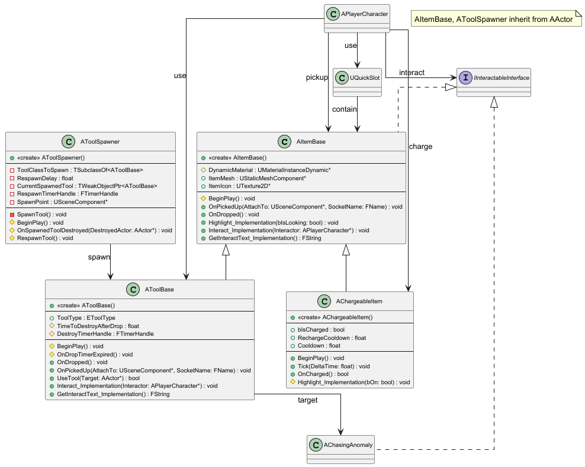

## 3.4 Item & Tool System
본 절은 플레이어의 상호작용과 관련된 모든 액터를 다룬다. 상호작용의 기반이 되는 IInteractableInterface와 모든 아이템의 부모인 AItemBase를 기술한다. 또한 AItemBase를 상속받아 '지방 충전' 쿨타임을 관리하는 AChargeableItem, AChasingAnomaly(3.3절) 제거 로직 및 10초 소멸 타이머를 포함하는 AToolBase (및 그 자식 ATool), 그리고 준비 구역에서 도구를 리스폰시키는 AToolSpawner의 상세 내용을 기술한다.

본 절의 클래스 다이어그램에는 다음 시스템의 클래스들이 참조로 포함될 수 있으며, 해당 클래스들의 상세 기술서는 명시된 세부 절에 작성되어 있다.
- 3.2 Character: APlayerCharacter
- 3.3 Anomaly System: AChasingAnomaly
- 3.6 UI System: UQuickSlot

***

### AItemBase
#### 클래스 개요
월드에 배치되거나 플레이어가 소지할 수 있는 모든 아이템의 기본 부모 클래스이다. AActor와 IInteractableInterface를 상속받는다. UStaticMeshComponent를 루트로 가지며, 상호작용 시 하이라이트(Highlight), 줍기(Interact), 텍스트 반환(GetInteractText) 기능을 제공한다. 또한 줍기(OnPickedUp)와 버리기(OnDropped)에 대한 기본 로직(물리/충돌 제어)을 정의한다.

#### 멤버 변수
| 이름 | 타입 | 가시성 | 설명 |
|:---:|:---:|:---:|:---:|
| ItemMesh | UStaticMeshComponent* | public | 아이템의 외형을 나타내는 스태틱 메시 컴포넌트이다. (VisibleAnywhere, BlueprintReadWrite) |
| ItemIcon | UTexture2D* | public | 퀵슬롯 UI(UQuickSlot)에 표시될 아이템 아이콘 텍스처이다. (EditAnywhere, BlueprintReadWrite) |
| DynamicMaterial | UMaterialInstanceDynamic* | protected | BeginPlay 시 ItemMesh에서 생성되는 동적 머티리얼 인스턴스이다. 하이라이트 효과에 사용된다. |

#### 멤버 함수
| 이름 | 타입 | 가시성 | 설명 |
|:---:|:---:|:---:|:---:|
| AItemBase |  | public | 생성자이다. ItemMesh를 루트 컴포넌트로 생성하고 Visibility 채널에 충돌 응답을 설정한다. |
| OnPickedUp | void | public | APlayerCharacter가 아이템을 주웠을 때 호출된다. 물리 시뮬레이션과 충돌을 비활성화하고 AttachTo 컴포넌트의 SocketName에 부착한다. |
| OnDropped | void | public | APlayerCharacter가 아이템을 버렸을 때 호출된다. 부모로부터 분리하고 물리 시뮬레이션과 충돌을 활성화한다. |
| Highlight_Implementation | void | public | 플레이어가 바라볼 때 호출된다. DynamicMaterial의 Color 파라미터를 변경하여 하이라이트 효과를 준다. (Override) |
| Interact_Implementation | void | public | 플레이어가 E키로 상호작용할 때 호출된다. Interactor(플레이어)의 PickupItem 함수를 호출하여 자신을 줍도록 한다. (Override) |
| GetInteractText_Implementation | FString | public | 상호작용 UI에 줍기 텍스트를 반환한다. (Override) |
| BeginPlay | void | protected | 게임 시작 시 호출된다. ItemMesh에서 DynamicMaterial을 생성한다. (Override) |

***

### AToolSpawner
#### 클래스 개요
'플레이 준비 구역'에 배치되어 특정 도구(`AToolBase`)를 스폰하고, 해당 도구가 파괴되면 자동으로 리스폰하는 액터이다. `BeginPlay` 시 첫 도구를 스폰(`SpawnTool`)하며, 스폰된 도구의 `OnDestroyed` 델리게이트에 `OnSpawnedToolDestroyed` 함수를 바인딩한다. 도구가 파괴되면 `RespawnDelay` 이후 `RespawnTool`을 통해 도구를 다시 스폰한다.

#### 멤버 변수
| 이름 | 타입 | 가시성 | 설명 |
|:---:|:---:|:---:|:---:|
| ToolClassToSpawn | TSubclassOf<AToolBase> | private | 이 스포너가 생성할 도구의 블루프린트 클래스이다. (EditAnywhere) |
| RespawnDelay | float | private | 도구가 파괴된 후 다시 스폰되기까지 걸리는 시간(초)이다. (기본값: 5.0) (EditAnywhere) |
| CurrentSpawnedTool | TWeakObjectPtr<AToolBase> | private | 현재 스폰되어 레벨에 존재하는 도구의 참조이다. (UPROPERTY) |
| RespawnTimerHandle | FTimerHandle | private | 리스폰 타이머 핸들이다. |
| SpawnPoint | USceneComponent* | private | 스폰 위치를 시각적으로 표시하기 위한 루트 컴포넌트이다. (VisibleAnywhere) |

#### 멤버 함수
| 이름 | 타입 | 가시성 | 설명 |
|:---:|:---:|:---:|:---:|
| AToolSpawner |  | public | 생성자이다. SpawnPoint를 루트 컴포넌트로 생성하고 틱을 비활성화한다. |
| BeginPlay | void | protected | 게임 시작 시 SpawnTool()을 호출하여 첫 도구를 스폰한다. (Override) |
| OnSpawnedToolDestroyed | void | protected | CurrentSpawnedTool의 OnDestroyed 델리게이트에 의해 호출된다. RespawnDelay 이후 RespawnTool을 호출하도록 타이머를 설정한다. |
| RespawnTool | void | protected | 리스폰 타이머 만료 시 SpawnTool을 호출한다. |
| SpawnTool | void | private | ToolClassToSpawn을 SpawnPoint 위치에 스폰하고 OnSpawnedToolDestroyed 델리게이트를 바인딩한다. |

***

### AToolBase
#### 클래스 개요
`AItemBase`를 상속받는 모든 '도구'의 기본 부모 클래스이다. `OnDropped` 시 10초 후 자동 소멸 타이머(`OnDropTimerExpired`)를 시작하며, `OnPickedUp` 시 이 타이머를 취소한다. `UseTool` 함수는 `AChasingAnomaly`가 요구하는 `ToolType`이 일치하는지 확인하여, 대상을 제거(`Banish`)하고 true를 반환(소모)하는 기능을 정의한다.

#### 멤버 변수
| 이름 | 타입 | 가시성 | 설명 |
|:---:|:---:|:---:|:---:|
| ToolType | EToolType | protected | 이 도구의 타입을 정의한다. (EditDefaultsOnly, BlueprintReadOnly) |
| TimeToDestroyAfterDrop | float | protected | 도구가 바닥에 떨어진 후 소멸하기까지의 시간(초)이다. (기본값: 10.0) (EditAnywhere) |
| DestroyTimerHandle | FTimerHandle | protected | OnDropped 시 시작되는 자동 소멸 타이머 핸들이다. |

#### 멤버 함수
| 이름 | 타입 | 가시성 | 설명 |
|:---:|:---:|:---:|:---:|
| AToolBase |  | public | 생성자이다. TimeToDestroyAfterDrop의 기본값을 10.0으로 설정한다. |
| OnDropped | void | public | AItemBase::OnDropped을 호출(물리 활성화)하고, OnDropTimerExpired를 10초 후에 실행하도록 타이머를 시작한다. (Override) |
| OnPickedUp | void | public | AItemBase::OnPickedUp을 호출(물리 비활성화)하고, DestroyTimerHandle 타이머를 취소한다. (Override) |
| UseTool | bool | public | Target이 AChasingAnomaly이고 ToolType이 일치하면 Banish()를 호출하고 true를 반환한다. |
| Interact_Implementation | void | public | 플레이어가 E키로 상호작용할 때 호출된다. Interactor의 PickupItem 함수를 호출하여 '줍기'를 수행한다. (Override) |
| GetInteractText_Implementation | FString | public | 상호작용 UI에 줍기 텍스트를 반환한다. (Override) |
| BeginPlay | void | protected | 게임 시작 시 호출된다. (Override) |
| OnDropTimerExpired | void | protected | DestroyTimerHandle에 의해 10초 후 호출되어 Destroy()를 통해 액터 자신을 소멸시킨다. |

***

### AChargeableItem
#### 클래스 개요
플레이어가 '지방'을 충전할 수 있는 상호작용 오브젝트이다. AItemBase를 상속받는다. APlayerCharacter의 홀드 상호작용(HandleCharging)에 의해 OnCharged가 호출되며, 성공 시 15초의 쿨타임(RechargeCooldown)을 가진다. 쿨타임 중에는 Tick이 활성화되어 쿨타임을 계산한다.

#### 멤버 변수
| 이름 | 타입 | 가시성 | 설명 |
|:---:|:---:|:---:|:---:|
| bIsCharged | bool | public | 현재 쿨타임이 적용 중인지 여부를 나타낸다. (EditAnywhere, BlueprintReadOnly) |
| RechargeCooldown | float | public | 충전 후 재사용 대기시간(쿨타임)이다. (기본값: 15.0초) (EditAnywhere, BlueprintReadWrite) |
| Cooldown | float | public | Tick 함수에서 계산되는, 현재 경과한 쿨타임 시간이다. |

#### 멤버 함수
| 이름 | 타입 | 가시성 | 설명 |
|:---:|:---:|:---:|:---:|
| AChargeableItem |  | public | 생성자이다. Tick을 활성화한다. |
| BeginPlay | void | public | 게임 시작 시 호출된다. (Override) |
| Tick | void | public | bIsCharged가 true일 때만 실행되어 Cooldown을 증가시킨다. RechargeCooldown에 도달하면 bIsCharged를 false로 리셋하고 Tick을 비활성화한다. (Override) |
| OnCharged | bool | public | APlayerCharacter의 HandleCharging에 의해 호출된다. bIsCharged가 false일 때만 bIsCharged = true로 설정, Tick을 활성화하고 true를 반환한다. ( BlueprintCallable) |
| Highlight_Implementation | void | public | 플레이어가 바라볼 때 호출된다. bIsCharged(쿨타임 중)이면 하얀색, 아니면(충전 가능) 초록색으로 하이라이트 색상을 변경한다. (Override) |
| GetInteractText_Implementation | FString | public | 상호작용 UI에 충전기 텍스트를 반환한다. (Override) |
