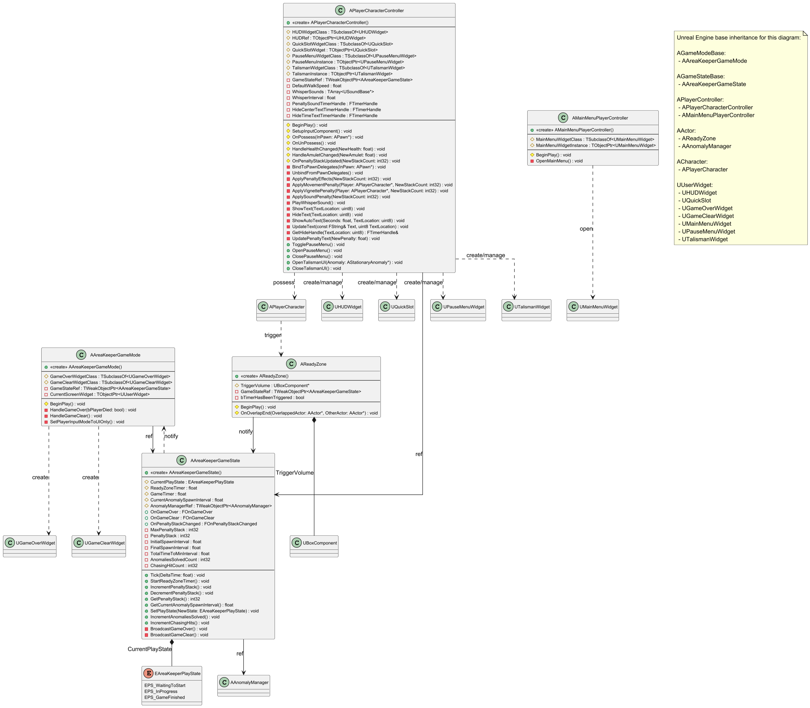
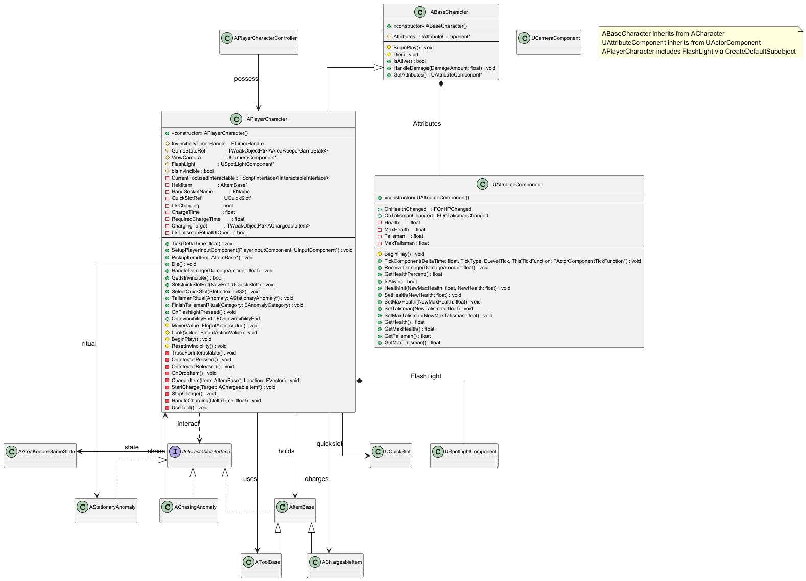
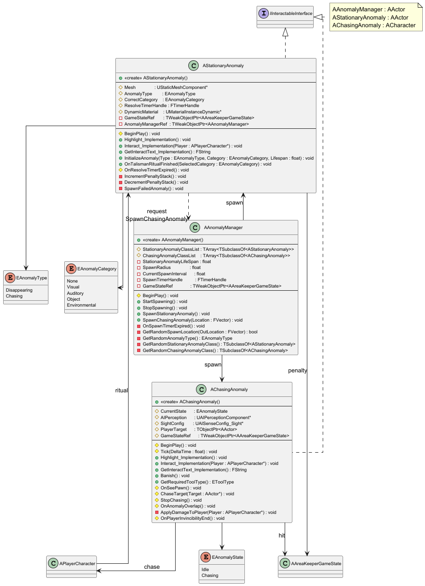
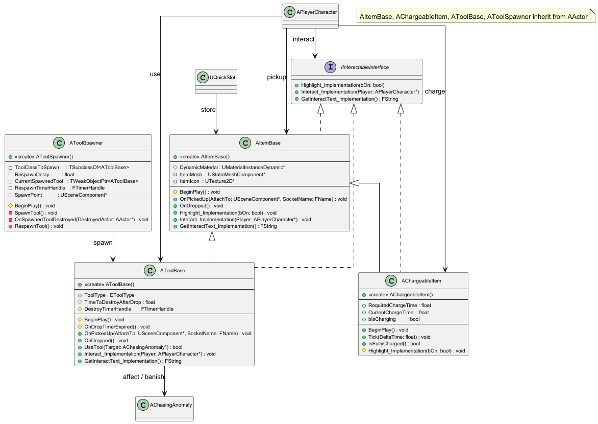
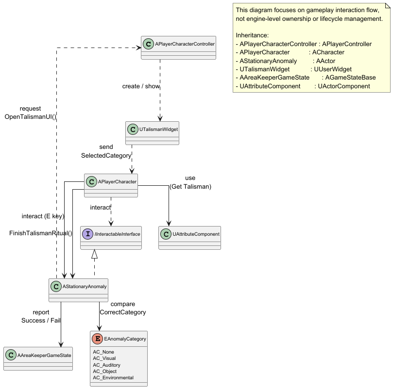
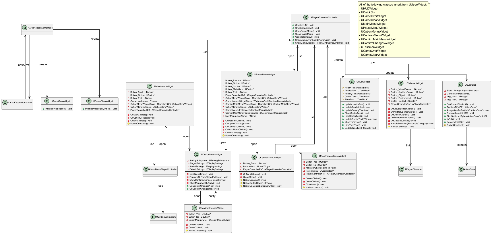

# 3. Class Diagram
이번 장은 'Area Keeper' 게임 시스템의 정적 구조를 나타내는 Class diagram과 각 클래스에 대한 설명을 기술한다. 본 문서의 Class diagram은 이전에 정의된 게임 기획서와 기능 요구사항(SRS)을 기반으로 설계되었다.
Class diagram 작성 시 다음과 같은 Unreal Engine C++ 코딩 표준 네이밍 컨벤션을 준수한다:
- 클래스/구조체/열거형/인터페이스: 특정 접두사 (A, U, S, F, I, T, E) + PascalCase
- 멤버 변수/멤버 함수: PascalCase (Boolean 변수는 b 접두사 사용)
- 상수/매크로: ALL_CAPS_SNAKE_CASE

블루프린트는 C++ 코딩 표준과 다른 네이밍 컨벤션을 가지며, 다음과 같은 네이밍 컨벤션을 준수한다: 
- 블루프린트 에셋 (클래스): 접두어(WBP, BP, ABP 등) + 언더스코어(_) + 에셋 이름으로 구성된다. (예: WBP_PauseMenu, BP_AnomalyManager)
- UI관련 컴포넌트 변수: 블루프린트 에디터의 '디자이너' 탭에서 추가된 UI 컴포넌트 변수는 PascalCase 또는 언더스코어(_)를 포함하는 이름을 가질 수 있다. (예: Button_Resume)
- 멤버 변수/멤버 함수: PascalCase (Boolean 변수는 b 접두사 사용)

본 장의 Class diagram 및 각 클래스에 대한 기술서를 이해할 때 고려해야 할 추가적인 사항은 다음과 같다:
- 기본적으로 표준 UML 표기법을 따르지만 PlantUML 툴을 이용하여 Class Diagram을 작성하기 때문에 조금 씩 다를 수 있다. 자세한 내용은 9.Reference.md PlantUML 관련 문헌을 참고하여 알 수 있다.
- Class Diagram에서는 PlantUML에서 사용하는 접근 지정자 표기법을 따르며, 자세한 내용은 아래 사진과 같다.
  
    

- Unreal Engine 지정자: 클래스 기술서의 Operations 항목 Description 란에는, 해당 함수의 Unreal Engine 내 역할을 명확히 하기 위해 (BlueprintCallable), (BlueprintPure), (Override) 등의 C++ 지정자를 괄호 안에 표기한다.
- 구조: 시스템의 이해를 돕기 위해 주요 기능 및 시스템별로 Class diagram을 나누어 설명한다. (예: 플레이어 관련 클래스, 이상 현상 관리 클래스 등)
- Class Diagram에 사용된 Enum(열거형)들은 3장의 Class Diagram에서 기술하지 않고, 8장의 Glossary에 용어를 정리해둔다.
- 중복 방지: 각 절에서 한 번 정의된 클래스나 구조체는 다른 다이어그램에서 다시 상세히 정의하지 않고 이름만 참조한다.

이어지는 절에서 게임의 핵심 시스템을 구성하는 주요 클래스들과 그 관계를 다이어그램과 설명을 통해 상세히 기술한다.

## 3.1 Core Game System
본 절은 게임의 전반적인 흐름, 상태, 규칙을 관리하는 핵심 클래스를 다룬다. EAreaKeeperPlayState와 같은 게임 상태를 관리하는 AAreaKeeperGameState, 게임 오버/클리어 로직을 처리하는 AAreaKeeperGameMode, 준비 구역 타이머를 시작하는 AReadyZone, 메인 메뉴 로직을 담당하는 AMainMenuPlayerController, 그리고 인게임 플레이어 입력을 처리하고 UI를 관리하는 APlayerCharacterController의 상세 내용을 기술한다.

본 절의 클래스 다이어그램에는 다음 시스템의 클래스들이 참조로 포함될 수 있으며, 해당 클래스들의 상세 기술서는 명시된 세부 절에 작성되어 있다.
- 3.2 Character: APlayerCharacter
- 3.3 Anomaly System: AAnomalyManager
- 3.6 UI System: UHUDWidget, UQuickSlot, UGameOverWidget, UGameClearWidget, UMainMenuWidget, UPauseMenuWidget, UTalismanWidget

***

### AAreaKeeperGameState
#### 클래스 개요
게임의 전체 상태를 관리하는 클래스이다. AGameStateBase를 상속받는다. Tick에서 ReadyZoneTimer(준비 시간)와 GameTimer(게임 클리어 시간)를 관리하며, GameTimer에 따라 이상 현상 스폰 주기를 20초에서 15초로 선형 보간(Lerp)한다. AReadyZone의 호출(StartReadyZoneTimer)을 받아 게임을 InProgress 상태로 변경하고 AAnomalyManager의 스폰을 시작시킨다. AStationaryAnomaly의 요청에 따라 패널티 스택을 증감(IncrementPenaltyStack, DecrementPenaltyStack)시키며, 최대 스택 도달 또는 APlayerCharacter의 사망 시 GameOver를 호출한다. OnPenaltyStackChanged, OnGameOver, OnGameClear 델리게이트를 통해 상태 변경을 외부로 브로드캐스트 한다.
#### 멤버 변수
| 이름 | 타입 | 가시성 | 설명 |
|:---:|:---:|:---:|:---:|
| OnGameOver | FOnGameOver | public | 게임 오버 시 BP GameMode가 바인딩할 델리게이트이다. (BlueprintAssignable) |
| OnGameClear | FOnGameClear | public | 게임 클리어 시 BP GameMode가 바인딩할 델리게이트이다. (BlueprintAssignable) |
| OnPenaltyStackChanged | FOnPenaltyStackChanged | public | 패널티 스택 변동 시 방송되는 델리게이트이다(BlueprintAssignable) |
| CurrentPlayState | EAreaKeeperPlayState | protected | 현재 플레이 상태 변수이다 |
| AnomalyManagerRef | TWeakObjectPtr<AAnomalyManager> | protected | 이상 현상 매니저를 참조한다 |
| ReadyZoneTimer | float | protected | 준비 구역 타이머이다 |
| GameTimer | float | protected | 게임 클리어 판정을 위한 누적 시간이다 |
| PenaltyStack | int32 | protected | 현재 패널티 스택 값이다 |
| MaxPenaltyStack | int32 | protected | 패널티 스택 최대값이다 |
| InitialSpawnInterval | float | protected | 이상현상 초기 스폰 간격(20초)이다 |
| FinalSpawnInterval | float | protected | 이상현상 최소 스폰 간격(15초)이다 |
| TotalTimeToMinInterval | float | protected | Lerp가 적용되는 총 시간이다 |
| AnomaliesSolvedCount | int32 | protected | 해결한 이상 현상 개수이다 |
| ChasingHitCount | int32 | protected | 체이싱 타입 피격 횟수이다 |

#### 멤버 함수
| 이름 | 타입 | 가시성 | 설명 |
|:---:|:---:|:---:|:---:|
| AAreaKeeperGameState |  | public | 생성자이다. PrimaryActorTick.bCanEverTick을 true로 설정하고 상태 변수들을 초기화한다. |
| Tick | void | public | 매 프레임 호출된다. ReadyZoneTimer, GameTimer 및 스폰 간격 보간을 처리한다 |
| StartReadyZoneTimer | void | public | ReadyZone에서 호출되며 게임 상태를 InProgress로 전환한다 |
|IncrementPenaltyStack	void | public | 패널티 스택을 증가시키고 OnPenaltyStackChanged를 호출한다 | 
|DecrementPenaltyStack | void | public | 패널티 스택을 감소시키고 OnPenaltyStackChanged를 호출한다 | 
|GetPenaltyStack | int32 | public | 현재 패널티 스택을 반환한다. | 
| GetCurrentAnomalySpawnInterval | float | public | CurrentAnomalySpawnInterval 값을 반환한다. (BlueprintPure) |
| SetPlayState | void | public | 플레이 상태를 변경한다 |
| IncrementAnomaliesSolved |void | public | 해결된 이상 현상 수를 증가시킨다 |
| IncrementChasingHits | void | public | 체이싱 타입 피격 횟수를 증가시킨다 |
| CheckGameClear | void | protected | GameTimer 기반으로 클리어 조건을 검사한다 |
| TriggerGameOver | void | protected | 패널티 또는 사망 조건 발생 시 GameOver 흐름을 실행한다 |
| BroadcastPenaltyChange | void | protected | 패널티 스택 변경 시 델리게이트를 브로드캐스트한다 |

***

### AAreaKeeperGameMode
#### 클래스 개요
게임의 핵심 규칙(시작, 종료, UI 관리)을 담당하는 게임 모드이다. AGameModeBase를 상속받는다. BeginPlay 시 AAreaKeeperGameState의 참조를 캐시하고, OnGameOver 및 OnGameClear 델리게이트에 HandleGameOver, HandleGameClear 함수를 바인딩한다. 게임 오버 또는 클리어 신호를 수신하면, APlayerCharacterController의 인게임 HUD와 퀵슬롯을 제거하고, GameOverWidgetClass 또는 GameClearWidgetClass 위젯을 생성하여 뷰포트에 표시하며 입력 모드를 UI 전용으로 변경한다.
#### 멤버 변수
| 이름 | 타입 | 가시성 | 설명 |
|:---:|:---:|:---:|:---:|
| GameOverWidgetClass | TSubclassOf<UGameOverWidget> | protected | 게임 오버 시 생성할 C++ 기반 UGameOverWidget의 블루프린트 클래스이다. (EditDefaultsOnly) |
| GameClearWidgetClass | TSubclassOf<UGameClearWidget> | protected | 게임 클리어 시 생성할 C++ 기반 UGameClearWidget의 블루프린트 클래스이다. (EditDefaultsOnly) |
| GameStateRef | TWeakObjectPtr<AAreaKeeperGameState> | private | BeginPlay 시 캐시된 AAreaKeeperGameState의 참조이다. |
| CurrentScreenWidget | TObjectPtr<UUserWidget> | private | 현재 화면에 표시된 게임 오버 또는 게임 클리어 위젯의 인스턴스이다. |
| SetPlayerInputModeToUIOnly | void | protected | 플레이어 컨트롤러의 입력 모드를 FInputModeUIOnly로 설정하고 마우스 커서를 표시한다. |
| RemoveInGameUI | void | private | HUD·QuickSlot 등 인게임 UI를 모두 제거한다 |

#### 멤버 함수
| 이름 | 타입 | 가시성 | 설명 |
|:---:|:---:|:---:|:---:|
| AAreaKeeperGameMode |  | public | 생성자이다. |
| BeginPlay | void | protected | GameStateRef를 캐시하고 OnGameOver 및 OnGameClear 델리게이트에 함수를 바인딩한다. (Override) |
| HandleGameOver | void | protected | GameStateRef->OnGameOver 델리게이트에 의해 호출된다. 인게임 UI를 제거하고 GameOverWidgetClass를 생성, InitializeWidget(bPlayerDied) 호출 후 뷰포트에 표시한다. |
| HandleGameClear | void | protected | GameStateRef->OnGameClear 델리게이트에 의해 호출된다. 인게임 UI를 제거하고 GameClearWidgetClass를 생성, InitializeWidget(통계 전달) 호출 후 뷰포트에 표시한다. |
| SetPlayerInputModeToUIOnly | void | protected | 플레이어 컨트롤러의 입력 모드를 FInputModeUIOnly로 설정하고 마우스 커서를 표시한다. |

***

### APlayerCharacterController
#### 클래스 개요
인게임 플레이어 컨트롤러이다. APlayerController를 상속받는다. BeginPlay 시 DefaultMappingContext를 설정하고 HUDWidgetClass와 QuickSlotWidgetClass의 인스턴스를 생성하여 뷰포트에 추가한다. OnPossess 시 BindToPawnDelegates를 호출하여 UAttributeComponent의 델리게이트(OnHealthChanged, OnTalismanChanged)에 HUD 업데이트 함수(HandleHealthChanged, HandleAmuletChanged)를 바인딩한다. 또한, 퀵슬롯(1, 2키) 및 일시 정지 메뉴(ESC) 입력을 처리하고, APlayerCharacter의 요청을 받아 '소지' UI(TalismanWidgetClass)를 열고 게임을 일시 정지시키는 등의 UI 관리자 역할을 수행한다.
#### 멤버 변수
| 이름 | 타입 | 가시성 | 설명 |
|:---:|:---:|:---:|:---:|
| HUDWidgetClass | TSubclassOf<UHUDWidget> | protected | 뷰포트에 생성할 HUD 위젯 블루프린트 클래스이다. (EditDefaultsOnly) |
| HUDRef | TObjectPtr<UHUDWidget> | protected | BeginPlay 시 생성된 HUDWidgetClass의 인스턴스 참조이다. |
| BoundAttribute | TObjectPtr<UAttributeComponent> | protected | 현재 Possess한 Pawn의 UAttributeComponent 참조이다. 델리게이트 바인딩에 사용된다. |
| DefaultMappingContext | TObjectPtr<UInputMappingContext> | protected | 인게임 플레이어가 사용할 기본 입력 매핑 컨텍스트이다. (EditAnywhere, BlueprintReadOnly) |
| QuickSlotWidgetClass | TSubclassOf<UQuickSlot> | protected | 뷰포트에 생성할 퀵슬롯 위젯 블루프린트 클래스이다. (EditAnywhere) |
| QuickSlotWidget | UQuickSlot* | protected | BeginPlay 시 생성된 QuickSlotWidgetClass의 인스턴스 참조이다. |
| IA_ToggleSettingsMenu | UInputAction* | protected | 일시 정지 메뉴(ESC)에 바인딩된 입력 액션이다. (EditAnywhere, BlueprintReadOnly) |
| PauseMenuWidgetClass | TSubclassOf<UPauseMenuWidget> | protected | 일시 정지 시 생성할 설정 메뉴 위젯 블루프린트 클래스이다. (EditDefaultsOnly) |
| PauseMenuInstance | TObjectPtr<UPauseMenuWidget> | protected | OpenPauseMenu 시 생성된 PauseMenuWidgetClass의 인스턴스 참조이다. |
| TalismanWidgetClass | TSubclassOf<UTalismanWidget> | protected | '소지' 시 생성할 위젯 블루프린트 클래스이다. (EditDefaultsOnly) |
| TalismanInstance | TObjectPtr<UTalismanWidget> | protected | OpenTalismanUI 시 생성된 TalismanWidgetClass의 인스턴스 참조이다. |
| HideCenterTextTimerHandle | FTimerHandle | private | ShowAutoText(0) 호출 시 중앙 텍스트를 숨기기 위한 타이머 핸들이다. |
| HideTimeTextTimerHandle | FTimerHandle | private | ShowAutoText(1) 호출 시 시간 텍스트를 숨기기 위한 타이머 핸들이다. |
| GameStateRef | TWeakObjectPtr<AAreaKeeperGameState> | private | AAreaKeeperGameState의 캐시된 참조이다. |
| DefaultWalkSpeed | float | private | 패널티 적용 시 이동 속도를 복원하기 위해 BeginPlay 시 캐시하는 값이다. |
| PenaltySoundTimerHandle | FTimerHandle | private | 2스택 패널티 사운드를 주기적으로 재생하기 위한 타이머 핸들이다. |
| WhisperSounds | TArray<TObjectPtr<USoundBase>> | private | 2스택 패널티일 때 재생할 속삭임 사운드 목록이다. (EditDefaultsOnly) |
| WhisperInterval | float | private | 속삭임 사운드의 재생 주기(초)이다. (기본값: 15.0) (EditDefaultsOnly) |

#### 멤버 함수
| 이름 | 타입 | 가시성 | 설명 |
|:---:|:---:|:---:|:---:|
| BeginPlay | void | protected | DefaultMappingContext를 추가하고, HUDRef와 QuickSlotWidget을 생성 및 뷰포트에 추가하며 델리게이트를 바인딩한다. (Override) |
| SetupInputComponent | void | protected | 퀵슬롯(1, 2키) 입력과 IA_ToggleSettingsMenu 입력을 SelectSlot1, SelectSlot2, TogglePauseMenu 함수에 바인딩한다. (Override) |
| OnPossess | void | protected | InPawn에 빙의할 때 호출된다. BindToPawnDelegates를 호출한다. (Override) |
| OnUnPossess | void | protected | 빙의가 해제될 때 호출된다. UnbindFromPawnDelegates를 호출한다. (Override) |
| BindToPawnDelegates | void | protected | InPawn의 UAttributeComponent를 찾아 OnHealthChanged, OnTalismanChanged 델리게이트에 함수를 바인딩한다. |
| UnbindFromPawnDelegates | void | protected | BoundAttribute에 바인딩된 모든 델리게이트를 해제한다. |
| HandleHealthChanged | void | protected | BoundAttribute->OnHealthChanged에 의해 호출된다. HUDRef->UpdateHealth를 호출하여 UI를 갱신한다. |
| HandleAmuletChanged | void | protected | BoundAttribute->OnTalismanChanged에 의해 호출된다. HUDRef->UpdateAmulet를 호출하여 UI를 갱신한다. |
| SelectSlot1 | void | protected | 1번 키 입력 시 호출된다. APlayerCharacter::SelectQuickSlot(0)을 호출한다. |
| SelectSlot2 | void | protected | 2번 키 입력 시 호출된다. APlayerCharacter::SelectQuickSlot(1)을 호출한다. |
| TogglePauseMenu | void | public | IA_ToggleSettingsMenu 입력 시 호출된다. SettingsMenuInstance의 존재 여부에 따라 OpenPauseMenu 또는 ClosePauseMenu를 호출한다. |
| OpenPauseMenu | void | public | SettingsMenuInstance를 생성 및 뷰포트에 추가하고, 입력을 GameAndUI 모드로 변경하며 게임을 일시 정지(SetPause(true))한다. |
| OpenTalismanUI | void | public | APlayerCharacter에 의해 호출된다. TalismanInstance를 생성 및 뷰포트에 추가하고, 입력을 GameAndUI 모드로 변경하며 게임을 일시 정지(SetPause(true))한다. |
| CloseTalismanUI | void | public | APlayerCharacter에 의해 호출된다. TalismanInstance를 뷰포트에서 제거하고, 입력을 GameOnly 모드로 변경하며 게임을 재개(SetPause(false))한다. (BlueprintCallable) |
| ClosePauseMenu | void | public | SettingsMenuInstance를 뷰포트에서 제거하고, 입력을 GameOnly 모드로 변경하며 게임을 재개(SetPause(false))한다. (BlueprintCallable) |
| ShowText | void | public | HUDRef의 중앙(0) 또는 시간(1) 텍스트를 보이게 한다. (BlueprintCallable) |
| ShowAutoText | void | public | ShowText를 호출한 뒤, Seconds 후에 HideText를 호출하도록 타이머를 설정한다. (BlueprintCallable) |
| HideText | void | public | HUDRef의 중앙(0) 또는 시간(1) 텍스트를 숨기고 타이머를 초기화한다. (BlueprintCallable) |
| UpdateText | void | public | HUDRef의 중앙(0) 또는 시간(1) 텍스트 내용을 Text로 갱신한다. (BlueprintCallable) |
| GetHideHandle | FTimerHandle& | private | TextLocation(0 또는 1)에 따라 HideCenterTextTimerHandle 또는 HideTimeTextTimerHandle의 참조를 반환한다. |
| GetHUDWidget | UHUDWidget* | public | HUDRef의 참조를 반환한다. |
| GetQuickSlotWidget | UQuickSlot* | public | QuickSlotWidget의 참조를 반환한다. |
| OnPenaltyStackUpdated | void | protected | GameStateRef->OnPenaltyStackChanged에 의해 호출된다. ApplyPenaltyEffects를 호출하여 패널티 효과를 적용한다. |
| ApplyPenaltyEffects | void | protected | NewStackCount에 따라 이동 속도, 비네트, 사운드 패널티를 각각 적용한다. |
| ApplySoundPenalty | void | protected | 2스택 이상일 때 PenaltySoundTimerHandle을 시작/정지하여 PlayWhisperSound를 주기적으로 호출한다. |
| ApplyVignettePenalty | void | protected | 3스택 이상일 때 PlayerChar의 ViewCamera에 비네트 효과를 적용/제거한다. |
| ApplyMovementPenalty | void | protected | 4스택 이상일 때 PlayerChar의 이동 속도를 DefaultWalkSpeed의 80%로 감소/복원한다. |
| PlayWhisperSound | void | protected | WhisperSounds 배열에서 랜덤한 사운드를 PlaySound2D로 재생한다. |
| UpdatePenaltyText | void | protected | HUD의 패널티 텍스트를 갱신한다. |
***

### AMainMenuPlayerController
#### 클래스 개요
메인 메뉴 레벨의 플레이어 컨트롤러이다. APlayerController를 상속받는다. BeginPlay 시 MainMenuWidgetClass에 지정된 위젯을 생성(OpenMainMenu)하고 뷰포트에 표시하며, 입력 모드를 GameAndUI로 설정하고 마우스 커서를 표시한다.
#### 멤버 변수
| 이름 | 타입 | 가시성 | 설명 |
|:---:|:---:|:---:|:---:|
| MainMenuWidgetClass | TSubclassOf<UMainMenuWidget> | protected | BeginPlay 시 생성할 메인 메뉴 위젯의 블루프린트 클래스이다. (EditDefaultsOnly) |
| MainMenuWidgetInstance | TObjectPtr<UMainMenuWidget> | protected | OpenMainMenu 호출 시 생성된 메인 메뉴 위젯의 인스턴스 참조이다. (VisibleInstanceOnly) |

#### 멤버 함수
| 이름 | 타입 | 가시성 | 설명 |
|:---:|:---:|:---:|:---:|
| BeginPlay | void | protected | OpenMainMenu 함수를 호출하여 메인 메뉴 UI를 연다. (Override) |
| OpenMainMenu | void | protected | MainMenuWidgetClass를 기반으로 위젯을 생성하고 뷰포트에 추가한다. 입력 모드를 GameAndUI로 설정하고 마우스 커서를 표시한다. |

***

### AReadyZone
#### 클래스 개요
플레이 준비 구역을 정의하는 액터이다. AActor를 상속받는다. TriggerVolume을 이용해 플레이어(APlayerCharacter)가 이 구역을 나가는 시점을 감지(OnOverlapEnd)하여, AAreaKeeperGameState의 StartReadyZoneTimer 함수를 한 번만 호출하는 역할을 한다.
#### 멤버 변수
| 이름 | 타입 | 가시성 | 설명 |
|:---:|:---:|:---:|:---:|
| TriggerVolume | UBoxComponent* | protected | 이 구역의 범위를 나타내는 트리거 볼륨이다. (VisibleAnywhere, BlueprintReadOnly) |
| GameStateRef | TWeakObjectPtr<AAreaKeeperGameState> | private | AAreaKeeperGameState의 캐시된 참조이다. |
| bTimerHasBeenTriggered | bool | private | StartReadyZoneTimer가 중복 호출되는 것을 방지하기 위한 플래그이다. |

#### 멤버 함수
| 이름 | 타입 | 가시성 | 설명 |
|:---:|:---:|:---:|:---:|
| AReadyZone |  | public | 생성자이다. TriggerVolume을 생성하고 루트 컴포넌트로 설정하며 bTimerHasBeenTriggered를 false로 초기화한다. |
| BeginPlay | void | protected | GameStateRef를 캐시하고 TriggerVolume의 OnComponentEndOverlap 델리게이트에 OnOverlapEnd 함수를 바인딩한다. (Override) |
| OnOverlapEnd | void | protected | TriggerVolume에서 액터가 나갈 때 호출된다. OtherActor가 APlayerCharacter이고 bTimerHasBeenTriggered가 false이면 GameStateRef->StartReadyZoneTimer()를 호출하고 플래그를 true로 설정한다. |

## 3.2 Character
본 절은 ACharacter를 상속받는 모든 캐릭터의 기본 구조를 다룬다. 모든 캐릭터의 공통 부모로서 피격(HandleDamage) 및 죽음(Die) 로직을 정의하는 ABaseCharacter, 플레이어가 조작하며 1초 무적 로직과 상호작용(OnInteractPressed)을 처리하는 APlayerCharacter, 그리고 이들 캐릭터에 부착되어 체력(Health)과 지방(Talisman)을 관리하는 UAttributeComponent의 상세 내용을 기술한다.

본 절의 클래스 다이어그램에는 다음 시스템의 클래스들이 참조로 포함될 수 있으며, 해당 클래스들의 상세 기술서는 명시된 세부 절에 작성되어 있다.
- 3.1 Core Game System: AAreaKeeperGameState, APlayerCharacterController
- 3.3 Anomaly System: AStationaryAnomaly, AChasingAnomaly
- 3.4 Item & Interaction System: IInteractableInterface, AItemBase, AToolBase, AChargeableItem
- 3.6 UI System: UQuickSlot

***

### ABaseCharacter
#### 클래스 개요
플레이어(APlayerCharacter)와 적(예: AChasingAnomaly)의 공통 부모 클래스이다. ACharacter를 상속받는다. 모든 캐릭터가 공통으로 가지는 UAttributeComponent를 소유하며, 생존 여부(IsAlive), 피격(HandleDamage), 죽음(Die) 처리에 대한 기본 로직을 정의한다.
#### 멤버 변수
| 이름 | 타입 | 가시성 | 설명 |
|:---:|:---:|:---:|:---:|
| Attributes | UAttributeComponent* | protected | 체력 및 지방 등의 속성을 관리하는 컴포넌트이다. (VisibleAnywhere, BlueprintReadOnly) |

#### 멤버 함수
| 이름 | 타입 | 가시성 | 설명 |
|:---:|:---:|:---:|:---:|
| ABaseCharacter |  | public | 생성자이다. AttributeComponent를 CreateDefaultSubobject로 생성하고 기본 컴포넌트 설정만 수행한다. |
| IsAlive | bool | public | AttributeComponent의 체력이 0보다 큰지(생존 여부)를 반환한다. (BlueprintPure) |
| HandleDamage | void | public | AttributeComponent에 피해를 전달하고, 사망 시(IsAlive가 false 반환) Die()를 호출한다. |
| BeginPlay | void | protected | 게임 시작 시 호출된다. (Override) |
| Die | void | protected | 캐릭터가 죽었을 때(HandleDamage에 의해) 호출된다. 충돌을 비활성화하고 로그를 남긴다. (Virtual) |
| GetAttributes | UAttributeComponent* | public | Attributes 컴포넌트의 포인터를 반환한다. |

***

### APlayerCharacter
#### 클래스 개요
플레이어가 직접 조작하는 1인칭 캐릭터이다. ABaseCharacter를 상속받는다. 플레이어의 모든 입력(이동, 시점, 상호작용, 버리기, 웅크리기)을 처리하며, IInteractableInterface 객체를 탐지하고 상황에 맞는 상호작용(도구 사용, 소지, 충전, 줍기)을 수행한다.
#### 멤버 변수
| 이름 | 타입 | 가시성 | 설명 |
|:---:|:---:|:---:|:---:|
| OnInvincibilityEnd | FOnInvincibilityEnd | public | 무적 시간이 종료될 때 브로드캐스트된다. (BlueprintAssignable) |
| bIsInvincible | bool | protected | 현재 1초 무적 상태인지 여부를 나타낸다. |
| InvincibilityTimerHandle | FTimerHandle | protected | 무적 시간 해제를 위한 타이머 핸들이다. |
| GameStateRef | TWeakObjectPtr<AAreaKeeperGameState> | protected | AAreaKeeperGameState의 캐시된 참조이다. |
| SpringArm | USpringArmComponent* | protected | ViewCamera가 생성된다 |
| ViewCamera | UCameraComponent* | protected | 플레이어의 시점을 담당하는 메인 카메라이다. (VisibleAnywhere) |
| MoveAction | UInputAction* | protected | 이동(WASD)에 바인딩된 입력 액션이다. (EditAnywhere) |
| LookAction | UInputAction* | protected | 시점(마우스)에 바인딩된 입력 액션이다. (EditAnywhere) |
| InteractAction | UInputAction* | protected | 상호작용(E키 짧게 누르기/홀드)에 바인딩된 입력 액션이다. (EditAnywhere) |
| DropAction | UInputAction* | protected | 아이템 버리기(G키)에 바인딩된 입력 액션이다. (EditAnywhere) |
| FlashlightAction | UInputAction* | protected | 손전등(F키)에 바인딩된 입력 액션이다. (EditAnywhere) |
| CrouchAction | UInputAction* | protected | 웅크리기(Ctrl키)에 바인딩된 입력 액션이다. (EditAnywhere) |
| CurrentFocusedInteractable | TScriptInterface<IInteractableInterface> | private | TraceForInteractable에 의해 갱신되는, 현재 바라보고 있는 상호작용 가능 객체의 참조이다. (UPROPERTY) |
| HeldItem | AItemBase* | private | 현재 플레이어가 손에 들고 있는 아이템의 참조이다. (VisibleAnywhere) |
| HandSocketName | FName | private | HeldItem이 부착될 스켈레탈 메시의 소켓 이름이다. (기본값: RightHandSocket) (EditDefaultsOnly) |
| QuickSlotRef | UQuickSlot* | private | 퀵슬롯 UI 위젯(WBP_HUD 내)에 대한 참조이다. |
| bIsCharging | bool | private | 현재 지방 충전(E키 홀드) 중인지 나타내는 플래그이다. |
| ChargeTime | float | private | 현재까지 충전이 진행된 시간이다. |
| RequiredChargeTime | float | private | 지방 충전을 완료하는 데 필요한 홀드 시간이다. (기본값: 2.0초) (EditAnywhere) |
| ChargingTarget | TWeakObjectPtr<AChargeableItem> | private | 현재 충전 중인 대상(AChargeableItem)의 참조이다. |
| bIsTalismanRitualUIOpen | bool | private | '소지' UI가 열려있는 동안 Tick 로직을 차단하기 위한 플래그이다. |

#### 멤버 함수
| 이름 | 타입 | 가시성 | 설명 |
|:---:|:---:|:---:|:---:|
| APlayerCharacter |  | public | 생성자이다. SpringArm, ViewCamera 컴포넌트를 생성하고 캡슐의 충돌 설정을 변경한다. |
| Tick | void | public | bIsTalismanRitualUIOpen이 false일 때 HandleCharging과 TraceForInteractable을 매 틱 실행한다. (Override) |
| SetupPlayerInputComponent | void | public | 플레이어 입력 컴포넌트에 MoveAction, LookAction, InteractAction, DropAction을 바인딩한다. (Override) |
| PickupItem | void | public | ItemBase::Interact에 의해 호출된다. HeldItem을 교체하고 QuickSlotRef에 아이템을 할당한다. |
| Die | void | public | ABaseCharacter::Die를 재정의한다. GameStateRef->GameOver(true)를 호출하여 게임 오버를 알린다. (Override) |
| HandleDamage | void | public | ABaseCharacter::HandleDamage를 재정의한다. 무적 상태가 아닐 때만 피해를 받고 1초 무적 상태로 진입한다. (Override) |
| getIsInvincible | bool | public | 현재 bIsInvincible 상태를 반환한다. |
| BeginPlay | void | protected | PlayerCharacter 태그를 추가하고, AttributeComponent의 체력/지방을 초기화하며 GameStateRef를 캐시한다. (Override) |
| ResetInvincibility | void | protected | InvincibilityTimerHandle에 의해 1초 후 호출되어 bIsInvincible 상태를 false로 되돌리고 OnInvincibilityEnd 델리게이트를 방송한다. |
| Move | void | protected | MoveAction 입력에 따라 컨트롤러의 전후/좌우로 이동 입력을 추가한다. |
| Look | void | protected | LookAction 입력에 따라 컨트롤러의 Yaw/Pitch 회전 입력을 추가한다. |
| OnInteractPressed | void | private | InteractAction (Started)에 호출된다. 바라보는 대상의 타입에 따라 도구 사용, 충전 시작, 소지 시작, 아이템 줍기 로직으로 분기한다. |
| OnInteractReleased | void | private | InteractAction (Completed/Canceled)에 호출된다. StopCharge를 호출하여 충전을 중단한다. |
| OnDropItem | void | private | DropAction (G키)에 호출된다. 현재 HeldItem을 QuickSlotRef에서 제거하고 ChangeItem을 호출하여 바닥에 버린다. |
| TraceForInteractable | void | private | 매 틱(Tick) 호출된다. 카메라 시점 전방으로 라인 트레이스를 수행하여 IInteractableInterface를 구현한 객체를 감지하고 CurrentFocusedInteractable을 갱신 및 하이라이트 처리한다. |
| ChangeItem | void | private | 대상 Item을 소켓에서 분리하고 OnDropped을 호출한 뒤 지정된 Location에 내려놓는다. |
| SetQuickSlotRef | void | public | QuickSlotRef 변수에 UQuickSlot 위젯 참조를 설정한다.  |
| SelectQuickSlot | void | public | QuickSlotRef의 현재 슬롯을 변경하고 해당 슬롯의 아이템을 HeldItem으로 장착/해제(숨김)한다.  |
| TalismanRitual | void | public | AStationaryAnomaly에 의해 호출된다. 지방이 있는지 확인 후, APlayerCharacterController::OpenTalismanUI를 호출하고 게임을 일시 정지한다. |
| FinishTalismanRitual | void | public | '소지' UI 위젯에서 호출된다. 게임을 재개하고, 지방을 1개 소모하며, AStationaryAnomaly::OnTalismanRitualFinished를 호출하여 결과를 전달한다. (BlueprintCallable) |
| StartCharge | void | private | OnInteractPressed에 의해 호출된다. AChargeableItem을 대상으로 충전을 시작한다. |
| StopCharge | void | private | OnInteractReleased 또는 HandleCharging에 의해 호출된다. 충전을 중단하고 UI 텍스트를 숨긴다. |
| HandleCharging | void | private | bIsCharging이 true일 때 매 틱 실행된다. 충전 대상(ChargingTarget)을 계속 바라보는지, 쿨타임 중인지 확인하고, RequiredChargeTime 도달 시 AChargeableItem::OnCharged를 호출하며 UAttributeComponent::SetTalisman으로 지방을 가득 채운다. |
| UseTool | void | private | OnInteractPressed에 의해 호출된다. HeldItem이 AToolBase인지 확인하고, 대상 AChasingAnomaly에 UseTool을 실행하고 성공 시 아이템을 파괴(소모)한다. |
| GetViewCamera | UCameraComponent* | public | UCameraComponent를 반환한다. |
| UpdateInteractionPrompt | void | private | 플레이어가 바라보는 대상에 맞춰 '줍기', '소지하기', '도구 사용' 같은 상호작용 안내 텍스트를 HUD에 표시하거나 숨긴다. |

***

### UAttributeComponent
#### 클래스 개요
캐릭터의 핵심 속성(체력, 지방)을 관리하는 액터 컴포넌트이다. UActorComponent를 상속받는다. 체력(Health)과 지방(Talisman) 값의 변경 사항을 감지하여 OnHealthChanged, OnTalismanChanged 이벤트를 통해 외부(예: UI)로 브로드캐스트한다.
#### 멤버 변수
| 이름 | 타입 | 가시성 | 설명 |
|:---:|:---:|:---:|:---:|
| Health | float | private | 현재 체력 값이다. (EditAnywhere) |
| MaxHealth | float | private | 최대 체력 값이다. (EditAnywhere) |
| Talisman | float | private | 현재 소지한 지방(부적)의 개수이다. (EditAnywhere) |
| MaxTalisman | float | private | 소지 가능한 지방의 최대 개수이다. (EditAnywhere) |
| OnHealthChanged | FOnHPChanged | public | 체력(Health) 값이 변경될 때 브로드캐스트된다. (BlueprintAssignable) |
| OnTalismanChanged | FOnTalismanChanged | public | 지방(Talisman) 개수가 변경될 때 브로드캐스트된다. (BlueprintAssignable) |

#### 멤버 함수
| 이름 | 타입 | 가시성 | 설명 |
|:---:|:---:|:---:|:---:|
| UAttributeComponent |  | public | 생성자이다. PrimaryComponentTick.bCanEverTick을 true로 설정한다. |
| TickComponent | void | public | 매 프레임 호출된다. (Override) |
| BeginPlay | void | protected | 게임 시작 시 호출된다. OnHealthChanged와 OnTalismanChanged를 방송하여 UI를 초기화한다. (Override) |
| ReceiveDamage | void | public | DamageAmount만큼 Health를 감소(Clamp)시키고 OnHealthChanged 이벤트를 방송한다. |
| GetHealthPercent | float | public | 현재 체력 비율(Health / MaxHealth)을 반환한다. |
| IsAlive | bool | public | Health가 0보다 큰지(생존 여부)를 반환한다. |
| HealthInit | void | public | MaxHealth와 Health 값을 동시에 설정한다. |
| SetHealth | void | public | Health 값을 NewHealth로 설정(Clamp)하고 이벤트를 방송한다. |
| SetMaxHealth | void | public | MaxHealth 값을 NewMaxHealth로 설정한다. |
| SetTalisman | void | public | Talisman 값을 NewTalisman으로 설정(Clamp)하고 이벤트를 방송한다. (지방 충전 시 사용) |
| SetMaxTalisman | void | public | MaxTalisman 값을 NewMaxTalisman으로 설정한다. |
| GetHealth | float | public | 현재 Health 값을 반환한다. |
| GetMaxHealth | float | public | MaxHealth 값을 반환한다. |
| GetTalisman | float | public | 현재 Talisman 값을 반환한다. |
| GetMaxTalisman | float | public | MaxTalisman 값을 반환한다. |

## 3.3 Anomaly System
본 절은 게임의 핵심 위협 요소인 이상 현상을 관리, 스폰, 정의하는 클래스들을 다룬다. EAnomalyType, EAnomalyCategory 등 정의된 타입을 기반으로 동작하며, AAreaKeeperGameState(3.1절)의 상태에 따라 이상 현상을 스폰하는 AAnomalyManager, 플레이어가 '소지'해야 하는 정지된 이상 현상인 AStationaryAnomaly, 그리고 플레이어를 추적하는 AChasingAnomaly의 상세 내용을 기술한다.

본 절의 클래스 다이어그램에는 다음 시스템의 클래스들이 참조로 포함될 수 있으며, 해당 클래스들의 상세 기술서는 명시된 세부 절에 작성되어 있다.
- 3.1 Core Game System: AAreaKeeperGameState
- 3.2 Character: APlayerCharacter
- 3.4 Item & Interaction System: IInteractableInterface

***

### AAnomalyManager
#### 클래스 개요
게임 내 모든 이상 현상의 스폰, 타이밍, 생명 주기를 관리하는 액터이다. `AActor`를 상속받는다. `AAreaKeeperGameState`의 상태(`CurrentPlayState`)에 따라 `StartSpawning`/`StopSpawning`이 호출되며, `OnSpawnTimerExpired` 타이머를 통해 주기적으로 `SpawnStationaryAnomaly`를 실행한다. 또한 `AStationaryAnomaly`의 요청을 받아 `SpawnChasingAnomaly`를 실행하는 스포너(Spawner) 역할을 한다.

#### 멤버 변수
| 이름 | 타입 | 가시성 | 설명 |
|:---:|:---:|:---:|:---:|
| StationaryAnomalyClassList | TArray<TSubclassOf<AStationaryAnomaly>> | protected | 스폰할 '정지된 이상현상'의 블루프린트 클래스 목록이다. (EditDefaultsOnly) |
| ChasingAnomalyClassList | TArray<TSubclassOf<AChasingAnomaly>> | protected | 스폰할 '쫓아오는 이상현상'의 블루프린트 클래스 목록이다. (EditDefaultsOnly) |
| StationaryAnomalyLifeSpan | float | private | '정지된 이상현상'의 생성 유지 시간(초)이다. (EditAnywhere) |
| SpawnTimerHandle | FTimerHandle | private | OnSpawnTimerExpired를 주기적으로 호출하기 위한 타이머 핸들이다. |
| SpawnRadius | float | private | GetRandomSpawnLocation에서 사용할 네비게이션 반경이다. (EditAnywhere) |
| CurrentSpawnInterval | float | private | 현재 이상현상 생성 주기(초)이다. (EditAnywhere) |
| GameStateRef | TWeakObjectPtr<AAreaKeeperGameState> | private | AAreaKeeperGameState의 캐시된 참조이다. |

#### 멤버 함수
| 이름 | 타입 | 가시성 | 설명 |
|:---:|:---:|:---:|:---:|
| AAnomalyManager |  | public | 생성자이다. Tick을 false로 설정한다. |
| BeginPlay | void | protected | GameStateRef를 캐시한다. (Override) |
| StartSpawning | void | public | OnSpawnTimerExpired()를 즉시 호출하여 이상 현상의 주기적 스폰을 시작한다. (BlueprintCallable) |
| StopSpawning | void | public | SpawnTimerHandle을 정지시켜 이상 현상 스폰을 중지한다. (BlueprintCallable) |
| SpawnChasingAnomaly | void | public | AStationaryAnomaly의 만료 요청에 따라 지정된 Location에 ChasingAnomalyClassList 중 하나를 스폰한다. (BlueprintCallable) |
| SpawnStationaryAnomaly | void | public | GetRandomSpawnLocation을 호출하여 StationaryAnomalyClassList 중 하나를 스폰하고, InitializeAnomaly를 호출하여 랜덤 속성을 부여한다. |
| OnSpawnTimerExpired | void | private | GameStateRef에서 CurrentSpawnInterval을 갱신받아 타이머를 재설정하고 SpawnStationaryAnomaly를 호출한다. |
| GetRandomSpawnLocation | bool | private | NavMesh 반경 내 랜덤 위치를 OutLocation에 반환한다. |
| GetRandomAnomalyType | EAnomalyType | private | EAnomalyType (Disappearing/Chasing) 중 하나를 랜덤 반환한다. |
| GetRandomStationaryAnomalyClass | TSubclassOf<AStationaryAnomaly> | private | StationaryAnomalyClassList 배열에서 랜덤 클래스를 반환한다. |
| GetRandomChasingAnomalyClass | TSubclassOf<AChasingAnomaly> | private | ChasingAnomalyClassList 배열에서 랜덤 클래스를 반환한다. |

***

### AChasingAnomaly
#### 클래스 개요
'정지된 이상 현상'(AStationaryAnomaly)에서 생성되는 추격 개체이다. ACharacter와 IInteractableInterface를 상속받는다. AIPerception을 사용해 플레이어를 감지(OnSeePawn)하고, EAnomalyState에 따라 추적(ChaseTarget)한다. 플레이어와 접촉(OnAnomalyOverlap) 시 피해를 1 주고(ApplyDamageToPlayer), GameState의 IncrementChasingHits를 호출한 뒤, 자신은 소멸(Banish)한다. APlayerCharacter가 RequiredToolType이 일치하는 도구를 사용하면 Banish될 수 있다.

#### 멤버 변수
| 이름 | 타입 | 가시성 | 설명 |
|:---:|:---:|:---:|:---:|
| CurrentState | EAnomalyState | protected | 현재 AI 상태(Idle 또는 Chasing)이다. (VisibleAnywhere, BlueprintReadOnly) |
| AIPerception | UAIPerceptionComponent* | protected | AI 시야 감지를 위한 퍼셉션 컴포넌트이다. (EditAnywhere, BlueprintReadOnly) |
| SightConfig | UAISenseConfig_Sight* | protected | AIPerception에 사용될 시야 설정 오브젝트이다. (EditAnywhere, BlueprintReadOnly) |
| PlayerTarget | TObjectPtr<AActor> | protected | 현재 추적 중인 플레이어 대상의 참조이다. (VisibleAnywhere, BlueprintReadOnly) |
| GameStateRef | TWeakObjectPtr<AAreaKeeperGameState> | protected | AAreaKeeperGameState의 캐시된 참조이다. |

#### 멤버 함수
| 이름 | 타입 | 가시성 | 설명 |
|:---:|:---:|:---:|:---:|
| AChasingAnomaly |  | public | 생성자이다. AIPerception, SightConfig를 생성하고 OnComponentBeginOverlap 이벤트를 바인딩한다. |
| Highlight_Implementation | void | public | 플레이어가 바라볼 때 하이라이트 효과를 적용한다. (현재 내용 비어있음) (Override) |
| Interact_Implementation | void | public | 플레이어가 상호작용 시 호출된다. (실제 로직은 APlayerCharacter::UseTool에서 처리하므로 비어있음) (Override) |
| GetInteractText_Implementation | FString | public | 상호작용 UI에 도구 사용 텍스트를 반환한다. (Override) |
| Banish | void | public | 이 액터를 즉시 소멸(Destroy)시킨다. (BlueprintCallable) |
| GetRequiredToolType | EToolType | public | 이 개체를 퇴치하는 데 필요한 도구 타입을 반환한다. (BlueprintPure) |
| BeginPlay | void | protected | AnomalyController, GameStateRef 참조를 얻고, AIPerception->OnTargetPerceptionUpdated 델리게이트를 바인딩하며, ChasingSpeed를 계산한다. (Override) |
| Tick | void | protected | CurrentState가 EAS_Chasing일 때, PlayerTarget과의 거리를 계산하여 StopChasing, MoveDirectlyToTarget, MoveToTarget 중 하나를 호출한다. (Override) |
| OnSeePawn | void | protected | AIPerception이 플레이어를 감지하면 ChaseTarget을 호출한다. |
| ChaseTarget | void | protected | PlayerTarget을 설정하고, CurrentState를 EAS_Chasing로 변경하며 이동 속도를 높인다.  |
| StopChasing | void | protected | PlayerTarget을 해제하고, CurrentState를 EAS_Idle로 변경하며 이동을 멈춘다. |
| OnAnomalyOverlap | void | protected | 캡슐 컴포넌트가 APlayerCharacter와 오버랩될 때 호출된다. 플레이어가 무적이 아니면 ApplyDamageToPlayer를 호출하고, 무적이면 OnPlayerInvincibilityEnd에 바인딩한다. |
| ApplyDamageToPlayer | void | private | Player->HandleDamage(1.0f)를 호출하고, GameStateRef->IncrementChasingHits()를 호출한 뒤, Banish()를 호출하여 자신을 소멸시킨다. |
| OnPlayerInvincibilityEnd | void | protected | 플레이어의 무적이 끝났을 때 델리게이트에 의해 호출된다. 이 때 아직 플레이어와 오버랩 중이고 생존 상태라면 ApplyDamageToPlayer를 호출한다.  |

***

### AStationaryAnomaly
#### 클래스 개요
플레이어가 '소지(Talisman Ritual)'를 수행해야 하는 정지된 이상 현상 액터이다. AActor와 IInteractableInterface를 상속받는다. AAnomalyManager에 의해 스폰되며, InitializeAnomaly를 통해 '사라지는 유형(Disappearing)' 또는 '쫓아오는 유형(Chasing)'과 '정답 범주(CorrectCategory)'를 할당받는다. Interact 시 APlayerCharacter의 소지 UI를 호출하며, OnTalismanRitualFinished를 통해 소지 결과를 처리한다.

#### 멤버 변수
| 이름 | 타입 | 가시성 | 설명 |
|:---:|:---:|:---:|:---:|
| Mesh | TObjectPtr<UStaticMeshComponent> | protected | 이상 현상의 외형을 나타내는 스태틱 메시 컴포넌트이다. (VisibleAnywhere, BlueprintReadOnly) |
| AnomalyType | EAnomalyType | protected | 미해결 시 '사라지는' 유형인지 '쫓아오는' 유형인지 결정한다. (EditAnywhere, BlueprintReadOnly) |
| CorrectCategory | EAnomalyCategory | protected | '소지' 성공을 위해 플레이어가 선택해야 하는 정답 범주이다. (EditAnywhere, BlueprintReadOnly) |
| ResolveTimerHandle | FTimerHandle | protected | 이상 현상의 생성 유지 시간(Lifespan)을 측정하는 타이머 핸들이다. |
| DynamicMaterial | UMaterialInstanceDynamic* | protected | BeginPlay 시 Mesh에서 생성되는 하이라이트용 동적 머티리얼이다.  |
| GameStateRef | TWeakObjectPtr<AAreaKeeperGameState> | private | 패널티 스택 증감을 위해 캐시된 AAreaKeeperGameState의 참조이다. |
| AnomalyManagerRef | TWeakObjectPtr<AAnomalyManager> | private | 소지 실패 또는 만료 시 다른 이상 현상을 스폰하기 위해 캐시된 AAnomalyManager의 참조이다. |

#### 멤버 함수
| 이름 | 타입 | 가시성 | 설명 |
|:---:|:---:|:---:|:---:|
| AStationaryAnomaly |  | public | 생성자이다. Mesh를 루트 컴포넌트로 생성하고 충돌을 설정한다. |
| Highlight_Implementation | void | public | 플레이어가 바라볼 때 호출된다. DynamicMaterial의 Color 파라미터를 변경하여 하이라이트 효과를 준다. (Override) |
| Interact_Implementation | void | public | 플레이어가 E키로 상호작용할 때 호출된다. Interactor(플레이어)의 TalismanRitual 함수를 호출하여 '소지' UI를 연다. (Override) |
| GetInteractText_Implementation | FString | public | 상호작용 UI에 소지하기 텍스트를 반환한다. (Override) |
| InitializeAnomaly | void | public | AAnomalyManager가 스폰 직후 호출한다. AnomalyType, CorrectCategory, Lifespan을 설정하고 OnResolveTimerExpired 타이머를 시작한다. |
| OnTalismanRitualFinished | void | public | APlayerCharacter가 '소지' UI를 닫을 때 호출된다. SelectedCategory가 CorrectCategory와 일치하면 DecrementPenaltyStack을 호출하고 자신을 파괴한다. 불일치 시 SpawnFailedAnomaly를 호출한다. (BlueprintCallable) |
| BeginPlay | void | protected | DynamicMaterial을 생성하고 GameStateRef, AnomalyManagerRef를 캐시한다. (Override) |
| OnResolveTimerExpired | void | protected | ResolveTimerHandle에 의해 생성 유지 시간이 만료되면 호출된다. AnomalyType에 따라 SpawnChasingAnomaly 또는 IncrementPenaltyStack을 호출한 뒤 자신을 파괴한다. |
| IncrementPenaltyStack | void | private | GameStateRef가 유효하면 IncrementPenaltyStack 함수를 호출한다. |
| DecrementPenaltyStack | void | private | GameStateRef가 유효하면 DecrementPenaltyStack 함수를 호출한다. |
| SpawnFailedAnomaly | void | private | AnomalyManagerRef가 유효하면 SpawnStationaryAnomaly 함수를 호출한다. |

## 3.4 Item & Tool System
본 절은 플레이어의 상호작용과 관련된 모든 액터를 다룬다. 상호작용의 기반이 되는 IInteractableInterface와 모든 아이템의 부모인 AItemBase를 기술한다. 또한 AItemBase를 상속받아 '지방 충전' 쿨타임을 관리하는 AChargeableItem, AChasingAnomaly(3.3절) 제거 로직 및 10초 소멸 타이머를 포함하는 AToolBase (및 그 자식 ATool), 그리고 준비 구역에서 도구를 리스폰시키는 AToolSpawner의 상세 내용을 기술한다.

본 절의 클래스 다이어그램에는 다음 시스템의 클래스들이 참조로 포함될 수 있으며, 해당 클래스들의 상세 기술서는 명시된 세부 절에 작성되어 있다.
- 3.2 Character: APlayerCharacter
- 3.3 Anomaly System: AChasingAnomaly
- 3.6 UI System: UQuickSlot

***
### IInteractableInterface
#### 클래스 개요
플레이어가 월드 오브젝트와 상호작용할 수 있도록 하는 공통 인터페이스이다. 하이라이트 처리, 상호작용 트리거, 상호작용 텍스트 제공을 위한 함수들을 정의하며, 실제 동작은 이를 구현하는 클래스에서 정의된다.

#### 멤버 함수
| 이름 | 타입 | 가시성 | 설명 |
|---|---|---|---|
| Highlight_Implementation | void | public | 플레이어가 객체를 바라보거나 포커싱할 때 호출된다. 하이라이트 효과의 On/Off를 처리한다. |
| Interact_Implementation | void | public | 플레이어가 상호작용 키를 눌렀을 때 호출된다. 실제 상호작용 로직은 구현 클래스에서 정의된다. |
| GetInteractText_Implementation | FString | public | 상호작용 UI에 표시할 텍스트를 반환한다. |

### AItemBase
#### 클래스 개요
월드에 배치되거나 플레이어가 소지할 수 있는 모든 아이템의 기본 부모 클래스이다. AActor와 IInteractableInterface를 상속받는다. UStaticMeshComponent를 루트로 가지며, 상호작용 시 하이라이트(Highlight), 줍기(Interact), 텍스트 반환(GetInteractText) 기능을 제공한다. 또한 줍기(OnPickedUp)와 버리기(OnDropped)에 대한 기본 로직(물리/충돌 제어)을 정의한다.

#### 멤버 변수
| 이름 | 타입 | 가시성 | 설명 |
|:---:|:---:|:---:|:---:|
| ItemMesh | UStaticMeshComponent* | public | 아이템의 외형을 나타내는 스태틱 메시 컴포넌트이다. (VisibleAnywhere, BlueprintReadWrite) |
| ItemIcon | UTexture2D* | public | 퀵슬롯 UI(UQuickSlot)에 표시될 아이템 아이콘 텍스처이다. (EditAnywhere, BlueprintReadWrite) |
| DynamicMaterial | UMaterialInstanceDynamic* | protected | BeginPlay 시 ItemMesh에서 생성되는 동적 머티리얼 인스턴스이다. 하이라이트 효과에 사용된다. |

#### 멤버 함수
| 이름 | 타입 | 가시성 | 설명 |
|:---:|:---:|:---:|:---:|
| AItemBase |  | public | 생성자이다. ItemMesh를 루트 컴포넌트로 생성하고 Visibility 채널에 충돌 응답을 설정한다. |
| BeginPlay | void | protected | 게임 시작 시 호출된다. ItemMesh에서 DynamicMaterial을 생성한다. (Override) |
| OnPickedUp | void | public | APlayerCharacter가 아이템을 주웠을 때 호출된다. 물리 시뮬레이션과 충돌을 비활성화하고 AttachTo 컴포넌트의 SocketName에 부착한다. |
| OnDropped | void | public | APlayerCharacter가 아이템을 버렸을 때 호출된다. 부모로부터 분리하고 물리 시뮬레이션과 충돌을 활성화한다. |
| Highlight_Implementation | void | public | 플레이어가 바라볼 때 호출된다. DynamicMaterial의 Color 파라미터를 변경하여 하이라이트 효과를 준다. (Override) |
| Interact_Implementation | void | public | 플레이어가 E키로 상호작용할 때 호출된다. Interactor(플레이어)의 PickupItem 함수를 호출하여 자신을 줍도록 한다. (Override) |
| GetInteractText_Implementation | FString | public | 상호작용 UI에 줍기 텍스트를 반환한다. (Override) |

***

### AToolSpawner
#### 클래스 개요
'플레이 준비 구역'에 배치되어 특정 도구(`AToolBase`)를 스폰하고, 해당 도구가 파괴되면 자동으로 리스폰하는 액터이다. `BeginPlay` 시 첫 도구를 스폰(`SpawnTool`)하며, 스폰된 도구의 `OnDestroyed` 델리게이트에 `OnSpawnedToolDestroyed` 함수를 바인딩한다. 도구가 파괴되면 `RespawnDelay` 이후 `RespawnTool`을 통해 도구를 다시 스폰한다.

#### 멤버 변수
| 이름 | 타입 | 가시성 | 설명 |
|:---:|:---:|:---:|:---:|
| ToolClassToSpawn | TSubclassOf<AToolBase> | private | 이 스포너가 생성할 도구의 블루프린트 클래스이다. (EditAnywhere) |
| RespawnDelay | float | private | 도구가 파괴된 후 다시 스폰되기까지 걸리는 시간(초)이다. (기본값: 5.0) (EditAnywhere) |
| CurrentSpawnedTool | TWeakObjectPtr<AToolBase> | private | 현재 스폰되어 레벨에 존재하는 도구의 참조이다. (UPROPERTY) |
| RespawnTimerHandle | FTimerHandle | private | 리스폰 타이머 핸들이다. |
| SpawnPoint | USceneComponent* | private | 스폰 위치를 시각적으로 표시하기 위한 루트 컴포넌트이다. (VisibleAnywhere) |

#### 멤버 함수
| 이름 | 타입 | 가시성 | 설명 |
|:---:|:---:|:---:|:---:|
| AToolSpawner |  | public | 생성자이다. SpawnPoint를 루트 컴포넌트로 생성하고 틱을 비활성화한다. |
| BeginPlay | void | protected | 게임 시작 시 SpawnTool()을 호출하여 첫 도구를 스폰한다. (Override) |
| OnSpawnedToolDestroyed | void | protected | CurrentSpawnedTool의 OnDestroyed 델리게이트에 의해 호출된다. RespawnDelay 이후 RespawnTool을 호출하도록 타이머를 설정한다. |
| RespawnTool | void | protected | 리스폰 타이머 만료 시 SpawnTool을 호출한다. |
| SpawnTool | void | private | ToolClassToSpawn을 SpawnPoint 위치에 스폰하고 OnSpawnedToolDestroyed 델리게이트를 바인딩한다. |

***

### AToolBase
#### 클래스 개요
`AItemBase`를 상속받는 모든 '도구'의 기본 부모 클래스이다. `OnDropped` 시 10초 후 자동 소멸 타이머(`OnDropTimerExpired`)를 시작하며, `OnPickedUp` 시 이 타이머를 취소한다. `UseTool` 함수는 `AChasingAnomaly`가 요구하는 `ToolType`이 일치하는지 확인하여, 대상을 제거(`Banish`)하고 true를 반환(소모)하는 기능을 정의한다.

#### 멤버 변수
| 이름 | 타입 | 가시성 | 설명 |
|:---:|:---:|:---:|:---:|
| ToolType | EToolType | protected | 이 도구의 타입을 정의한다. (EditDefaultsOnly, BlueprintReadOnly) |
| TimeToDestroyAfterDrop | float | protected | 도구가 바닥에 떨어진 후 소멸하기까지의 시간(초)이다. (기본값: 10.0) (EditAnywhere) |
| DestroyTimerHandle | FTimerHandle | protected | OnDropped 시 시작되는 자동 소멸 타이머 핸들이다. |

#### 멤버 함수
| 이름 | 타입 | 가시성 | 설명 |
|:---:|:---:|:---:|:---:|
| AToolBase |  | public | 생성자이다. TimeToDestroyAfterDrop의 기본값을 10.0으로 설정한다. |
| OnDropped | void | public | AItemBase::OnDropped을 호출(물리 활성화)하고, OnDropTimerExpired를 10초 후에 실행하도록 타이머를 시작한다. (Override) |
| OnPickedUp | void | public | AItemBase::OnPickedUp을 호출(물리 비활성화)하고, DestroyTimerHandle 타이머를 취소한다. (Override) |
| UseTool | bool | public | Target이 AChasingAnomaly이고 ToolType이 일치하면 Banish()를 호출하고 true를 반환한다. |
| Interact_Implementation | void | public | 플레이어가 E키로 상호작용할 때 호출된다. Interactor의 PickupItem 함수를 호출하여 '줍기'를 수행한다. (Override) |
| GetInteractText_Implementation | FString | public | 상호작용 UI에 줍기 텍스트를 반환한다. (Override) |
| BeginPlay | void | protected | 게임 시작 시 호출된다. (Override) |
| OnDropTimerExpired | void | protected | DestroyTimerHandle에 의해 10초 후 호출되어 Destroy()를 통해 액터 자신을 소멸시킨다. |

***

### AChargeableItem
#### 클래스 개요
플레이어가 '지방'을 충전할 수 있는 상호작용 오브젝트이다. AItemBase를 상속받는다. APlayerCharacter의 홀드 상호작용(HandleCharging)에 의해 OnCharged가 호출되며, 성공 시 15초의 쿨타임(RechargeCooldown)을 가진다. 쿨타임 중에는 Tick이 활성화되어 쿨타임을 계산한다.

#### 멤버 변수
| 이름 | 타입 | 가시성 | 설명 |
|:---:|:---:|:---:|:---:|
| RequiredChargeTime | float | public | 충전이 완료되기까지 필요한 총 시간이다. |
| CurrentChargeTime | float | public | 현재까지 누적된 충전 시간이다. |
| bIsCharging | bool | public | 현재 충전 중인지 여부를 나타낸다. |

#### 멤버 함수
| 이름 | 타입 | 가시성 | 설명 |
|:---:|:---:|:---:|:---:|
| AChargeableItem |  | public | 생성자이다. Tick을 활성화한다. |
| BeginPlay | void | public | 충전 관련 변수들을 초기화한다. |
| Tick | void | public | 충전 중일 경우 CurrentChargeTime을 증가시킨다. |
| IsFullyCharged | bool | public | 충전 시간이 RequiredChargeTime에 도달했는지 여부를 반환한다. |
| Highlight_Implementation | void | protected | 충전 대상 아이템 하이라이트를 처리한다. |

## 3.5 Talisman Ritual System
본 절은 '소지(Talisman Ritual)' 기능의 상호작용을 다룬다. 이 절에서 새롭게 기술하는 클래스는 없으며, 대신 APlayerCharacter(3.2절)가 AStationaryAnomaly(3.3절)와 상호작용하여 APlayerCharacterController(3.1절)를 통해 UTalismanWidget(3.6절)을 여는 일련의 과정을 다이어그램으로 기술한다.

본 절의 클래스 다이어그램에는 다음 시스템의 클래스들이 참조로 포함되며, 해당 클래스들의 상세 기술서는 명시된 세부 절에 작성되어 있다.
- 3.1 Core Game System: APlayerCharacterController, AAreaKeeperGameState
- 3.2 Character: APlayerCharacter, UAttributeComponent
- 3.3 Anomaly System: AStationaryAnomaly, EAnomalyCategory
- 3.6 UI System: UTalismanWidget

## 3.6 UI System
본 절은 C++ 기반 위젯과 블루프린트 위젯을 포함한 모든 사용자 인터페이스(UI)를 다룬다. 인게임 정보를 표시하는 UHUDWidget과 아이템 슬롯을 관리하는 UQuickSlot을 기술한다. 또한, UMainMenuWidget, UPauseMenuWidget, UTalismanWidget, UOptionMenuWidget, UControlsMenuWidget, UConfirmMainMenuWidget, UConfirmChangesWidget, UGameOverWidget, UGameClearWidget의 상세 내용을 기술한다.

본 절의 클래스 다이어그램에는 다음 시스템의 클래스들이 참조로 포함될 수 있으며, 해당 클래스들의 상세 기술서는 명시된 세부 절에 작성되어 있다.
- 3.1 Core Game System: APlayerCharacterController, AMainMenuPlayerController, AAreaKeeperGameMode, AAreaKeeperGameState
- 3.2 Character: APlayerCharacter
- 3.4 Item & Interaction System: AItemBase
- 3.7 Settings & Saving System: USettingSubsystem

***

### UHUDWidget

#### 클래스 개요

인게임 플레이 중에 표시되는 메인 HUD 위젯이다. `UUserWidget`을 상속받는다. `APlayerCharacterController`와 `AAreaKeeperGameState`로부터 호출되어 체력, 지방(Amulet), 시간, 상호작용 텍스트 등 실시간 정보를 화면에 표시한다.

#### 멤버 변수
| 이름 | 타입 | 가시성 | 설명 |
|:---:|:---:|:---:|:---:|
| HealthText | class UTextBlock* | protected | 체력을 표시하는 텍스트 블록이다. |
| AmuletText | class UTextBlock* | protected | 지방(Amulet) 개수를 표시하는 텍스트 블록이다. |
| CenterText | class UTextBlock* | protected | 화면 중앙에 텍스트(예: 충전 상태)를 표시하는 텍스트 블록이다. |
| TimeText | class UTextBlock* | protected | 화면 상단에 텍스트(예: 남은 시간)를 표시하는 텍스트 블록이다. |
| PenaltyText | class UTextBlock* | protected | 누적 패널티 수치를 표시하는 텍스트 블록이다. |

#### 멤버 함수
| 이름 | 타입 | 가시성 | 설명 |
|:---:|:---:|:---:|:---:|
| UpdateHealth | void | public | HealthText의 내용을 CurrentHealth 값으로 갱신한다. (BlueprintCallable) |
| UpdateAmulet | void | public | AmuletText의 내용을 CurrentAmulet 값으로 갱신한다. (BlueprintCallable) |
| UpdatePenaltyText | void | public | PenaltyText의 내용을 CurrentPenalty 값으로 갱신한다. (BlueprintCallable) |
| ShowCenterText | void | public | CenterText를 보이도록 설정한다. (BlueprintCallable) |
| HideCenterText | void | public | CenterText를 숨기도록 설정한다. (BlueprintCallable) |
| UpdateCenterText | void | public | CenterText의 내용을 Text로 갱신한다. (BlueprintCallable) |
| ShowTimeText | void | public | TimeText를 보이도록 설정한다. (BlueprintCallable) |
| HideTimeText | void | public | TimeText를 숨기도록 설정한다. (BlueprintCallable) |
| UpdateTimeText | void | public | TimeText의 내용을 Text로 갱신한다. (BlueprintCallable) |

***

### UQuickSlot

#### 클래스 개요

인게임 퀵슬롯 UI 위젯이다. `UUserWidget`을 상속받는다. `APlayerCharacterController`에 의해 생성되며, `APlayerCharacter`가 참조하여 아이템을 관리한다. 2개의 슬롯(`Slots`) 데이터를 관리하며, 아이템을 슬롯에 배정(`AssignItemToSlot`)하거나 제거(`RemoveItemAt`)하고, 현재 선택된 슬롯(`CurrentSlotIndex`)의 하이라이트(`UpdateSlotHighlight`)를 갱신한다.

#### 멤버 변수
| 이름 | 타입 | 가시성 | 설명 |
|:---:|:---:|:---:|:---:|
| Slots | TArray<FQuickSlotData> | private | 2개의 슬롯 데이터를 저장하는 배열이다.  |
| CurrentSlotIndex | int32 | private | 현재 선택된 슬롯 인덱스(0 또는 1)이다. (기본값: 0) |
| Img_Icon1 | UImage* | private | 1번 슬롯의 아이콘 이미지이다. |
| Img_Icon2 | UImage* | private | 2번 슬롯의 아이콘 이미지이다. |

#### 멤버 함수
| 이름 | 타입 | 가시성 | 설명 |
|:---:|:---:|:---:|:---:|
| SetCurrentSlot | void | public | CurrentSlotIndex를 NewIndex로 설정하고 UpdateSlotHighlight를 호출한다. |
| GetItemAt | AItemBase* | public | Index에 해당하는 슬롯의 ItemRef를 반환한다. |
| IsFull | bool | public | 2개의 슬롯이 모두 채워졌는지 여부를 반환한다. |
| FindSlotIndexByItem | int32 | public | TargetItem이 있는 슬롯의 인덱스를 찾아 반환한다. |
| UpdateSlotIcon | void | public | SlotIndex에 해당하는 이미지(Img_Icon1/2)의 텍스처를 NewIcon으로 설정한다. |
| ForceRefreshUI | void | public | 슬롯 이미지의 레이아웃을 강제로 갱신한다. |
| GetCurrentSlotIndex | int32 | public | CurrentSlotIndex 값을 반환한다. |
| AssignItemToSlot | void | public | Index 슬롯의 FQuickSlotData에 NewItem 정보를 저장하고 아이콘을 갱신한다. |
| RemoveItemAt | void | public | Index 슬롯의 FQuickSlotData를 비우고 아이콘을 nullptr로 갱신한다. |
| NativeConstruct | void | protected | Slots 배열을 2개로 초기화하고 CurrentSlotIndex를 0으로 설정하며 아이콘을 정리한다. (Override) |

***

### UGameOverWidget

#### 클래스 개요

게임 오버 화면을 관리하는 C++ 기반 위젯이다. `UUserWidget`을 상속받는다. `NativeConstruct`에서 '재도전' 및 '메인 메뉴' 버튼에 C++ 함수를 바인딩하며, `InitializeWidget`을 통해 게임 오버 사유(사망 또는 패널티)를 받아 텍스트로 표시한다.

#### 멤버 함수
| 이름 | 타입 | 가시성 | 설명 |
|:---:|:---:|:---:|:---:|
| InitializeWidget | void | public | 게임 오버 사유(bPlayerDied)를 받아 Text_GameOverReason의 텍스트를 설정한다. (BlueprintCallable) |

***

### UGameClearWidget

#### 클래스 개요

게임 클리어 시 표시되는 위젯이다. `UUserWidget`을 상속받는다. `NativeConstruct`에서 '메인 메뉴' 버튼을 바인딩하며, `InitializeWidget`을 통해 최종 게임 결과(패널티 스택, 해결한 이상현상 등)를 받아 텍스트로 표시한다.

#### 멤버 함수
| 이름 | 타입 | 가시성 | 설명 |
|:---:|:---:|:---:|:---:|
| InitializeWidget | void | public | PenaltyStack, AnomaliesSolved, ChasingHits 값을 받아 UI 텍스트를 설정한다. (BlueprintCallable) |

***

### UMainMenuWidget

#### 클래스 개요

메인 메뉴(WBP_MainMenu)의 C++ 기반 클래스이다. `UUserWidget`을 상속받는다. `NativeConstruct`에서 `PlayerControllerRef`를 캐시하고 '시작', '설정', '종료' 버튼의 `OnClicked` 델리게이트를 C++ 함수에 바인딩한다. '시작' 시 `GameLevelName` 레벨을 열고, '설정' 시 `OptionMenuWidgetClass` 인스턴스를 생성하여 표시한다.

#### 멤버 변수
| 이름 | 타입 | 가시성 | 설명 |
|:---:|:---:|:---:|:---:|
| Button_Start | TObjectPtr<UButton> | private | '시작하기' 버튼의 참조이다. |
| Button_Option | TObjectPtr<UButton> | private | '설정' 버튼의 참조이다. |
| Button_Exit | TObjectPtr<UButton> | private | '종료' 버튼의 참조이다. |
| GameLevelName | FName | private | '시작하기' 버튼 클릭 시 열릴 레벨 이름이다. (EditDefaultsOnly) |
| OptionMenuWidgetClass | TSubclassOf<UOptionMenuWidget> | private | '설정' 버튼 클릭 시 열릴 옵션 메뉴 위젯 클래스이다. (EditDefaultsOnly) |
| OptionMenuInstance | TObjectPtr<UOptionMenuWidget> | private | OnOptionClicked 시 생성/캐시되는 옵션 메뉴 위젯의 인스턴스이다. |
| PlayerControllerRef | TObjectPtr<APlayerCharacterController> | private | NativeConstruct에서 캐시되는 플레이어 컨트롤러 참조이다. |

#### 멤버 함수
| 이름 | 타입 | 가시성 | 설명 |
|:---:|:---:|:---:|:---:|
| NativeConstruct | void | protected | 버튼 이벤트 바인딩 |
| OnStartClicked | void | private | 게임 레벨로 이동 |
| OnOptionClicked | void | private | 옵션 메뉴 표시 |
| OnExitClicked | void | private | 게임 종료 |

***

### UPauseMenuWidget

#### 클래스 개요

일시 정지 메뉴(WBP_PauseMenu)의 C++ 기반 클래스이다. `UUserWidget`을 상속받는다. `NativeConstruct`에서 `PlayerControllerRef`를 캐시하고 모든 버튼(`Button_Resume` 등)의 `OnClicked` 델리게이트를 함수(예: `OnResumeClicked`)에 바인딩한다. 각 버튼 클릭 시 `APlayerCharacterController`의 함수(예: `ClosePauseMenu`)를 호출하거나, 하위 메뉴 위젯(`OptionMenuWidgetClass` 등)의 인스턴스를 생성하여 뷰포트에 표시하고 입력 모드를 변경한다.

#### 멤버 변수
| 이름 | 타입 | 가시성 | 설명 |
|:---:|:---:|:---:|:---:|
| PlayerControllerRef | TObjectPtr<APlayerCharacterController> | private | NativeConstruct에서 캐시되는 플레이어 컨트롤러 참조이다. |
| OptionMenuInstance | TObjectPtr<UOptionMenuWidget> | private | 생성된 옵션 메뉴 위젯의 인스턴스이다. (VisibleInstanceOnly) |
| ControlsMenuInstance | TObjectPtr<UControlsMenuWidget> | private | 생성된 조작법 메뉴 위젯의 인스턴스이다. (VisibleInstanceOnly) |
| ConfirmMainMenuPopupInstance | TObjectPtr<UConfirmMainMenuWidget> | private | 생성된 메인 메뉴 확인 팝업의 인스턴스이다. (VisibleInstanceOnly) |
| MainMenuLevelName | FName | private | '메인 메뉴로' 이동 시 로드할 레벨의 이름이다. (기본값: MainMenu) (EditDefaultsOnly) |

#### 멤버 함수
| 이름 | 타입 | 가시성 | 설명 |
|:---:|:---:|:---:|:---:|
| NativeConstruct | void | protected | PlayerControllerRef를 캐시하고 모든 Button의 OnClicked 델리게이트를 C++ 함수에 바인딩한다. (Override) |
| OnResumeClicked | void | private | '계속하기' 버튼 클릭 시 PlayerCharacterControllerRef->ClosePauseMenu()를 호출한다. |
| OnOptionClicked | void | private | '설정' 버튼 클릭 시 OptionMenuInstance를 생성/표시하고 입력 모드를 변경하며 자신을 숨긴다. |
| OnControlsClicked | void | private | '조작법' 버튼 클릭 시 ControlsMenuInstance를 생성/표시하고 입력 모드를 변경하며 자신을 숨긴다. |
| OnMainMenuClicked | void | private | '메인 메뉴로' 버튼 클릭 시 ConfirmMainMenuPopupInstance를 생성/표시하고 입력 모드를 변경한다. |
| OnExitClicked | void | private | '게임 종료' 버튼 클릭 시 UKismetSystemLibrary::QuitGame()을 호출한다. |

***

### UOptionMenuWidget

#### 클래스 개요

옵션 메뉴(WBP_OptionMenu)의 C++ 기반 클래스이다. `UUserWidget`을 상속받는다. `NativeConstruct`에서 `USettingSubsystem`의 참조를 얻고 모든 UI 컴포넌트(슬라이더, 콤보박스, 버튼)의 델리게이트를 함수에 바인딩한다. `FDisplaySettings` 구조체를 이용해 임시(Staged), 저장된(Saved), 기본(Default) 설정을 관리하며, `UpdateUIState`를 통해 버튼 활성화 상태를 갱신한다. `OnOKClicked` 또는 `NativeOnKeyDown`(ESC) 호출 시, 변경 사항이 있으면 `ConfirmChangesPopupClass` 팝업을 띄운다.

#### 멤버 변수
| 이름 | 타입 | 가시성 | 설명 |
|:---:|:---:|:---:|:---:|
| SettingSubsystem | TObjectPtr<USettingSubsystem> | private | USettingSubsystem의 캐시된 참조이다. |
| PlayerControllerRef | TObjectPtr<APlayerCharacterController> | private | APlayerController의 캐시된 참조이다. |
| StagedSettings | FDisplaySettings | private | UI에서 변경되었으나 아직 적용/저장되지 않은 임시 설정 값이다. |
| SavedSettings | FDisplaySettings | private | 현재 디스크에 저장된(로드된) 설정 값이다. |
| DefaultSettings | FDisplaySettings | private | 게임의 하드코딩된 기본 설정 값이다. |
| ConfirmChangesPopupClass | TSubclassOf<UConfirmChangesWidget> | private | '변경사항 저장' 팝업 위젯의 블루프린트 클래스이다. (EditDefaultsOnly) |

#### 멤버 함수
| 이름 | 타입 | 가시성 | 설명 |
|:---:|:---:|:---:|:---:|
| InitializeSettings | void | private | SettingSubsystem에서 SavedSettings와 DefaultSettings를 로드하고 UI를 초기화한다. |
| PopulateUIFromStagedSettings | void | private | StagedSettings의 데이터를 실제 UI 컴포넌트(슬라이더, 콤보박스)에 반영한다. |
| ShowConfirmChangesPopup | void | private | ConfirmChangesPopupClass 위젯을 생성하여 뷰포트에 추가하고 포커스를 설정한다. |
| OnApplyClicked | void | private | '적용' 버튼 클릭 시. StagedSettings를 SettingSubsystem에 적용하고 저장한다. |
| OnResetAllClicked | void | private | '초기화' 버튼 클릭 시. StagedSettings를 DefaultSettings로 되돌리고 UI를 갱신한다. |
| OnOKClicked | void | private | '확인' 버튼 클릭 시. 변경 사항이 있으면 ShowConfirmChangesPopup을, 없으면 CloseMenu(false)를 호출한다. |
| OnCancelClicked | void | private | '취소' 버튼 클릭 시. CloseMenu(false)를 호출한다. |
| OnConfirmChangesYes | void | public | ConfirmChangesPopupClass의 '예' 버튼 클릭 시 호출된다. CloseMenu(true)를 실행한다. (BlueprintCallable) |
| OnConfirmChangesNo | void | public | ConfirmChangesPopupClass의 '아니오' 버튼 클릭 시 호출된다. CloseMenu(false)를 실행한다. (BlueprintCallable) |

***

### UControlsMenuWidget

#### 클래스 개요

'조작법' 메뉴의 클래스이다. `UUserWidget`을 상속받는다. `UPauseMenuWidget`에 의해 생성되며, `NativeConstruct`에서 '뒤로가기' 버튼을 바인딩한다. ESC 키(`NativeOnKeyDown`) 또는 '뒤로가기' 버튼 클릭 시 `CloseMenu`를 호출하여 뷰포트에서 자신을 제거하고 부모 메뉴(`ParentMenu`)로 복귀한다.

#### 멤버 변수
| 이름 | 타입 | 가시성 | 설명 |
|:---:|:---:|:---:|:---:|
| Button_Back | TObjectPtr<UButton> | private | '뒤로가기' 버튼의 참조이다. |
| ParentMenu | TObjectPtr<UUserWidget> | private | 이 위젯을 생성한 부모 위젯(UPauseMenuWidget)의 참조이다. |
| PlayerControllerRef | TObjectPtr<APlayerCharacterController> | private | NativeConstruct에서 캐시되는 플레이어 컨트롤러 참조이다. |

#### 멤버 함수
| 이름 | 타입 | 가시성 | 설명 |
|:---:|:---:|:---:|:---:|
| SetParentMenu | void | public | 이 위젯을 연 부모 메뉴(ParentMenu)를 설정한다. |
| NativeConstruct | void | protected | bIsFocusable을 true로 설정하고, PlayerControllerRef를 캐시하며 Button_Back의 OnClicked 델리게이트를 바인딩한다. (Override) |
| NativeOnKeyDown | FReply | protected | ESC 키 입력을 감지하여 CloseMenu를 호출하고 입력을 처리(Handled)한다. (Override) |
| NativeOnMouseButtonDown | FReply | protected | 위젯 배경 클릭 시 키보드 포커스를 유지하고 입력을 처리(Handled)한다. (Override) |
| OnBackClicked | void | private | '뒤로가기' 버튼 클릭 시 CloseMenu()를 호출한다. |
| CloseMenu | void | private | ParentMenu를 다시 보이게 하고 입력 모드를 복원한 뒤, 자신을 뷰포트에서 제거한다. |

***

### UConfirmMainMenuWidget

#### 클래스 개요

'메인 메뉴로 돌아가기' 확인 팝업의 C++ 기반 클래스이다. `UUserWidget`을 상속받는다. `UPauseMenuWidget`에 의해 생성되며, `NativeConstruct`에서 '예'/'아니오' 버튼을 바인딩한다. '예' 클릭 시 `MainMenuLevelName` 레벨을 로드하고, '아니오' 클릭 시 `CloseMenu`를 호출하여 팝업을 닫고 부모 메뉴로 복귀한다.

#### 멤버 변수
| 이름 | 타입 | 가시성 | 설명 |
|:---:|:---:|:---:|:---:|
| Button_Yes | TObjectPtr<UButton> | private | '예' 버튼의 참조이다. |
| Button_No | TObjectPtr<UButton> | private | '아니오' 버튼의 참조이다. |
| MainMenuLevelName | FName | private | '예' 버튼 클릭 시 로드할 레벨의 이름이다. (기본값: MainMenu) (EditDefaultsOnly) |
| ParentMenu | TObjectPtr<UUserWidget> | private | 이 팝업을 생성한 부모 위젯(UPauseMenuWidget)의 참조이다. |
| PlayerControllerRef | TObjectPtr<APlayerCharacterController> | private | NativeConstruct에서 캐시되는 플레이어 컨트롤러 참조이다. |

#### 멤버 함수
| 이름 | 타입 | 가시성 | 설명 |
|:---:|:---:|:---:|:---:|
| SetParentMenu | void | public | 이 팝업을 연 부모 메뉴(ParentMenu)를 설정한다. |
| NativeConstruct | void | protected | PlayerControllerRef를 캐시하고 Button_Yes, Button_No의 OnClicked 델리게이트를 C++ 함수에 바인딩한다. (Override) |
| OnYesClicked | void | private | '예' 버튼 클릭 시 호출된다. 게임을 재개하고 MainMenuLevelName 레벨을 로드한다. |
| OnNoClicked | void | private | '아니오' 버튼 클릭 시 호출된다. CloseMenu()를 호출한다. |
| CloseMenu | void | private | ParentMenu를 다시 보이게 하고 입력 모드를 복원한 뒤, 자신을 뷰포트에서 제거한다. |

***

### UConfirmChangesWidget

#### 클래스 개요

`UOptionMenuWidget`에서 저장되지 않은 변경 사항이 있을 때 띄우는 '예/아니오' 확인 팝업 위젯이다. `UUserWidget`을 상속받는다. `NativeConstruct`에서 '예'/'아니오' 버튼을 바인딩하며, 클릭 시 `OptionMenuOwner`의 해당 함수(예: `OnConfirmChangesYes`)를 호출하고 자신을 닫는다.

#### 멤버 변수
| 이름 | 타입 | 가시성 | 설명 |
|:---:|:---:|:---:|:---:|
| Button_Yes | TObjectPtr<UButton> | private | '예' 버튼의 참조이다. |
| Button_No | TObjectPtr<UButton> | private | '아니오' 버튼의 참조이다. |
| OptionMenuOwner | TObjectPtr<UOptionMenuWidget> | private | 이 팝업을 생성한 UOptionMenuWidget의 캐시된 참조이다. |

#### 멤버 함수
| 이름 | 타입 | 가시성 | 설명 |
|:---:|:---:|:---:|:---:|
| SetParentMenu | void | public | 이 팝업을 연 부모 위젯(OptionMenuOwner)을 설정한다. |
| NativeConstruct | void | protected | Button_Yes, Button_No의 OnClicked 델리게이트를 C++ 함수에 바인딩한다. (Override) |
| OnYesClicked | void | private | '예' 버튼 클릭 시 OptionMenuOwner->OnConfirmChangesYes()를 호출하고 팝업을 닫는다. |
| OnNoClicked | void | private | '아니오' 버튼 클릭 시 OptionMenuOwner->OnConfirmChangesNo()를 호출하고 팝업을 닫는다. |

***

### UTalismanWidget

#### 클래스 개요

'소지' UI (지방 선택)를 위한 C++ 기반 위젯 클래스이다. `UUserWidget`을 상속받는다. `APlayerCharacterController`에 의해 `OpenTalismanUI`가 호출될 때 생성되며, `NativeConstruct`에서 플레이어 참조를 캐시하고 각 범주 버튼의 `OnClicked` 델리게이트에 함수를 바인딩한다. 버튼 클릭 시 `HandleSelection`을 통해 `APlayerCharacter::FinishTalismanRitual` 함수를 호출하여 선택된 `EAnomalyCategory`를 전달한다.

#### 멤버 변수
| 이름 | 타입 | 가시성 | 설명 |
|:---:|:---:|:---:|:---:|
| Button_VisualSense | TObjectPtr<UButton> | private | '시각' 범주 버튼의 참조이다. |
| Button_AuditorySense | TObjectPtr<UButton> | private | '청각' 범주 버튼의 참조이다. |
| Button_Object | TObjectPtr<UButton> | private | '물체' 범주 버튼의 참조이다. |
| Button_Environment | TObjectPtr<UButton> | private | '환경' 범주 버튼의 참조이다. |
| Button_GoBack | TObjectPtr<UButton> | private | '돌아가기'(취소) 버튼의 참조이다. |
| PlayerCharacterRef | TObjectPtr<APlayerCharacter> | private | NativeConstruct에서 캐시되는 플레이어 캐릭터 참조이다. |

#### 멤버 함수
| 이름 | 타입 | 가시성 | 설명 |
|:---:|:---:|:---:|:---:|
| NativeConstruct | void | protected | 버튼 OnClicked 델리게이트를 C++ 함수에 바인딩하고 PlayerCharacterRef를 캐시한다. (Override) |
| OnVisualSenseClicked | void | private | '시각' 버튼 클릭 시 HandleSelection(AC_Visual)을 호출한다. |
| OnAuditorySenseClicked | void | private | '청각' 버튼 클릭 시 HandleSelection(AC_Auditory)을 호출한다. |
| OnObjectClicked | void | private | '물체' 버튼 클릭 시 HandleSelection(AC_Object)을 호출한다. |
| OnEnvironmentClicked | void | private | '환경' 버튼 클릭 시 HandleSelection(AC_Environmental)을 호출한다. |
| OnGoBackClicked | void | private | '뒤로가기' 버튼 클릭 시 HandleSelection(AC_None)을 호출한다. |
| HandleSelection | void | private | PlayerCharacterRef->FinishTalismanRitual을 SelectedCategory와 함께 호출한다. |

## 3.7 Settings & Saving System
본 절은 게임의 설정값을 디스크에 저장하고 불러오는 클래스들을 다룬다. 실제 설정 데이터(볼륨, 해상도 등)를 저장하는 USaveGame 객체인 USettingSaveGame과, 이 데이터를 로드(LoadSettings), 적용(ApplySettings), 저장(SaveSettings)하는 USettingSubsystem의 상세 내용을 기술한다.

본 절의 클래스 다이어그램에는 다음 시스템의 클래스들이 참조로 포함될 수 있으며, 해당 클래스들의 상세 기술서는 명시된 세부 절에 작성되어 있다.
- 3.6 UI System: UOptionMenuWidget

***

### USettingSaveGame

#### 클래스 개요

게임의 설정 값(사운드, 마우스 감도, 화면 설정 등)을 저장하고 불러오기 위한 클래스이다. Unreal Engine의 USaveGame 클래스를 상속받아 구현된다.

#### 멤버 변수
| 이름 | 타입 | 가시성 | 설명 |
|:---:|:---:|:---:|:---:|
| MasterVolume | float | public | 전체 사운드 볼륨 설정 값 |
| MouseSensitivity | float | public | 마우스 감도 설정 값 |
| ScreenBrightness | float | public | 화면 밝기 설정 값 |
| ResolutionIndex | uint32 | public | 화면 해상도 설정 인덱스 값 |
| WindowModeIndex | uint32 | public | 창 모드 설정 인덱스 값(0: 전체 화면, 1: 테두리 없는 창모드, 2: 창 모드). |
| SaveSlotName | FString | public | 저장 슬롯의 이름 정보 |
| UserIndex | uint32 | public | 저장 시스템에서 사용하는 사용자 인덱스 정보 |

#### 멤버 함수
| 이름 | 타입 | 가시성 | 설명 |
|:---:|:---:|:---:|:---:|
| USettingSaveGame |  | public | 생성자이다. 게임의 기본 설정값으로 초기화한다. |

***

### USettingSubsystem

#### 클래스 개요

게임의 설정을 관리하는 서브시스템이다. `UGameInstanceSubsystem`을 상속받아 게임 인스턴스 생명주기 동안 설정을 로드, 적용, 저장하는 중앙 관리자 역할을 한다. UI(위젯 블루프린트)와 실제 게임 설정(오디오, 입력, 비디오) 간의 인터페이스를 제공한다.

#### 멤버 변수
| 이름 | 타입 | 가시성 | 설명 |
|:---:|:---:|:---:|:---:|
| CurrentSettings | TObjectPtr<USettingSaveGame> | private | 현재 게임에 적용된 설정값을 담고 있는 USettingSaveGame 객체 포인터이다. |

#### 멤버 함수
| 이름 | 타입 | 가시성 | 설명 |
|:---:|:---:|:---:|:---:|
| Initialize | void | public | 서브시스템 초기화 시 호출되며, LoadSettings()를 호출하여 저장된 설정을 불러온다. (Override) |
| SaveSettings | void | public | CurrentSettings의 현재 설정 값들을 디스크(Save Game 파일)에 저장한다. (BlueprintCallable) |
| ApplySettings | void | public | CurrentSettings에 저장된 모든 설정 값들을 실제 게임 시스템(오디오, 입력, 화면)에 적용한다. (BlueprintCallable) |
| ApplySettingScreenResolution | void | private | CurrentSettings의 해상도 값을 실제 게임 화면에 적용한다. |
| ApplySettingWindowMode | void | private | CurrentSettings의 창 모드 값을 실제 게임 화면에 적용한다. |
| GetMasterVolume | float | public | 현재 마스터 볼륨 값을 반환한다. (BlueprintPure) |
| GetDefaultMasterVolume | float | public | 기본 마스터 볼륨 값을 반환한다. (BlueprintPure) |
| SetMasterVolume | void | public | CurrentSettings의 마스터 볼륨 값을 NewValue로 설정한다. (BlueprintCallable) |
| GetMouseSensitivity | float | public | 현재 마우스 감도 값을 반환한다. (BlueprintPure) |
| GetDefaultMouseSensitivity | float | public | 기본 마우스 감도 값을 반환한다. (BlueprintPure) |
| SetMouseSensitivity | void | public | CurrentSettings의 마우스 감도 값을 NewValue로 설정한다. (BlueprintCallable) |
| GetScreenBrightness | float | public | 현재 화면 밝기 값을 반환한다. (BlueprintPure) |
| GetDefaultScreenBrightness | float | public | 기본 화면 밝기 값을 반환한다. (BlueprintPure) |
| SetScreenBrightness | void | public | CurrentSettings의 화면 밝기 값을 NewValue로 설정한다. (BlueprintCallable) |
| GetSupportedScreenResolutions | TArray<FString> | public | 현재 시스템에서 지원하는 해상도 목록을 반환한다. (BlueprintCallable) |
| SetScreenResolution | void | public | 문자열로 받은 해상도를 CurrentSettings에 적용한다. (BlueprintCallable) |
| GetResolutionIndex | int | public | 현재 해상도 인덱스 값을 반환한다. (BlueprintPure) |
| GetDefaultResolutionIndex | int | public | 기본 해상도 인덱스 값을 반환한다. (BlueprintPure) |
| SetResolutionIndex | void | public | CurrentSettings의 해상도 인덱스 값을 NewValue로 설정한다. (BlueprintCallable) |
| GetWindowModeIndex | int | public | 현재 창 모드 인덱스 값을 반환한다. (BlueprintPure) |
| GetDefaultWindowModeIndex | int | public | 기본 창 모드 인덱스 값을 반환한다. (BlueprintPure) |
| SetWindowModeIndex | void | public | CurrentSettings의 창 모드 인덱스 값을 NewValue로 설정한다. (BlueprintCallable) |
| ResetAllSettingsToDefaults | void | public | CurrentSettings의 모든 값을 기본값으로 되돌린다. (BlueprintCallable) |
| LoadSettings | void | private | 디스크(Save Game 파일)에서 설정 값을 불러와 CurrentSettings에 로드한다. 파일이 없으면 기본값으로 CurrentSettings를 생성한다. |
| FindOptimalResolutionIndex | uint32 | private | 현재 PC 환경에 가장 적합한 해상도 옵션의 인덱스를 찾아 반환한다. |
