# 4. State machine diagram
이 장은 시스템의 동적 동작을 묘사하는 Sequence Diagram(이하 SD)과 그에 대한 설명을 제공한다. 본 문서의 SD 작성 시 고려한 사항은 다음과 같다.

- 모든 SD는 2. Use case analysis에서 식별한 특정 Use case와 1:1로 대응된다.
- 각 SD의 흐름은 해당 Use case의 Main Success Scenario(주요 성공 시나리오) 또는 Extension Scenario(확장 시나리오)를 따른다.
- 메시지를 주고받는 객체(LifeLine)들은 3. Class diagram에서 정의된 클래스 및 관계를 바탕으로 작성되었다.
- 하단에 기술된 흐름 묘사는 SD의 내용을 글로 풀어 설명한 것으로, 다이어그램과 설계의 일치성을 검증하고 시각적 표현만으로는 이해하기 어려운 세부 로직이나 데이터 흐름을 보완하기 위해 작성되었다.
- 다이어그램 상의 **'Player'**는 실제 코드상의 클래스가 아닌 시스템을 사용하는 사용자를 지칭하는 개념적 객체이다. 따라서 Player가 시스템(Controller, Character, UI 등)으로 보내는 메시지는 실제 함수 호출이 아닌 사용자의 입력 행위(키보드, 마우스 조작 등)를 의미한다.

이어지는 절에서는 위 사항을 바탕으로 작성된 시퀀스 다이어그램을 제시하고, 다이어그램 하단에 해당 Use case의 실행 흐름에 따른 객체 간 메시지 전달 순서와 주요 로직의 처리 과정을 상세히 기술하여 분석한다.

# 4.1 GameStart
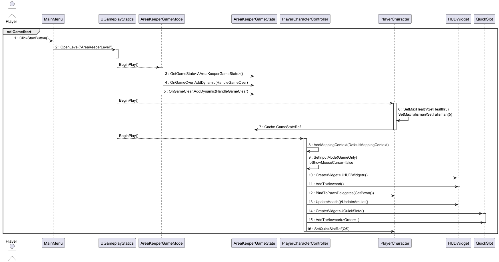

**[그림 4-1]**

위 [그림 4-1]은 Player가 게임을 시작하는 Use case를 나타내는 Sequence diagram이다.
Player가 메인 메뉴 화면의 “시작하기” 버튼을 클릭하면 MainMenu 레벨을 종료하고 AreaKeeperLevel로 진입한다. 이 과정이 완료되면 엔진이 자동으로 BeginPlay()를 각 액터에 비동기로 호출한다.
우선, AreaKeeperGameMode는 BeginPlay()에서 GameState를 가져오고 이후에 발생할 GameOver와 GameClear 이벤트에 델리게이트를 등록한다.
그 다음으로, PlayerCharacter의 체력, 부적의 초기값을 설정한다. 이후 GameState 참조를 캐싱해서 게임 내 이벤트에서 사용할 수 있도록 한다.
마지막으로, PlayerCharacterController에 WASD, 마우스 등 키 입력이 인식되도록 입력 매핑 컨텍스트를 등록한다. 그리고 입력 모드를 “GameOnly”로 전환하고 마우스 커서를 숨긴다. 
컨트롤러는 체력, 부적 개수, 타이머 등의 정보를 시각적으로 표시하는 HUD 위젯을 생성하고 화면에 표시한다.
그리고 Character의 체력/부적 개수 변화를 HUD에 실시간으로 반영하도록 연결한다.
마지막으로 퀵슬롯 UI를 생성해 화면에 표시하고 Character에게 해당 퀵슬롯의 참조를 넘겨서 SelectQuickSlot 기능을 사용할 수 있게 한다.

# 4.2 KeyMovement
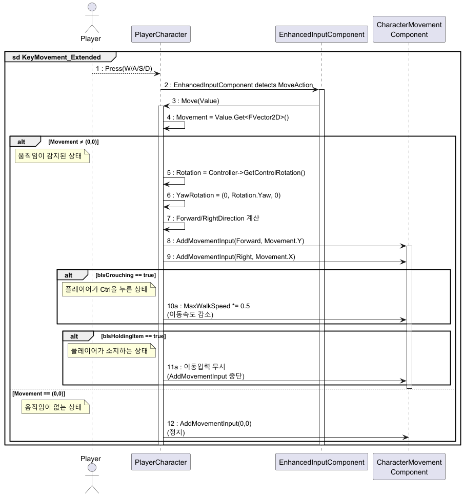

**[그림 4-2]**

[그림 4-2]는 Player가 키보드를 통해 이동 입력을 넣었을 때, 그에 따라 캐릭터가 물리적으로 움직이는 과정을 나타내는 Sequence diagram이다.
Player가 W/A/S/D 키를 누르면 엔진은 입력 이벤트를 PlayerCharacter의 EnhancedInputComponent에 전달한다.
EnhancedInputComponent는 MoveAction이 트리거된 것을 감지하고, 미리 바인딩되어 있던 APlayerCharacter::Move(const FInputActionValue& Value) 함수를 호출한다.
Move 함수 내부에서는 입력 값에서 2차원 이동 벡터를 추출해 Movement에 저장한다.
YawRotation에 GetControlRotation 값을 가져와 Yaw(좌우 회전) 성분만 남겨 저장한다.
이 회전값을 기준으로 ForwardDirection와 RightDirection을 계산한 뒤, 입력 벡터의 Y값을 전방 방향으로, X값을 오른쪽 방향으로 전달하여 AddMovementInput ()을 호출한다. 이 과정을 통해 CharacterMovementComponent가 실제 이동을 수행한다.
입력 벡터가 (0,0)일 경우, AddMovementInput()의 스케일이 0이 되어 캐릭터는 정지 상태를 유지한다.
또한, 플레이어가 웅크린 상태(bIsCrouching == true)일 경우 이동 속도를 50%로 감소시켜 느린 보행 상태로 전환되며, 소지 상태(bIsHoldingItem == true)에서는 AddMovementInput() 호출 자체를 생략하여 이동 입력이 반영되지 않는다.

# 4.3 MouseMovement
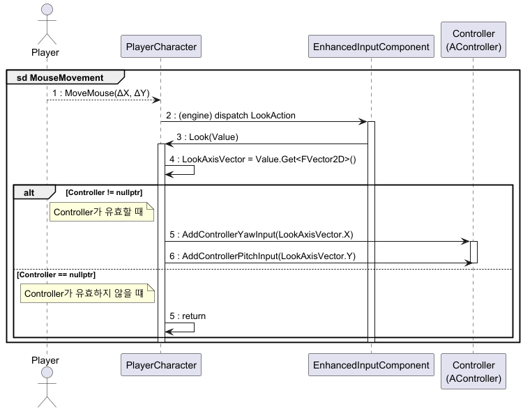

**[그림 4-3]**

[그림 4-3]은 Player가 마우스를 움직였을 때 시점 회전을 처리하는 Use case를 나타내는 Sequence diagram이다.
Player가 마우스를 이동하면 엔진은 입력 이벤트를 PlayerCharacter의 입력 컴포넌트로 전달하고, EnhancedInput 시스템이 LookAction을 트리거한다.
PlayerCharacter는 SetupPlayerInputComponent()에서 LookAction을 APlayerCharacter::Look(const FInputActionValue& Value) 함수에 바인딩해 두었기 때문에, LookAction이 발동되면 곧바로 Look() 함수가 호출된다.
Look() 함수 내부에서는 먼저 입력 값에서 2차원 시점 이동 벡터를 추출해 LookAxisVector에 저장한다. . 이후 Controller 포인터가 유효한지 확인한 뒤, X축 입력을 AddControllerYawInput 함수에, Y축 입력을 AddControllerPitchInput 함수에 전달하여 카메라의 좌우와 위아래 회전을 반영한다.

# 4.4 FlashlightControl
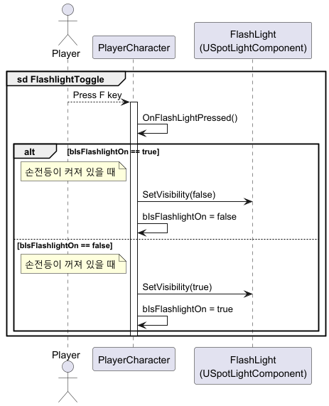

**[그림 4-4]**

[그림 4-4]는 Player가 F 키를 눌러 손전등을 켜거나 끄는 Use case를 나타내는 Sequence diagram이다.
Player가 F 키를 누르면 입력 이벤트는 IsFlahsLightOn의 값에 따라 분기가 나누어진다. 만약 손전동이 켜져있다면 SetVisibility(false)로 FlashLight가 보이지 않게하고 bIsFlashlightOn 변수에 false를 저장한다.
반대로 손전등이 꺼져있다면 SetVisibility(true)로 FlashLight가 보이게 하고 bIsFlashlightOn 변수에 true를 저장한다.

# 4.5 InventoryManagement
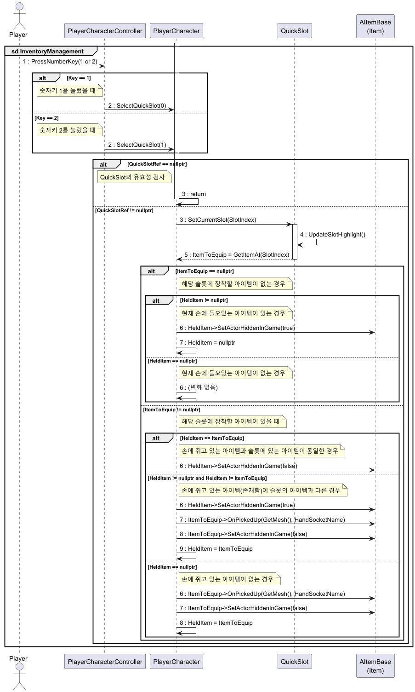

**[그림 4-5]**

[그림 4-5]는 Player가 숫자키를 눌러 퀵슬롯에 등록된 아이템을 장착하거나 해제하는 Use case를 나타내는 Sequence diagram이다.
Player가 숫자키 1 또는 2를 누르면 PlayerCharacterController는 입력된 키에 따라 SelectQuickSlot(0 또는 1)을 PlayerCharacter에 호출한다.
PlayerCharacter는 먼저 QuickSlotRef가 유효한지 검사한다. 유효하지 않다면 더 이상 처리를 진행하지 않고 함수를 종료한다. 유효한 경우에는 QuickSlot 위젯의 SetCurrentSlot (SlotIndex)를 호출하여 현재 선택된 슬롯 인덱스를 갱신하고, 내부적으로 UpdateSlot Highlight()를 통해 UI 하이라이트를 갱신한다. 이후 GetItemAt(SlotIndex)를 통해 해당 슬롯에 등록된 아이템 포인터(ItemToEquip)를 가져온다.
해당 슬롯에 장착할 아이템이 없는 경우(ItemToEquip ==  nullptr)에는 현재 손에 들고 있는 아이템(HeldItem)이 존재하는지 검사한다. HeldItem이 있을 경우 SetActorHiddenInGame(true)를 호출하여 월드에서 숨기고, HeldItem 포인터를 nullptr로 초기화하여 더 이상 어떤 아이템도 들고 있지 않은 상태로 만든다. HeldItem == nullptr이라면 추가적인 변화 없이 함수를 종료한다.
슬롯에 장착할 아이템이 존재하는 경우(ItemToEquip != nullptr)에는 먼저 이 아이템이 현재 손에 들고 있는 아이템과 동일한지 검사한다. 만약 HeldItem == ItemToEquip라면, 이미 쥐고 있던 아이템을 다시 보이게 하기 위해 SetActorHiddenInGame(false)만 호출하고 함수를 종료한다.
그 외의 경우에는, 먼저 기존에 들고 있던 아이템이 있다면 SetActorHiddenInGame(true)로 숨긴 뒤, 새로 선택된 아이템(ItemToEquip)에 대해 OnPickedUp 함수를 호출하여 플레이어의 손 소켓에 부착한다. 이후 ItemToEquip->SetActorHiddenInGame(false)를 호출하여 새 아이템을 화면에 표시하고, 마지막으로 HeldItem 포인터를 ItemToEquip로 갱신하여 현재 손에 들고 있는 아이템 정보를 최신 상태로 유지한다.

# 4.6 GetItem
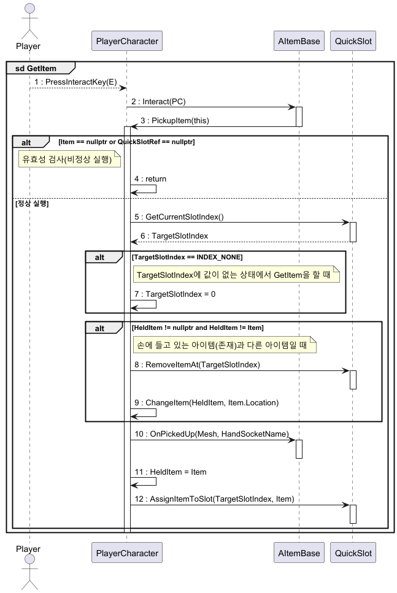

**[그림 4-6]**

[그림 4-6]은 Player가 상호작용 키(E)를 눌러 아이템을 획득하는 Use case를 나타내는 Sequence diagram이다.
Player가 E 키를 누르면 PlayerCharacter는 현재 시야에 포커스된 오브젝트를 검사하고, 그 대상이 AItemBase 계열의 아이템인 경우 해당 아이템의 Interact(PC)를 호출한다. 아이템의 Interact 구현에서는 다시 PlayerCharacter의 PickupItem(this)를 호출하여 실제 획득 로직을 위임한다.
PickupItem 함수 내부에서는 먼저 전달된 아이템 포인터와 QuickSlotRef가 유효한지 검사한다. 둘 중 하나라도 nullptr이면 더 이상 처리하지 않고 함수를 종료한다. 둘 다 유효한 경우,GetCurrentSlotIndex 함수로 퀵슬롯 위젯에서 현재 선택된 슬롯 인덱스를 가져오고, 그 값이 INDEX_NONE인 경우 0번 슬롯으로 초기화한다.
이후 이미 HeldItem이 존재하고, 그것이 새로 집으려는 아이템과 다른 경우에는 해당 슬롯에서 이전 아이템을 제거하기 위해 RemoveItemAt 함수를 호출한다. 이어서 ChangeItem 함수를 호출하여 기존 아이템에 대해 OnDropped 처리 및 월드 상 위치 이동을 수행함으로써 실제로 아이템을 바닥에 내려놓는 동작을 구현한다
그 다음으로 새로 집을 아이템에 대해 OnPickedUp 함수를 호출하여 플레이어의 손 소켓에 부착하고, HeldItem 포인터를 이 아이템으로 갱신한다. 마지막으로 AssignItemToSlot 함수를 호출해 퀵슬롯 데이터에 현재 장착된 아이템 정보를 반영한다.

# 4.7 DropItem
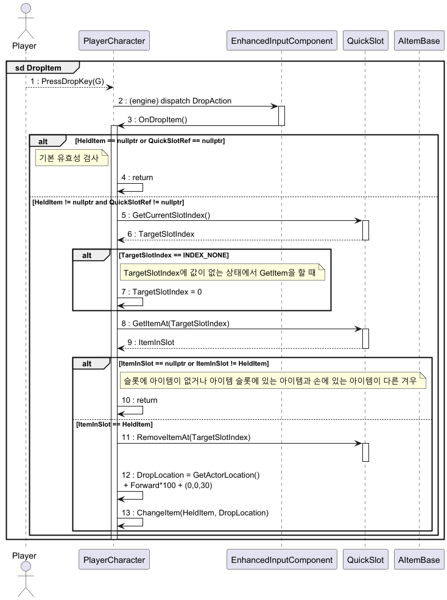

**[그림 4-7]**

[그림 4-7]은 Player가 G 키를 눌러 손에 들고 있는 아이템을 버리는 Use case를 나타내는 Sequence diagram이다.
OnDropItem 함수 내부에서는 먼저 HeldItem과 QuickSlotRef가 유효한지 검사한다. 둘 중 하나라도 nullptr인 경우에는 더 이상 처리하지 않고 함수를 종료한다. 두 포인터가 모두 유효한 경우, GetCurrentSlotIndex 함수의 값을 TargetSlotIndex에 저장한다. 만약, 그 값이 INDEX_NONE이면 0번 슬롯으로 초기화한다.
이후 해당 슬롯에 어떤 아이템이 들어 있는지 확인하기 위해 GetItemAt() 함수를 호출한다. 슬롯에 등록된 아이템이 없거나, 슬롯의 아이템이 현재 손에 들고 있는 아이템과 다를 경우에는 잘못된 상태로 판단하고 추가 로직 없이 바로 함수를 종료한다. 반대로, 슬롯 안의 아이템이 HeldItem과 동일한 경우에는 RemoveItemAt 함수를 호출하여 퀵슬롯 데이터에서 해당 아이템을 제거한다.
그 다음, 드랍 위치를 계산한다. 드랍 위치는 플레이어의 현재 위치에서 Forward * 100만큼 떨어진 지점에, 약간의 높이 (0,0,30)를 더한 좌표로 설정된다. 계산된 드랍 위치와 HeldItem을 인자로 하여 ChangeItem 함수를 호출하면, ChangeItem 내부에서 HeldItem에 대해 OnDropped 함수를 실행하고, 액터 위치를 드랍 위치로 옮기며, 마지막으로 HeldItem 포인터를 nullptr로 설정하여 더 이상 아이템을 들고 있지 않은 상태로 만든다.

# 4.8 AnomalyManagement
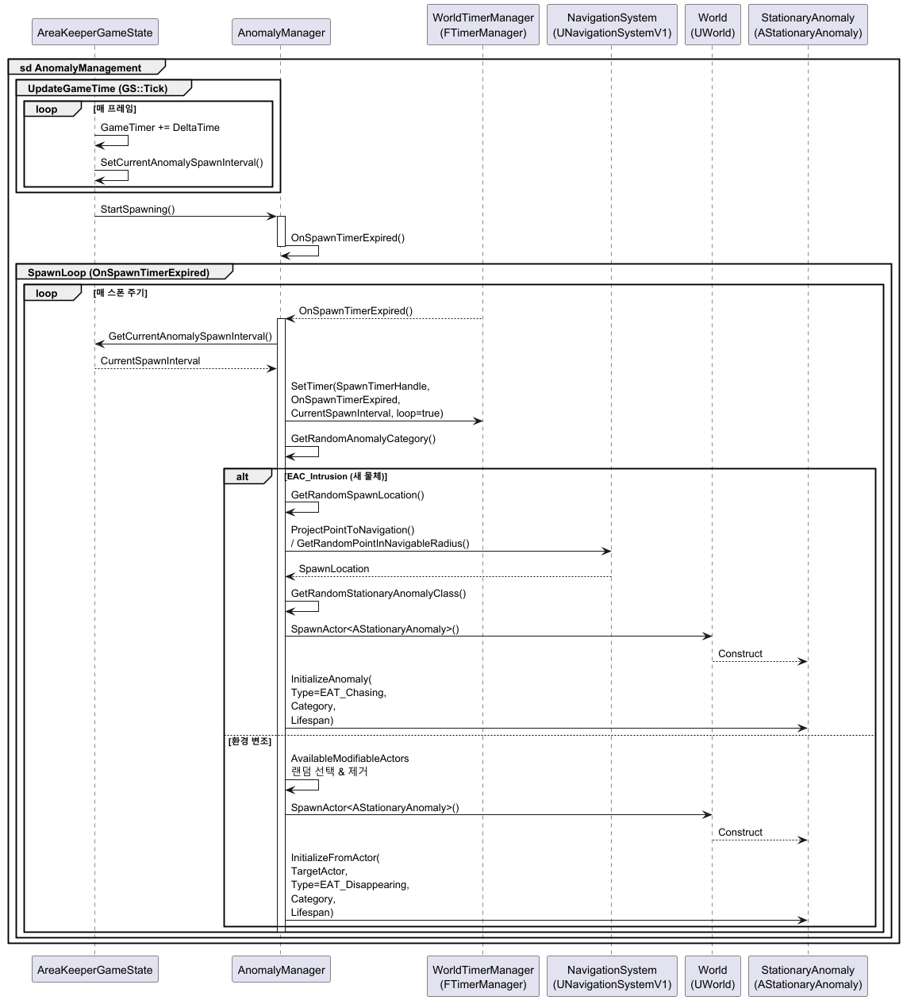

**[그림 4-8]**

[그림 4-8]은 게임 진행 중 정지형 이상현상(AStationaryAnomaly)을 관리하고 생성하는 과정을 나타낸 Sequence Diagram이다.
먼저 AreaKeeperGameState는 매 프레임 Tick 함수에서 GameTimer를 증가시키고, SetCurrentAnomalySpawnInterval()을 호출하여 게임 경과 시간에 따라 이상현상 스폰 간격을 동적으로 갱신한다. 이 값은 이후 실제 스폰 주기를 결정하는 기준으로 사용된다.
게임이 본격적인 플레이 상태로 전환되면, AreaKeeperGameState는 레벨에 배치된 AnomalyManager의 StartSpawning() 함수를 호출한다. AnomalyManager는 첫 스폰을 지연 없이 수행하기 위해 즉시 OnSpawnTimerExpired()를 한 번 호출한다.
OnSpawnTimerExpired()는 이상현상 스폰 루프의 핵심 콜백이다. 함수가 호출되면 먼저 GameState로부터 최신 스폰 간격(GetCurrentAnomalySpawnInterval)을 가져온 뒤, FTimerManager::SetTimer를 통해 동일한 콜백을 해당 간격으로 다시 등록한다. 이를 통해 스폰 주기가 게임 진행 상황에 따라 지속적으로 변화하도록 설계되어 있다.
이후 AnomalyManager는 GetRandomAnomalyCategory()를 호출하여 생성할 정지형 이상현상의 범주를 결정한다. 범주가 EAC_Intrusion인 경우에는 새로운 물체 형태의 이상현상을 생성하며, 이때 GetRandomSpawnLocation()과 UNavigationSystemV1을 이용해 NavMesh 상의 유효한 위치를 계산한 뒤 SpawnActor<AStationaryAnomaly>를 호출한다. 생성된 이상현상은 InitializeAnomaly()를 통해 타입, 범주, 유지 시간이 설정된다.
반면 환경 변조 계열 범주가 선택된 경우에는, AvailableModifiableActors 목록에서 기존 월드 액터를 하나 선택하여 제거한 뒤, 동일한 위치에 정지형 이상현상을 스폰한다. 이 경우 InitializeFromActor()를 통해 원본 액터의 숨김, 변조, 패널티 성격의 이상현상 초기화가 한 번에 처리된다.
이러한 과정을 통해 AnomalyManager는 새 물체 생성형 이상현상과 환경 변조형 이상현상을 상황에 맞게 분기 생성하며, 모든 스폰은 동일한 타이머 기반 루프 안에서 일관되게 관리된다.

# 4.9 StationaryUnSolvedManagement
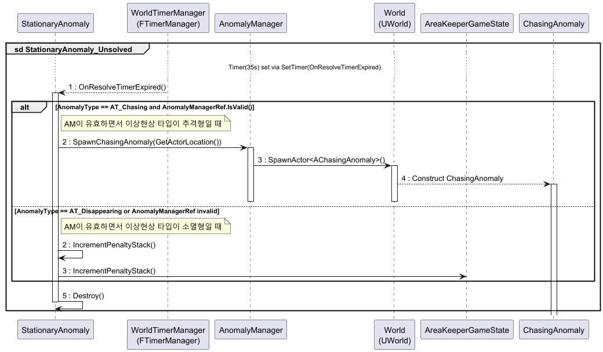

**[그림 4-9]**

[그림 4-9]는 정지형 이상현상이 생성된 이후 35초 동안 해결되지 못했을 때 발생하는 “미해결(실패)” 처리 흐름을 나타내는 Sequence diagram이다.
정지형 이상현상은 생성 시 GetWorldTimerManager().SetTimer 함수를 통해 35초 후 OnResolveTimerExpired 함수가 호출되도록 Lifespan 타이머를 등록한다. 플레이어가 이 시간 내에 소지 의식을 완료하지 못하면, WorldTimerManager가 등록된 타이머를 트리거하여 StationaryAnomaly의 OnResolveTimerExpired 함수를 실행한다.
이 함수 내부에서는 이상현상의 유형(AnomalyType)에 따라 두 가지 경로로 나뉜다.
AT_Chasing 타입일 경우, 이상현상은 해결되지 않은 상태로 간주되어 AnomalyManager::SpawnChasingAnomaly 함수를 호출한다. AnomalyManager는 SpawnActor<AChasingAnomaly> 함수를  통해 동일 위치에 ChasingAnomaly(추적형 이상 현상)을 새로 생성하며, 정지형 이상현상은 이후 제거된다.
AT_Disappearing 타입일 경우, 추적형 변이 없이 단순히 사라지며, IncrementPenaltyStack 함수를 호출해 GameState의 패널티 스택을 1 증가시킨다. GameState는 누적된 스택 수를 감시하여 필요 시 Game Over 조건을 판단한다.
두 경우 모두 마지막에 Destroy()를 호출해 해당 이상현상을 월드에서 제거한다.

# 4.10 ChasingInteraction
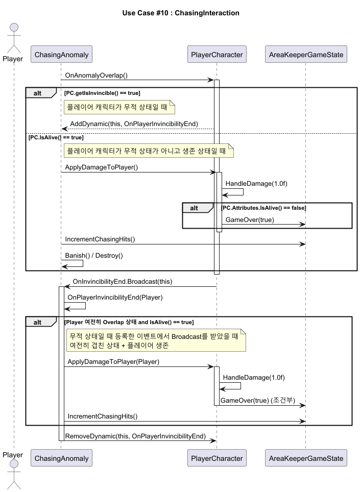

**[그림 4-10]**

[그림 4-10]은 추적형 이상현상(ChasingAnomaly)이 플레이어와 접촉할 때 발생하는 상호작용 과정을 나타내는 Sequence diagram이다.
이상현상은 플레이어와 충돌 시 OnAnomalyOverlap 함수를 호출한다. 이때 플레이어가 무적 상태인 경우 즉시 데미지를 적용하지 않고, PlayerCharacter의 OnInvincibilityEnd 델리게이트 에 AChasingAnomaly::OnPlayerInvincibilityEnd()를 동적으로 등록하여 무적 해제 시점을 감지하도록 한다.
반대로 무적 상태가 아니라면 플레이어의 생존 여부를 검사한 뒤 ApplyDamageToPlayer 함수 를 호출한다. 이 함수 내부에서는 HandleDamage(1.0f)를 통해 체력을 1 감소시키고, 일정 시간(1초) 동안 무적 상태를 부여한다. 이후 GameState::IncrementChasingHits()로 통계 데이터를 갱신하며, 자신(ChasingAnomaly)은 Banish()를 호출해 제거된다. 만약 체력이 모두 소진된 경우 GameState::GameOver(true)를 호출하여 사망 처리를 수행한다.
일정 시간이 지나 플레이어의 무적이 해제되면, PlayerCharacter가 OnInvincibilityEnd.Broadc ast(this)를 호출한다. 이를 통해 AChasingAnomaly::OnPlayerInvincibilityEnd(Player)가 실행되며, 이 함수는 플레이어가 여전히 콜라이더 안에 겹쳐 있는지 확인한 후 다시 한 번 ApplyDamageToPlayer(Player)를 호출한다. 이때 재피격이 발생하면 체력 감소와 함께 GameOver 혹은 IncrementChasingHits 함수가 동일하게 수행된다.
마지막으로, 이벤트 핸들러가 중복 호출되지 않도록 RemoveDynamic을 통해 델리게이트 구독을 해제한다.
 

# 4.11 StationaryInteraction
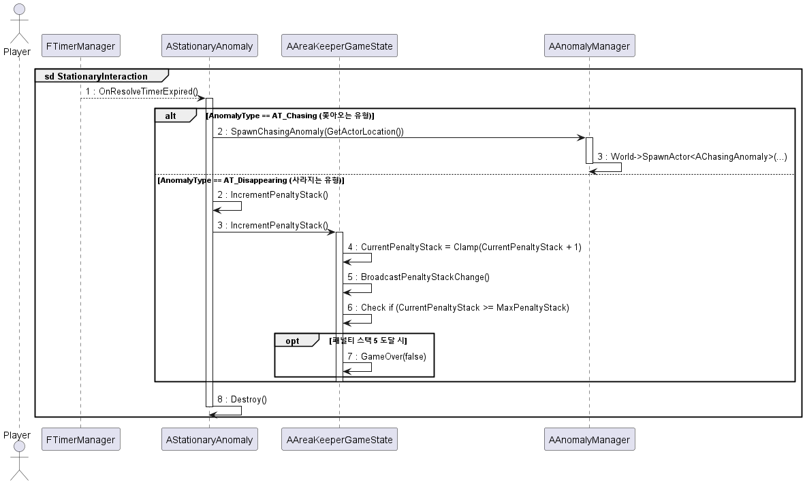

**[그림 4-11]**

[그림 4-11]은 정지형 이상현상(AStationaryAnomaly)이 생성된 이후 35초 동안 해결되지 못했을 때 발생하는 "미해결(실패)" 처리 흐름을 나타내는 Sequence diagram이다.
정지형 이상현상은 생성 시 FTimerManager를 통해 35초 후 OnResolveTimerExpired 함수가 호출되도록 Lifespan 타이머를 등록한다. 플레이어가 이 시간 내에 '소지'를 완료하지 못하면, FTimerManager가 등록된 타이머를 트리거하여 AStationaryAnomaly의 OnResolveTimerExpired 함수를 실행한다.
이 함수 내부에서는 이상현상의 유형(AnomalyType)에 따라 두 가지 경로로 나뉜다.
 - AT_Chasing 타입일 경우 (쫓아오는 유형): AAnomalyManager의 SpawnChasingAnomaly 함수를 호출한다. AnomalyManager는 World->SpawnActor<AChasingAnomaly>를 통해 동일 위치에 AChasingAnomaly(추적형 이상현상)를 새로 생성한다.
 - AT_Disappearing 타입일 경우 (사라지는 유형): AAnomalyManager를 호출하는 대신, IncrementPenaltyStack 함수를 호출해 AAreaKeeperGameState의 패널티 스택을 1 증가시킨다. GameState는 스택 증가 후 현재 스택이 5개 이상인지 확인(Check if CurrentPenaltyStack >= MaxPenaltyStack)하고, 조건 충족 시 GameOver(false)를 호출하여 '패널티 게임 오버' 유스케이스를 트리거한다.
두 경우 모두 마지막에 Destroy()를 호출하여 타이머가 만료된 기존의 AStationaryAnomaly(정지형 이상현상)를 월드에서 제거한다.

# 4.12 PenaltyManagement
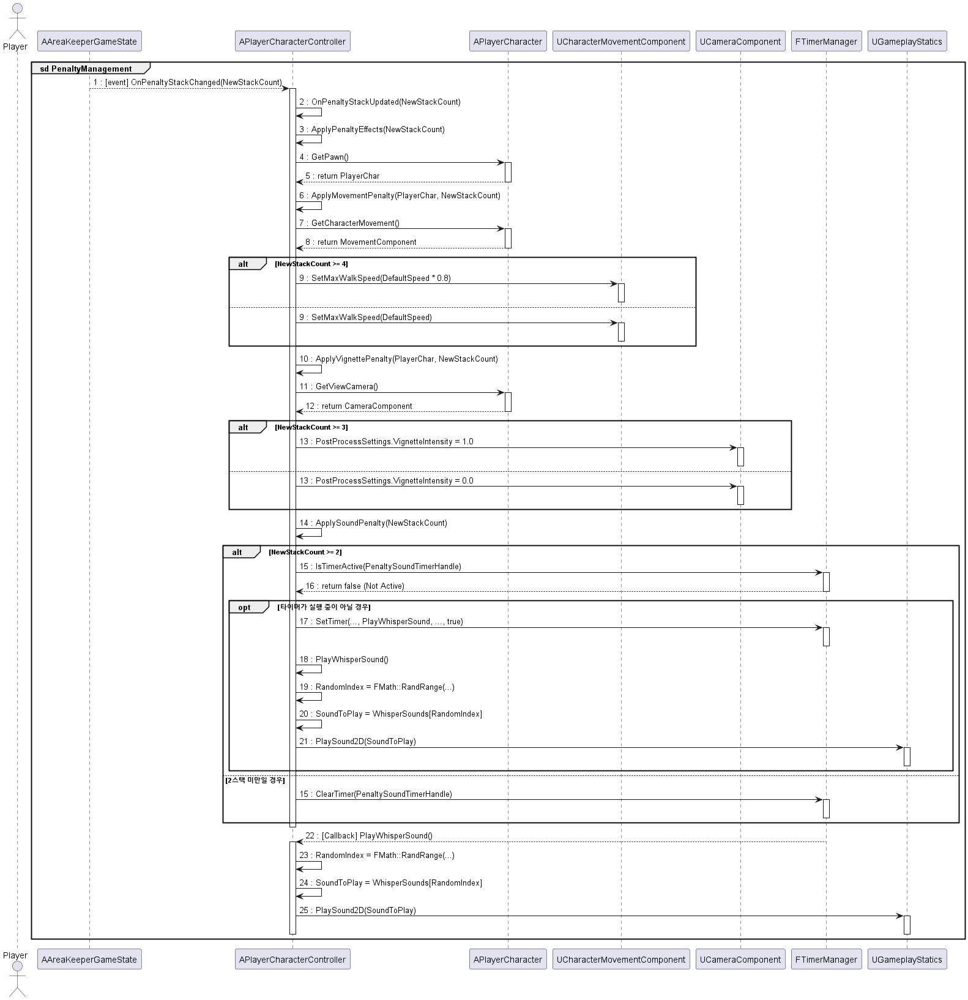

**[그림 4-12]**

[그림 4-12]는 AAreaKeeperGameState의 패널티 스택이 변경되었을 때, APlayerCharacterController가 이를 감지하여 플레이어에게 실제 패널티 효과를 적용하거나 해제하는 과정을 나타내는 Sequence diagram이다.
AAreaKeeperGameState가 IncrementPenaltyStack 또는 DecrementPenaltyStack 함수로 인해 스택이 변경되면, OnPenaltyStackChanged 델리게이트를 브로드캐스트한다. APlayerCharacterController는 BeginPlay 시점에 이 델리게이트에 OnPenaltyStackUpdated 함수를 바인딩해 두었으므로, 이 함수가 새 스택 수(NewStackCount)와 함께 자동으로 호출된다.
OnPenaltyStackUpdated는 내부적으로 ApplyPenaltyEffects 함수를 호출하며, 이 함수는 다시 세 개의 보조 함수(ApplyMovementPenalty, ApplyVignettePenalty, ApplySoundPenalty)로 나뉘어 각 패널티를 독립적으로 처리한다.
 - ApplyMovementPenalty: NewStackCount >= 4인지 확인한다. 4스택 이상이면 APlayerCharacter의 UCharacterMovementComponent를 찾아 MaxWalkSpeed를 DefaultSpeed * 0.8 (20% 감소)로 설정한다. 4스택 미만(else)이면 DefaultSpeed로 복구한다.
 - ApplyVignettePenalty: NewStackCount >= 3인지 확인한다. 3스택 이상이면 APlayerCharacter의 UCameraComponent를 찾아 PostProcessSettings.VignetteIntensity를 1.0으로 설정한다. 3스택 미만(else)이면 0.0으로 복구한다.
 - ApplySoundPenalty: NewStackCount >= 2인지 확인한다. 2스택 이상이면 FTimerManager의 IsTimerActive를 호출하여 PenaltySoundTimerHandle이 이미 실행 중인지 확인하고, 실행 중이 아닐 경우에만 SetTimer를 호출하여 PlayWhisperSound 콜백 함수를 주기적(반복)으로 등록한다. else (2스택 미만)의 경우, 즉시 ClearTimer를 호출하여 반복 사운드를 중지시킨다.
타이머가 실행되면, FTimerManager는 주기적으로 PCC::PlayWhisperSound를 호출한다. 이 함수는 WhisperSounds 배열에서 FMath::RandRange로 랜덤 인덱스를 선택한 뒤, UGameplayStatics::PlaySound2D를 통해 해당 사운드를 재생한다.

# 4.13 CharacterHealthManagement 
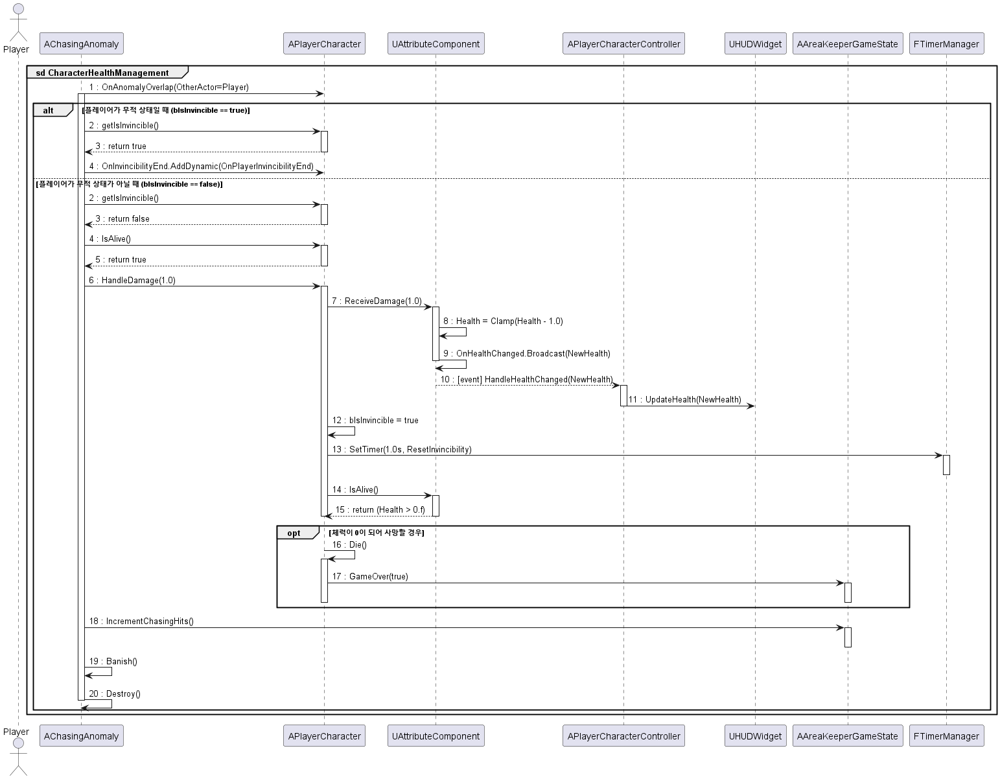

**[그림 4-13]**

[그림 4-13]은 추적형 이상현상(AChasingAnomaly)이 플레이어와 접촉할 때 발생하는 피해 상호작용 과정을 나타내는 Sequence diagram이다.
이상현상은 플레이어와 충돌 시 OnAnomalyOverlap 함수를 호출한다.
 - 플레이어가 무적 상태일 경우 (getIsInvincible() == true): 즉시 데미지를 적용하지 않고, APlayerCharacter의 OnInvincibilityEnd 델리게이트에 AChasingAnomaly::OnPlayerInvincibilityEnd 함수를 동적으로 등록하여 무적 해제 시점을 감지하도록 한다.
 - 플레이어가 무적 상태가 아닐 경우 (getIsInvincible() == false): 플레이어의 생존 여부(IsAlive)를 검사한 뒤 APlayerCharacter::HandleDamage(1.0f)를 호출한다.
HandleDamage 함수는 UAttributeComponent::ReceiveDamage(1.0f)를 호출하여 체력을 1 감소시키고, OnHealthChanged 델리게이트를 브로드캐스트한다. 이 델리게이트를 수신한 APlayerCharacterController는 UHUDWidget::UpdateHealth를 호출하여 UI를 갱신한다. 동시에 APlayerCharacter는 bIsInvincible = true로 설정하고, FTimerManager를 통해 1초 뒤 ResetInvincibility를 호출하는 타이머를 등록한다.
HandleDamage가 반환된 후, AChasingAnomaly는 AAreaKeeperGameState::IncrementChasingHits를 호출하여 통계 데이터를 갱신하며, 자신은 Banish() (내부적으로 Destroy())를 호출해 제거된다.
만약 HandleDamage 내부에서 체력 감소 후 Attr::IsAlive()가 false를 반환하면(사망 시), APlayerCharacter::Die()가 호출되고, 이는 AAreaKeeperGameState::GameOver(true)를 호출하여 '사망 게임 오버' 유스케이스를 트리거한다.

# 4.14 ToolUsage
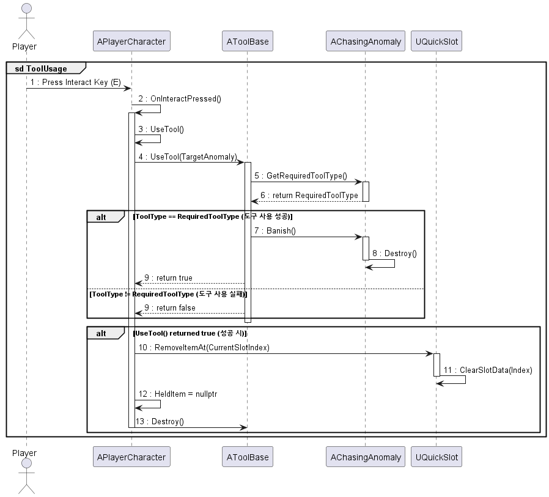

**[그림 4-14]**

[그림 4-14]는 플레이어가 손에 든 도구(AToolBase)를 사용하여 '쫓아오는 이상현상'(AChasingAnomaly)을 제거하는 과정을 나타내는 Sequence diagram이다.
플레이어가 AChasingAnomaly를 바라보며 E키를 누르면, APlayerCharacter::OnInteractPressed 함수가 호출된다. 이 함수는 현재 HeldItem이 '도구'이고 바라보는 대상이 AChasingAnomaly임을 확인한 뒤, APlayerCharacter::UseTool() 함수를 호출한다.
UseTool 함수는 손에 든 AToolBase의 UseTool(TargetAnomaly) 함수를 호출한다. AToolBase는 AChasingAnomaly::GetRequiredToolType()을 호출하여 대상이 요구하는 도구 타입을 반환받는다.
 - 도구 타입이 일치할 경우 (성공): ToolType == RequiredToolType이 true가 되어, AChasingAnomaly::Banish() (내부적으로 Destroy())를 호출하여 이상현상을 제거하고, APlayerCharacter에게 true를 반환한다.
 - 도구 타입이 일치하지 않을 경우 (실패): APlayerCharacter에게 false를 반환한다.
APlayerCharacter는 UseTool의 반환값을 확인한다.
 - true (성공)을 반환받은 경우: UQuickSlot::RemoveItemAt을 호출하여 퀵슬롯에서 아이템을 제거하고, HeldItem 참조를 nullptr로 변경하며, AToolBase::Destroy()를 호출하여 사용한 도구를 소모시킨다.
 - false (실패)를 반환받은 경우: 아무 작업도 수행하지 않고 함수를 종료하여, 도구가 소모되지 않도록 한다.

# 4.15 TalismanRitual
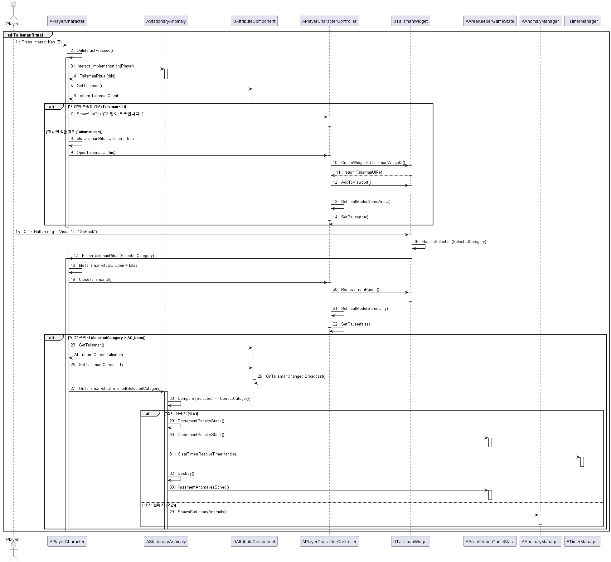

**[그림 4-15]**

[그림 4-15]는 플레이어가 '정지된 이상현상'(AStationaryAnomaly)을 '소지'로 해결하려는 시도 및 취소 과정을 나타내는 Sequence diagram이다.
플레이어가 AStationaryAnomaly를 바라보고 E키를 누르면, APlayerCharacter::OnInteractPressed가 AStationaryAnomaly::Interact_Implementation을 호출하고, 이는 다시 APlayerCharacter::TalismanRitual을 호출한다.
TalismanRitual 함수는 UAttributeComponent::GetTalisman()을 호출하여 '지방' 개수를 확인한다.
 - Talisman < 1 (지방 부족): APlayerCharacterController::ShowAutoText로 "지방이 부족합니다." 메시지를 표시하고 즉시 종료한다.
 - Talisman >= 1 (지방 있음): bIsTalismanRitualUIOpen = true로 설정하고 APlayerCharacterController::OpenTalismanUI를 호출한다. PCC는 UTalismanWidget을 CreateWidget하여 AddToViewport하고, SetInputMode(GameAndUI) 및 SetPause(true)로 게임을 일시 정지시킨다.
플레이어가 UTalismanWidget UI의 버튼을 클릭하면 HandleSelection(SelectedCategory)이 호출되고, 이는 APlayerCharacter::FinishTalismanRitual(SelectedCategory)을 호출한다. FinishTalismanRitual은 공통적으로 APlayerCharacterController::CloseTalismanUI를 호출하여 UI를 닫고 게임을 재개(SetInputMode(GameOnly), SetPause(false))한다.
이후 SelectedCategory 값에 따라 로직이 분기된다.
 - SelectedCategory == AC_None ('뒤로가기' 취소): 함수가 즉시 종료된다. (지방이 소모되지 않음)
 - SelectedCategory != AC_None (범주 선택): UAttributeComponent::SetTalisman을 호출하여 '지방'을 1개 소모하고, AStationaryAnomaly::OnTalismanRitualFinished(SelectedCategory)를 호출한다.
OnTalismanRitualFinished 내부에서 Anomaly가 Selected == CorrectCategory를 비교한다.
 - '소지' 성공 (정답): AAreaKeeperGameState::DecrementPenaltyStack (패널티 감소), FTimerManager::ClearTimer (미해결 타이머 제거), Destroy() (이상현상 소멸), AAreaKeeperGameState::IncrementAnomaliesSolved (통계 갱신)를 차례로 호출한다.
 - '소지' 실패 (오답): AAnomalyManager::SpawnStationaryAnomaly를 호출하여 새로운 이상현상을 즉시 스폰하는 패널티를 부여한다.

# 4.16 TalismanCharge
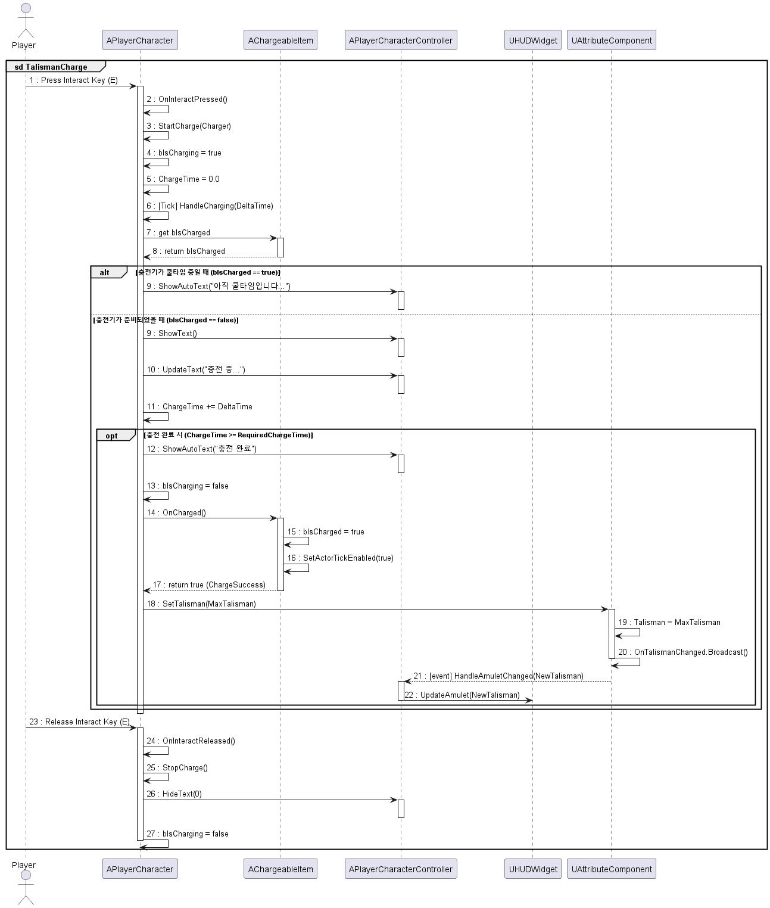

**[그림 4-16]**

[그림 4-16]은 플레이어가 2초 동안 E키를 눌러 '지방'을 충전하는 과정을 나타내는 Sequence diagram이다.
플레이어가 '지방 충전기'(AChargeableItem)를 바라보고 E키를 누르는 순간(Press Interact Key (E)), APlayerCharacter::OnInteractPressed가 호출되어 StartCharge 함수를 실행한다. 이 함수는 bIsCharging = true로 상태를 변경한다.
bIsCharging이 true인 동안, APlayerCharacter의 Tick은 매 프레임 HandleCharging(DeltaTime) 함수를 실행한다. HandleCharging은 먼저 AChargeableItem의 bIsCharged 변수(쿨타임 여부)를 get한다.
 - 쿨타임 중일 경우 (bIsCharged == true): APlayerCharacterController::ShowAutoText를 호출하여 "아직 쿨타임입니다..." 메시지를 표시하고 Tick 로직을 종료한다.
 - 준비된 경우 (bIsCharged == false): PCC::UpdateText("충전 중...")을 호출하고 ChargeTime += DeltaTime으로 시간을 누적시킨다.
누적된 ChargeTime이 RequiredChargeTime (2초) 이상이 되면 충전 완료(opt) 로직이 실행된다.
 1. PCC::ShowAutoText("충전 완료")를 호출한다.
 2. bIsCharging = false로 상태를 변경한다.
 3. AChargeableItem::OnCharged()를 호출한다.
 4. Charger는 bIsCharged = true로 설정하고 SetActorTickEnabled(true)를 호출하여 스스로 쿨타임 계산을 시작하며, true를 반환한다.
 5. APlayerCharacter는 UAttributeComponent::SetTalisman(MaxTalisman)을 호출하여 '지방'을 최대치로 채운다. (이는 OnTalismanChanged 델리게이트를 트리거하여 UHUDWidget::UpdateAmulet을 호출한다.)
만약 플레이어가 2초를 채우기 전에 E키를 떼면(Release Interact Key (E)), APlayerCharacter::OnInteractReleased가 호출되어 StopCharge 함수를 실행한다. 이 함수는 PCC::HideText로 "충전 중..." UI를 숨기고 bIsCharging = false로 설정하여 Tick 로직을 중단시킨다.

# 4.17 PauseGame
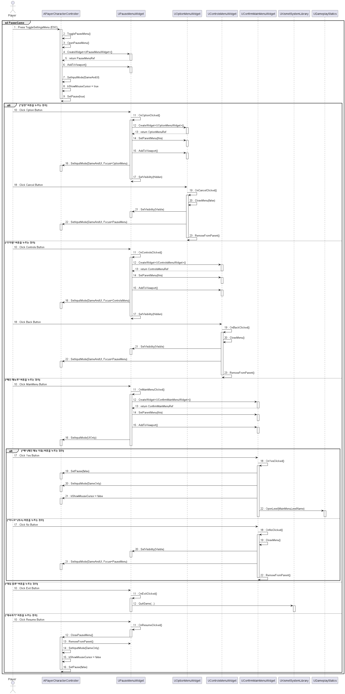

**[그림 4-17]**

[그림 4-17]은 플레이어가 일시 정지 메뉴를 열고, 메뉴 내의 5가지 버튼과 상호작용하는 전체 흐름을 나타내는 Sequence diagram이다.
플레이어가 ESC 키를 누르면 APlayerCharacterController::TogglePauseMenu가 호출된다. 메뉴가 닫혀있으므로 OpenPauseMenu가 실행되어 UPauseMenuWidget을 CreateWidget하고 AddToViewport한다. 이후 SetInputMode(GameAndUI)와 SetPause(true)를 통해 게임을 일시 정지하고 커서를 표시한다.
이후 플레이어의 버튼 클릭에 따라 5가지 경로(alt)로 나뉜다.
 - "설정" 클릭: OnOptionClicked가 UOptionMenuWidget을 생성하고(CreateWidget), SetParentMenu(this)로 부모를 설정한 뒤, AddToViewport 및 SetInputMode로 포커스를 넘긴다. PauseMenu 자신은 숨김(SetVisibility(Hidden)) 처리된다. (이후 18번 ConfigureSettings 유스케이스로 이어진다.)
 - "조작법" 클릭: OnControlsClicked가 UControlsMenuWidget을 생성하며, '설정'과 동일한 흐름으로 포커스를 넘기고 자신을 숨긴다.
 - "메인 메뉴로" 클릭: OnMainMenuClicked가 UConfirmMainMenuWidget(팝업)을 생성하고 SetParentMenu(this)로 설정한 뒤, AddToViewport 및 SetInputMode(UIOnly)를 호출한다.
  - 팝업에서 "예" 클릭: OnYesClicked가 SetPause(false), SetInputMode(GameOnly)로 게임 상태를 되돌린 후, UGameplayStatics::OpenLevel(MainMenuLevelName)로 메인 메뉴 레벨을 로드한다.
  - 팝업에서 "아니오" 클릭: OnNoClicked가 CloseMenu()를 호출한다. ParentMenu(PauseMenu)를 다시 보이게(SetVisibility(Visible))하고, SetInputMode(GameAndUI, Focus=PauseMenu)로 포커스를 복원한 뒤, 팝업(ConfirmMainMenu)은 RemoveFromParent된다.
 - "게임 종료" 클릭: OnExitClicked가 UKismetSystemLibrary::QuitGame()을 호출하여 게임을 즉시 종료한다.
 - "계속하기" 클릭: OnResumeClicked가 PCC::ClosePauseMenu()를 호출한다. PauseMenu는 RemoveFromParent되고, SetInputMode(GameOnly) 및 SetPause(false)를 통해 게임으로 복귀한다.

# 4.18 ConfigureSettings
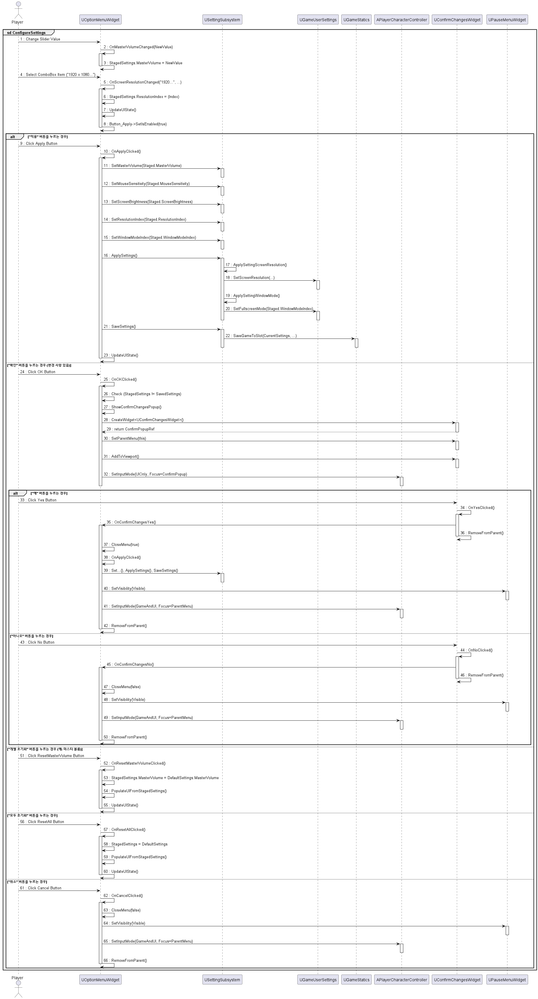

**[그림 4-18]**

[그림 4-18]은 '옵션 메뉴'(UOptionMenuWidget) 내에서 플레이어가 설정을 변경하고 저장, 취소, 초기화하는 상세 과정을 나타내는 Sequence diagram이다.
플레이어가 슬라이더나 콤보박스를 조작하면 OnMasterVolumeChanged, OnScreenResolutionChanged 등의 함수가 호출된다. 이 함수들은 변경된 값을 StagedSettings라는 임시 구조체 변수에 저장하고, UpdateUIState()를 호출하여 '적용' 버튼이나 '개별 초기화' 버튼의 활성화/가시성 상태를 갱신한다.
이후 플레이어의 버튼 클릭에 따라 여러 경로(alt)로 나뉜다.
 - "적용" 클릭: OnApplyClicked가 호출된다. StagedSettings의 모든 값을 USettingSubsystem의 SetMasterVolume, SetResolutionIndex 등의 함수로 전달한다. 이후 Subsystem::ApplySettings()를 호출하여 UGameUserSettings의 실제 엔진 설정을 변경하고, Subsystem::SaveSettings()를 호출하여 UGameplayStatics::SaveGameToSlot으로 변경 사항을 디스크에 저장한다.
 - "확인" 클릭 (변경 사항 있음): OnOKClicked가 ShowConfirmChangesPopup을 호출하여 UConfirmChangesWidget(팝업)을 생성하고 SetInputMode(UIOnly)로 포커스를 준다.
  - 팝업에서 "예" 클릭: OnConfirmChangesYes가 OptionMenu::CloseMenu(true)를 호출한다. CloseMenu(true)는 내부적으로 OnApplyClicked()를 호출하여 설정을 저장한 뒤, ParentMenu(PauseMenu)를 다시 표시하고 자신을 닫는다.
  - 팝업에서 "아니오" 클릭: OnConfirmChangesNo가 OptionMenu::CloseMenu(false)를 호출한다. OnApplyClicked()를 건너뛰어 변경 사항을 버리고, ParentMenu를 표시하고 자신을 닫는다.
 - "개별 초기화" 클릭: OnResetMasterVolumeClicked 등이 호출된다. StagedSettings의 해당 변수만 DefaultSettings 값으로 되돌리고, PopulateUIFromStagedSettings (UI 슬라이더 값 변경)와 UpdateUIState (버튼 상태 변경)를 호출한다.
 - "모두 초기화" 클릭: OnResetAllClicked가 호출된다. StagedSettings 구조체 전체를 DefaultSettings로 덮어쓰고, PopulateUIFromStagedSettings와 UpdateUIState를 호출한다.
 - "취소" 클릭: OnCancelClicked가 CloseMenu(false)를 호출하여 '확인' -> '아니오'와 동일하게 변경 사항을 버리고 메뉴를 닫는다.

# 4.19 GameOver
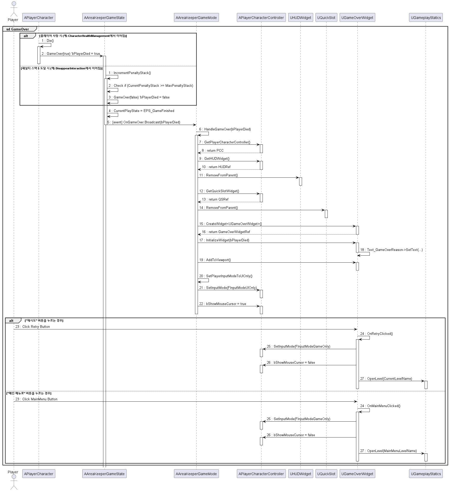

**[그림 4-19]**

[그림 4-19]는 게임 오버 조건이 충족되었을 때의 처리 흐름과, 게임 오버 화면에서의 플레이어 상호작용을 나타내는 Sequence diagram이다.
게임 오버는 두 가지 경로(alt)로 트리거된다.
 - 플레이어 사망 시: APlayerCharacter::Die() 함수가 AAreaKeeperGameState::GameOver(true)를 호출한다. (bPlayerDied = true)
 - 패널티 스택 5 도달 시: AAreaKeeperGameState::IncrementPenaltyStack 함수가 스택 5를 감지하고 AAreaKeeperGameState::GameOver(false)를 호출한다. (bPlayerDied = false)
GameState의 GameOver 함수는 CurrentPlayState를 EPS_GameFinished로 변경하고 OnGameOver 델리게이트를 브로드캐스트한다. AAreaKeeperGameMode는 HandleGameOver(bPlayerDied) 함수로 이 델리게이트를 수신하고, PCC의 GetHUDWidget, GetQuickSlotWidget을 통해 기존 UI 참조를 받아와 RemoveFromParent()로 제거한다.
이후 GameMode는 UGameOverWidget을 CreateWidget하고, GameOverUI::InitializeWidget(bPlayerDied)를 호출한다. InitializeWidget 함수는 전달받은 bPlayerDied 값에 따라 Text_GameOverReason 텍스트 블록에 "사망 (체력 0)" 또는 "이상현상 누적 (패널티 5)"을 설정한다. GameMode는 AddToViewport로 게임 오버 UI를 표시하고, SetPlayerInputModeToUIOnly를 호출하여 입력을 UI 모드로 전환한다.
플레이어가 게임 오버 화면에서 버튼을 클릭하면 다시 경로가 나뉜다.
 - "재시도" 클릭: OnRetryClicked가 SetInputMode(GameOnly)로 입력을 복원한 뒤, UGameplayStatics::OpenLevel(CurrentLevelName)을 호출하여 현재 레벨을 다시 로드한다.
 - "메인 메뉴로" 클릭: OnMainMenuClicked가 입력을 복원한 뒤, UGameplayStatics::OpenLevel(MainMenuLevelName)을 호출하여 메인 메뉴 레벨을 로드한다.

# 4.20 GameClear
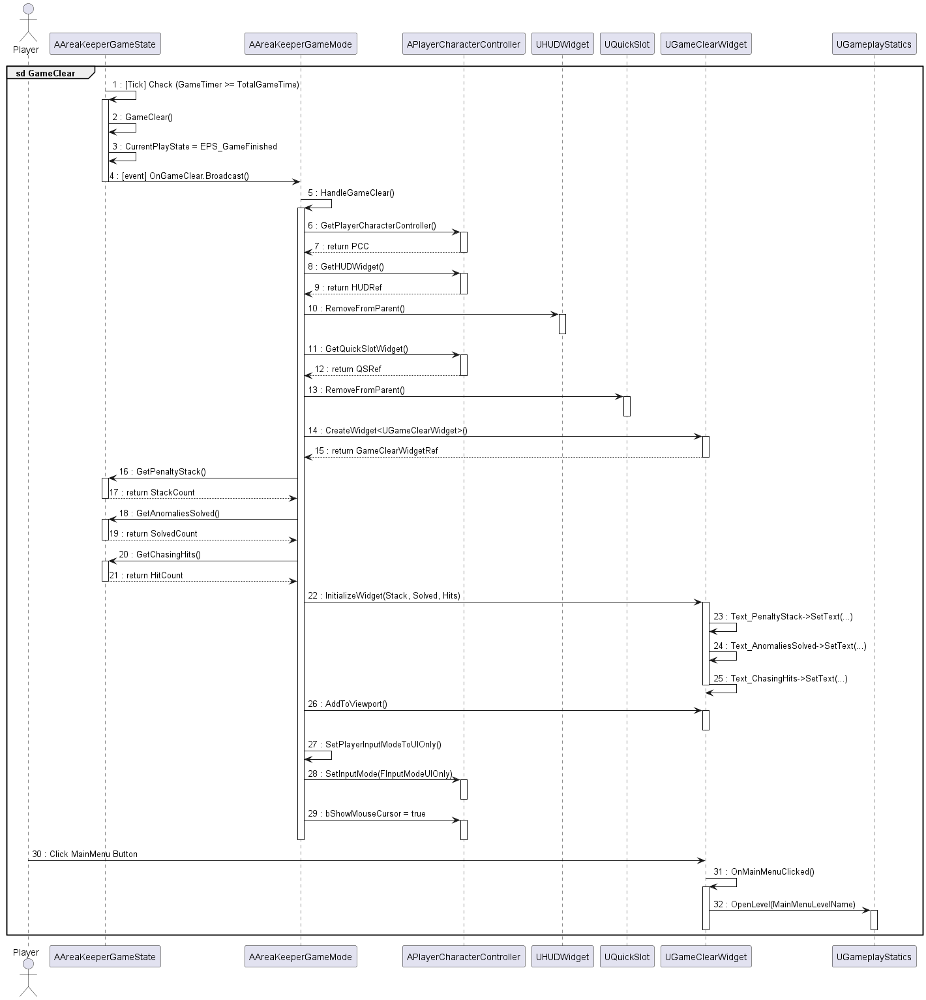

**[그림 4-20]**

[그림 4-20]은 게임 클리어 조건이 충족되었을 때의 처리 흐름과, 게임 클리어 화면에서의 통계 표시 과정을 나타내는 Sequence diagram이다.
AAreaKeeperGameState의 Tick 함수는 매 프레임 GameTimer를 확인하여, GameTimer >= TotalGameTime (20분) 조건을 감지하면 GameClear() 함수를 호출한다. GameClear 함수는 CurrentPlayState를 EPS_GameFinished로 변경하고 OnGameClear 델리게이트를 브로드캐스트한다.
AAreaKeeperGameMode는 HandleGameClear() 함수로 이 델리게이트를 수신하고, GameOver 유스케이스와 유사하게 기존 HUD와 QuickSlot UI를 제거한다. 이후 GameMode는 UGameClearWidget을 CreateWidget한다. GameMode는 GameState에 접근하여 GetPenaltyStack(), GetAnomaliesSolved(), GetChasingHits() 함수를 각각 호출하여 최종 통계 정보를 수집한다.
수집된 통계(Stack, Solved, Hits)는 GameClearUI::InitializeWidget 함수로 전달되며, 이 함수는 각 UTextBlock에 수집된 숫자(패널티 스택, 해결한 이상현상, 피격 횟수)를 텍스트로 설정한다. GameMode는 AddToViewport로 게임 클리어 UI를 표시하고, SetPlayerInputModeToUIOnly를 호출하여 입력을 UI 모드로 전환한다.
플레이어가 '메인 메뉴로' 버튼을 클릭하면 OnMainMenuClicked가 UGameplayStatics::OpenLevel(MainMenuLevelName)을 호출하여 메인 메뉴 레벨을 로드한다. 

