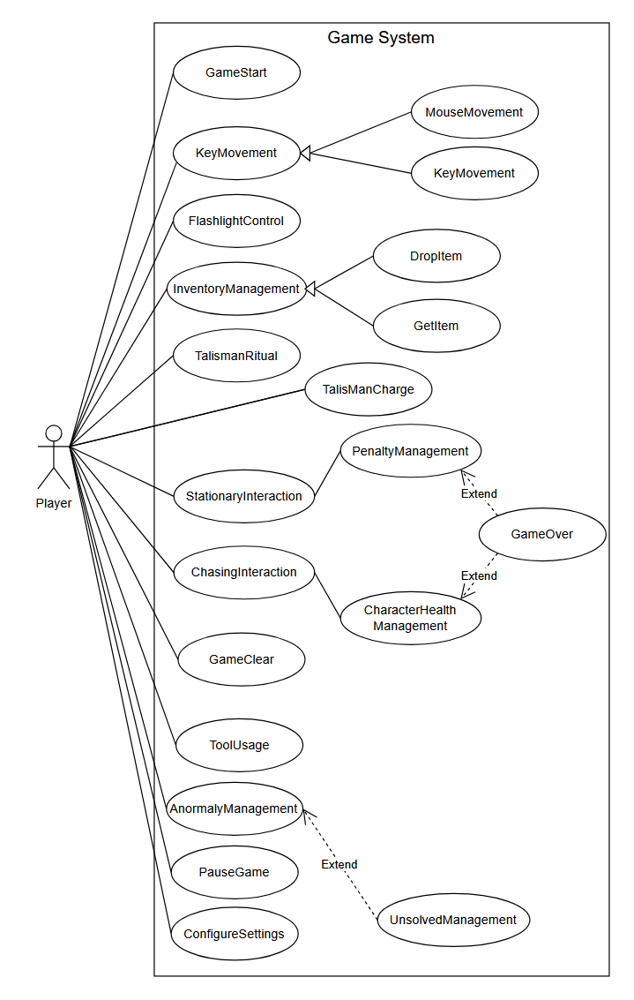

<h2>2. Use case analysis</h2>
 
이번 장은 'Area Keeper' 게임의 Use case diagram과 Use case description을 제공한다. 
Diagram 및 description에 관한 고려 사항은 다음과 같다. 
Use case diagram은 description에 대한 부가적인 결과물이다. 따라서 본 문서를 읽는 독자는 Use case diagram보다 Use case description에서 Use case에 대한 충분한 정보를 얻어야 한다. 
Use case diagram에 나타난 Use case는 모두 user-level use case이다. 
Player는 게임을 플레이하는 User이다. 
 
<h3>본 프로젝트의 Use case 목록은 다음과 같다. </h3>
1. GameStart: 게임 시작하기 (메인 메뉴에서 시작 및 준비 구역에서 스테이지 진입 포함) 
2. KeyMovement: 플레이어 키보드 조작을 제공한다. 
3. MouseMovement: 플레이어 시점 조작을 제공한다. 
4. FlashlightControl: 손전등 켜고 끄기 
5. InventoryManagement : 인벤토리 퀵슬롯 
6. GetItem : 도구를 습득하는 기능 
7. DropItem : 도구를 버리는 기능 
8. AnormalyManagement : 이상 현상 생성 관리 
9. UnsolvedManagement : 미해결이상현상관리 
10. ChasingInteraction : 쫓아오는 이상 현상 상호작용 
11. StationaryInteraction : 사라지는 이상 현상 상호작용 
12. PenaltyManagement : 이상현상 패널티에 대한 상호작용 
13. CharacterHealthManagement : 캐릭터체력에 대한 기능 
14. ToolUsage: 도구 사용 (쫓아오는 이상 현상 제거) 
15. TalismanRitual: 소지 수행 (정지된 이상 현상 해결 시도 및 취소) 
16. TalismanCharge: 지방 충전 
17. PauseGame: 일시 정지 메뉴 사용 (게임 일시 정지 및 메뉴 조작) 
18. ConfigureSettings: 옵션 설정 (메인 메뉴 또는 일시 정지 메뉴에서 설정 변경) 
19. GameOver: 게임 오버 조건 충족 
20. GameClear: 게임 클리어 조건 충족 

 

| **Use case #1 : GameStart** |  |
|:---:|:---:|
| **GENERAL CHARACTERISTICS** |  |
| **Summary** | 플레이어가 게임을 시작하게 해주는 기능 |
| **Scope** | Game System |
| **Level** | User Level |
| **Author** | 이강현 |
| **Last Update** | 2025-10-29 |
| **Status** | Analysis |
| **Primary Actor** | 게임 플레이어 |
| **Preconditions** | 플레이어는 게임 시작 버튼이 있는 화면에 위치 했다.  |
| **Trigger** | 플레이어가 게임 시작 기능을 가진 버튼을 누른다. |
| **Success Post Condition** | 게임 플레이 맵으로 넘어간다. |
| **Failed Post Condition** | 화면은 넘어가지 않고 플레이도 시작되지 않는다.  |
| **MAIN SUCCESS SCENARIO** |  |
| Step | Action |
| S | 플레이어가 게임을 시작한다. |
| 1 | 이 Use Case는 플레이어가 게임 시작 버튼을 누르게 되면 시작된다. |
| 2 | 게임 플레이 시작 화면으로 바뀐다. |
| 3 | 이 Use Case는 게임 플레이 화면으로 넘어가면 끝나게 된다.  |
| **EXTENSION SCENARIOS** |  |
| Step | - |
| - | - |
| **RELATED INFORMATION** |  |
| **Performance** | ≤ 4 seconds |
| **Frequency** | 플레이어 게임 플레이 전 평균 1번 |
| **<Concurrency>** | 제한없음 |
| **Due Date** |  |
|  |  |
| **Use case #2 : KeyMovement** |  |
| **GENERAL CHARACTERISTICS** |  |
| **Summary** | 캐릭터에게 각종 물리적 움직임을 제공하는 기능 |
| **Scope** | Game System |
| **Level** | User Level |
| **Author** | 이강현 |
| **Last Update** | 2025-10-29 |
| **Status** | Analysis |
| **Primary Actor** | 게임 플레이어 |
| **Preconditions** | 플레이어는 게임 플레이 중 이어야 한다. |
| **Trigger** | 플레이어가 키보드(w,a,s,d,c)를 누른다. |
| **Success Post Condition** | 입력된 키보드에 따라서 캐릭터가 움직인다.  |
| **Failed Post Condition** | 플레이어가 입력에 따라서 원하는 대로 움직이지 않는다. |
| **MAIN SUCCESS SCENARIO** |  |
| Step | Action |
| S | 플레이어가 입력하는 대로 움직인다. |
| 1 | 이 Use Case는 플레이어가 조작 키(w,a,s,d,c)를 누르게 되면 시작된다. |
| 2 | 플레이어가 움직이거나 앉게 된다. |
| 3 | 이 Use Case는 플레이어가 키보드의 입력을 멈추는 순간 멈추게 된다. |
| **EXTENSION SCENARIOS** |  |
| Step | Branching Action |
| 1 | 1a. 캐릭터가 앉은 상태로 움직인다. …1a1. 캐릭터의 시점이 앉으면 시점이 낮아지고 이동속도가 약간 느려진다. …1a2. 낮아진 시점, 느려진 이동속도는 유지된 채로 움직인다. 1b. 플레이어가 소지를 하고 있다. …1b1. 소지 단계에 진입하게 되면 게임은 일시정지 되기 때문에 키보드를 눌러서 캐릭터를 움직일 수 없다. |
| **RELATED INFORMATION** |  |
| **Performance** | ≤ 1 second |
| **Frequency** | 제한없음 |
| **<Concurrency>** | 제한없음 |
| **Due Date** |  |
|  |  |
| **Use case #3 : MouseMovement** |  |
| **GENERAL CHARACTERISTICS** |  |
| **Summary** | 캐릭터에게 마우스를 통해서 시점 전환을 제공하는 기능 |
| **Scope** | Game System |
| **Level** | User Level |
| **Author** | 이강현 |
| **Last Update** | 2025-10-30 |
| **Status** | Analysis |
| **Primary Actor** | 게임 플레이어 |
| **Preconditions** | 플레이어는 게임 플레이 중 이어야 한다. |
| **Trigger** | 플레이어가 마우스를 움직인다. |
| **Success Post Condition** | 마우스 움직임에 따라서 플레이어의 시점이 움직인다. |
| **Failed Post Condition** | 입력된 움직임에 따라서 시점이 움직이지 않는다. |
| **MAIN SUCCESS SCENARIO** |  |
| Step | Action |
| S | 플레이어의 시점이 원하는 대로 움직인다. |
| 1 | 이 Use Case는 플레이어가 마우스를 움직이게 되면 시작된다. |
| 2 | 플레이어가 마우스를 움직인다. |
| 3 | 마우스의 움직임에 따라서 플레이어의 시점이 움직이게 된다. |
| 4 | 이 Use Case는 플레이어가 마우스를 움직이지 않게 되면 멈추게 된다. |
| **EXTENSION SCENARIOS** |  |
| Step | - |
| - | - |
| **RELATED INFORMATION** |  |
| **Performance** | ≤ 1 second |
| **Frequency** | 제한없음 |
| **<Concurrency>** | 제한없음 |
| **Due Date** |  |
|  |  |
| **Use case #4 : FlashlightControl** |  |
| **GENERAL CHARACTERISTICS** |  |
| **Summary** | 캐릭터에게 라이트 기능을 제공하는 기능 |
| **Scope** | Game System |
| **Level** | User Level |
| **Author** | 이강현 |
| **Last Update** | 2025-10-30 |
| **Status** | Analysis |
| **Primary Actor** | 게임 플레이어 |
| **Preconditions** | 플레이어는 게임 플레이 중 이어야 한다. |
| **Trigger** | 플레이어가 키보드 f키를 누른다. |
| **Success Post Condition** | 캐릭터의 플래시가 반대의 상태로 전환된다. |
| **Failed Post Condition** | 플래시가 현재 상태를 유지하게 된다. |
| **MAIN SUCCESS SCENARIO** |  |
| Step | Action |
| S | 플레이어의 플래시가 반대의 상태로 전환된다. |
| 1 | 이 Use Case는 키보드 f키를 누르게 되면 시작된다. |
| 2 | 플레이어의 플래시의 상태에 따라서 플래시가 꺼지거나 켜지게 된다. |
| 3 | 이 Use Case는 플래시의 상태가 전환되면 끝나게 된다. |
| **EXTENSION SCENARIOS** |  |
| Step | - |
| - | - |
| **RELATED INFORMATION** |  |
| **Performance** | ≤ 1 second |
| **Frequency** | 제한없음 |
| **<Concurrency>** | 제한없음 |
| **Due Date** |  |
|  |  |
| **Use case #5 : InventoryManagement** |  |
| **GENERAL CHARACTERISTICS** |  |
| **Summary** | 캐릭터에게 인벤토리와 관련 기능을 제공하는 기능 |
| **Scope** | Game System |
| **Level** | User Level |
| **Author** | 이강현 |
| **Last Update** | 2025-10-30 |
| **Status** | Analysis |
| **Primary Actor** | 게임 플레이어 |
| **Preconditions** | 플레이어는 게임 플레이 중 이어야 한다. |
| **Trigger** | 플레이어가 키보드 숫자 키(1,2)를 누른다. |
| **Success Post Condition** | 숫자 키를 누르면 해당 칸에 존재하는 도구가 플레이어의 손에 생긴다. |
| **Failed Post Condition** | 숫자 키를 눌러도 인벤토리 전환되지 않고 손의 도구도 바뀌지 않는다. |
| **MAIN SUCCESS SCENARIO** |  |
| Step | Action |
| S | 숫자 키(1,2)를 누르면 해당 칸에 해당하는 도구를 플레이어의 손에 생긴다. |
| 1 | 이 Use Case는 숫자 키(1,2)를 누르면 시작된다. |
| 2 | 플레이어가 숫자 키(1,2)를 누른다. |
| 3 | 누른 숫자 키에 있는 도구가 캐릭터의 손에 생긴다. |
| 4 | 이 Use Case는 캐릭터의 손에 해당하는 도구가 생기는 순간 종료된다. |
| **EXTENSION SCENARIOS** |  |
| Step | Branching Action |
| 1 | 1a. 해당 인벤토리에 도구가 없다.  …1a1. 캐릭터의 손에는 도구 없이 맨손만 있다. |
| **RELATED INFORMATION** |  |
| **Performance** | ≤ 2 second |
| **Frequency** | 제한없음 |
| **<Concurrency>** | 제한없음 |
| **Due Date** |  |
|  |  |
| **Use case #6 : GetItem** |  |
| **GENERAL CHARACTERISTICS** |  |
| **Summary** | 캐릭터에게 도구를 줍게 해주는 기능 |
| **Scope** | Game System |
| **Level** | User Level |
| **Author** | 이강현 |
| **Last Update** | 2025-10-30 |
| **Status** | Analysis |
| **Primary Actor** | 게임 플레이어 |
| **Preconditions** | 플레이어는 게임 플레이 중 이어야 한다. |
| **Trigger** | 플레이어가 도구를 바라 본 상태에서 상호작용 키(e)를 누르면 아이템을 줍는다. |
| **Success Post Condition** | 숫자 키를 누르면 해당 칸에 존재하는 도구가 플레이어의 손에 생긴다. |
| **Failed Post Condition** | 숫자 키를 눌러도 인벤토리 전환되지 않고 손의 도구도 바뀌지 않는다. |
| **MAIN SUCCESS SCENARIO** |  |
| Step | Action |
| S | 상호작용 키(e)를 누르면 비어있는 슬롯에 아이템이 저장된다.  |
| 1 | 이 Use Case는 상호작용 가능한 물체(도구) 앞에서 상호작용을 하는 순간 시작된다. |
| 2 | 캐릭터가 도구 앞에서 서서 상호작용(e)를 누른다. |
| 3 | 비어있는 슬롯에 상호작용한 아이템이 들어간다. |
| 4 | 이 Use Case는 슬롯에 아이템이 들어가는 순간 종료된다. |
| **EXTENSION SCENARIOS** |  |
| Step | Branching Action |
| 1 | 1a. 비어있는 슬롯이 없다. …1a1. 도구가 슬롯에 들어가지 않게 된다. …1a2. 가득 차있었다는 메시지를 출력한다. |
| **RELATED INFORMATION** |  |
| **Performance** | ≤ 1 second |
| **Frequency** | 제한없음 |
| **<Concurrency>** | 제한없음 |
| **Due Date** |  |
|  |  |
| **Use case #7 : DropItem** |  |
| **GENERAL CHARACTERISTICS** |  |
| **Summary** | 캐릭터에게 도구를 버리게 해주는 기능 |
| **Scope** | Game System |
| **Level** | User Level |
| **Author** | 이강현 |
| **Last Update** | 2025-11-01 |
| **Status** | Analysis |
| **Primary Actor** | 게임 플레이어 |
| **Preconditions** | 플레이어는 게임 플레이 중 이어야 한다. |
| **Trigger** | 플레이어가 손에 도구를 든 상태에서 버리기 키(g)를 누른다. |
| **Success Post Condition** | 손에 들고있는 도구는 버려지면서 슬롯은 비게 된다. 버려진 도구는 버려진 장소에 남아있다.  |
| **Failed Post Condition** | 도구가 버려지지 않고 손에 남아있다. |
| **MAIN SUCCESS SCENARIO** |  |
| Step | Action |
| S | 버리기 키(g)를 누르면 손에 들고있는 도구를 버리게 된다. |
| 1 | 이 Use Case는 손에 도구를 들고 버리기 키(g)를 누르는 순간 시작된다. |
| 2 | 캐릭터가 도구를 손에 들고 버리기 키(g)를 누른다. |
| 3 | 해당 슬롯은 비어있는 상태가 되고 현재 플레이어가 서있는 위치에 도구를 버린다. |
| 4 | 이 Use Case는 도구가 버려지는 순간 종료된다. |
| **EXTENSION SCENARIOS** |  |
| Step | Branching Action |
| 2 | 2a. 빈 손인 상태에서 버리기를 한다. …2a1. 다른 행동없이 아무런 변화가 일어나지 않는다. |
| 3 | 3a. 도구가 버려지고 10초가 지난 경우 …3a1. 해당 도구는 사라진다. 3b. 도구가 버려지고 10초가 지나지 않은 경우 …3b1. 다시 줍기 키(e)를 사용해서 줍기 가능 |
| **RELATED INFORMATION** |  |
| **Performance** | ≤ 1 second |
| **Frequency** | 제한없음 |
| **<Concurrency>** | 제한없음 |
| **Due Date** |  |
|  |  |
| **Use case #8 : AbnormalManagement** |  |
| **GENERAL CHARACTERISTICS** |  |
| **Summary** | 이상현상 생성을 관리하는 기능 |
| **Scope** | Game System |
| **Level** | User Level |
| **Author** | 이강현 |
| **Last Update** | 2025-11-01 |
| **Status** | Analysis |
| **Primary Actor** | 게임 플레이어 |
| **Preconditions** | 플레이어가 게임플레이 중 이어야 한다. |
| **Trigger** | 이상현상이 일정 시간마다 랜덤한 지역에서 생성된다. |
| **Success Post Condition** | 이상현상이 정해진 시간(20초~15초)에 마다 생성된다. |
| **Failed Post Condition** | 이상현상이 정해진 시간에 따라 생성되지 않는다. |
| **MAIN SUCCESS SCENARIO** |  |
| Step | Action |
| S | 정해진 시간 마다 이상현상이 생성된다. |
| 1 | 이 Use Case는 게임에서 처음으로 이상현상이 생기면 시작된다. |
| 2 | 게임의 진행 시간에 따라서 생성주기 시간을 감소시킨다. (최종 감소된 시간 : 15초) |
| 3 | 정해진 시간이 될때까지 시간을 센다. |
| 4 | 정해진 시간이 되면 이전 이상현상의 위치, 종류를 제외하고 랜덤으로 선택된 이상현상이 생성된다. |
| 5 | 이 Use Case는 새로운 이상현상을 생성되는 순간 종료된다. |
| **EXTENSION SCENARIOS** |  |
| Step | - |
| - | - |
| **RELATED INFORMATION** |  |
| **Performance** | ≤ 1 second |
| **Frequency** | 게임 플레이 중 평균 75번 |
| **<Concurrency>** | 제한없음 |
| **Due Date** |  |
|  |  |
| **Use case #9 : UnsolvedManagement** |  |
| **GENERAL CHARACTERISTICS** |  |
| **Summary** | 미해결된 이상현상을 관리하는 기능 |
| **Scope** | Game System |
| **Level** | User Level |
| **Author** | 이강현 |
| **Last Update** | 2025-11-01 |
| **Status** | Analysis |
| **Primary Actor** | 게임 플레이어 |
| **Preconditions** | 플레이어가 게임플레이 중 이어야 한다. |
| **Trigger** | 이상현상이 이상현상의 유지시간(35초)동안 해결되지 못했다. |
| **Success Post Condition** | 이상현상이 정해진 대로(쫓아오는 이상현상/사라지는 이상현상) 변화한다. |
| **Failed Post Condition** | 해결되지 못한 이상현상이 변하지 않는다. |
| **MAIN SUCCESS SCENARIO** |  |
| Step | Action |
| S | 이상현상이 정해진 대로(쫓아오는 이상현상/사라지는 이상현상) 변화한다. |
| 1 | 이 Use Case는 이상현상 생성주기가 오면 시작된다. |
| 2 | 생성주기가 끝날 때 해결하지못한 이상현상을 확인한다. |
| 3 | 해결하지못한 이상현상은 정해진 유형에 따라 변하게 된다. |
| 4 | 이 Use Case는 미해결이상현상이 변화하면 종료된다. |
| **EXTENSION SCENARIOS** |  |
| Step | Branching Action |
| 3 | 3a. 쫓아오는 이상현상으로 변한다. …3a1. 플레이어를 목표로 쫓아오게 된다. 3b. 사라지는 이상현상으로 변한다. …3b1. 변하는 즉시 사라지게 된다. …3b2. 이상현상 패널티 수치를 1 증가시킨다. |
| **RELATED INFORMATION** |  |
| **Performance** | ≤ 1 second |
| **Frequency** | 게임 플레이 중 평균 35번 |
| **<Concurrency>** | 제한없음 |
| **Due Date** |  |
|  |  |
| **Use case #10 : ChasingInteraction** |  |
| **GENERAL CHARACTERISTICS** |  |
| **Summary** | 플레이어와 쫓아오는 이상현상의 상호작용에 대한 기능 |
| **Scope** | Game System |
| **Level** | User Level |
| **Author** | 이강현 |
| **Last Update** | 2025-11-02 |
| **Status** | Analysis |
| **Primary Actor** | 게임 플레이어 |
| **Preconditions** | 쫓아오는 이상현상이 게임 플레이 장소에 있어야 한다. |
| **Trigger** | 쫓아오는 이상현상이 플레이어와 접촉을 한다.  |
| **Success Post Condition** | 접촉 되는 즉시 플레이어의 체력은 1 감소되고 해당 이상현상이 사라진다. |
| **Failed Post Condition** | 체력이 감소되지 않거나 이상현상이 계속 유지된다. |
| **MAIN SUCCESS SCENARIO** |  |
| Step | Action |
| S | 쫓아오는 이상현상이 플레이어와 접촉해서 체력을 감소시킨다. |
| 1 | 이 Use Case는 쫓아오는 이상현상이 플레이어와 접촉하게 되면 시작된다. |
| 2 | 쫓아오는 이상현상은 플레이어를 대상으로 하고 쫓아온다. |
| 3 | 이상현상이 플레이어와 접촉하게 되면 사라진다. |
| 4 | 플레이어의 체력을 1 감소시킨다. |
| 5 | 이 Use Case는 플레이어의 체력을 1 감소시키면 끝나게 된다. |
| **EXTENSION SCENARIOS** |  |
| Step | Branching Action |
| 4 | 4a. 체력이 0이 된다. …4a1. 플레이어는 죽게 되고 게임 오버가 된다. |
| **RELATED INFORMATION** |  |
| **Performance** | ≤ 2 second |
| **Frequency** | 게임 플레이 중 평균 10번 |
| **<Concurrency>** | 제한없음 |
| **Due Date** |  |
|  |  |
| **Use case #11 : DisappearInteraction** |  |
| **GENERAL CHARACTERISTICS** |  |
| **Summary** | 플레이어와 사라지는 이상현상의 상호작용에 대한 기능 |
| **Scope** | Game System |
| **Level** | User Level |
| **Author** | 이강현 |
| **Last Update** | 2025-11-02 |
| **Status** | Analysis |
| **Primary Actor** | 게임 플레이어 |
| **Preconditions** | 사라지는 이상현상으로 정해진 이상현상이 게임 플레이 장소에 있어야한다. |
| **Trigger** | 사라지는 이상현상으로 정해진 이상현상이 미해결이 된다. |
| **Success Post Condition** | 유저의 이상현상 패널티가 1 증가한다. |
| **Failed Post Condition** | 패널티가 증가하지 않게 된다. |
| **MAIN SUCCESS SCENARIO** |  |
| Step | Action |
| S | 사라지는 이상현상이 사라지면서 패널티를 1 증가 시킨다. |
| 1 | 이 Use Case는 사라지는 이상현상으로 정해진 이상현상이 미해결되면 시작된다. |
| 2 | 미해결된 이상현상은 사라지게 된다. |
| 3 | 플레이어의 이상현상 패널티를 1 증가 시킨다. |
| 4 | 이 Use Case는 이상현상 패널티를 1 증가 시키면 끝나게 된다. |
| **EXTENSION SCENARIOS** |  |
| Step | Branching Action |
| 3 | 3a. 패널티가 5이다. …3a1. 플레이어가 죽게 되고 게임오버 화면이 나오게 된다. 3b. 미해결되기 전의 이상현상을 소지했다. …3b1. 패널티가 1 감소한다. |
| **RELATED INFORMATION** |  |
| **Performance** | ≤ 2 second |
| **Frequency** | 게임 플레이 중 평균 25번 |
| **<Concurrency>** | 제한없음 |
| **Due Date** |  |
|  |  |
| **Use case #12 : PenaltyManagement** |  |
| **GENERAL CHARACTERISTICS** |  |
| **Summary** | 이상현상패널티 수치에 따라서 플레이어에게 패널티를 부여하는 기능 |
| **Scope** | Game System |
| **Level** | User Level |
| **Author** | 이강현 |
| **Last Update** | 2025-11-04 |
| **Status** | Analysis |
| **Primary Actor** | 게임 플레이어 |
| **Preconditions** | 게임플레이 중 이어야 한다. |
| **Trigger** | 이상현상패널티 수치가 변해야 한다. |
| **Success Post Condition** | 변한 이상현상패널티 수치에 따라서 플레이어에게 패널티를 부여한다. |
| **Failed Post Condition** | 수치가 변해도 플레이어에게 패널티를 주지 않는다. |
| **MAIN SUCCESS SCENARIO** |  |
| Step | Action |
| S | 이상현상패널티 수치에 따라서 플레이어에게 패널티를 준다. |
| 1 | 이 Use Case는 이상현상패널티 수치가 변화하면 시작된다. |
| 2 | 변화된 이상현상 수치에 따라서 패널티를 부여한다. |
| 3 | 이 Use Case는 플레이어에게 패널티를 부여하게 되면 끝난다. |
| **EXTENSION SCENARIOS** |  |
| Step | Branching Action |
| 2 | 2a. 패널티가 2이다. …2a1. 귀신의 목소리와 이질적인 환경음이 들린다. 2b. 패널티가 3이다. …2b1. 화면의 가장자리 부분이 검게 변해서 볼 수 없는 상태가 된다. 2c. 패널티가 4이다. …2c1. 이동속도가 10% 감소하게 된다. 2d. 패널티가 5이다. …2d1. 플레이어가 죽게 되고 게임오버 화면이 나오게 된다. 2e. 이상현상을 소지 한다. …2e1. 패널티를 1 감소시킨다. …2e2. 감소한 패널티에 따라서 부여된 패널티를 제거한다. 2f. 미해결 이상현상이 사라지는 유형이다. …2f1. 패널티를 1 증가시킨다. …2f2. 증가한 패널티에 따라서 추가적으로 패널티를 부여한다. |
| **RELATED INFORMATION** |  |
| **Performance** | ≤ 1 second |
| **Frequency** | 게임 플레이 중 평균 45번 |
| **<Concurrency>** | 제한없음 |
| **Due Date** |  |
|  |  |
| **Use case #13 : CharacterHealthManagement** |  |
| **GENERAL CHARACTERISTICS** |  |
| **Summary** | 캐릭터에게 체력을 관리하는 기능 |
| **Scope** | Game System |
| **Level** | User Level |
| **Author** | 이강현 |
| **Last Update** | 2025-11-04 |
| **Status** | Analysis |
| **Primary Actor** | 게임 플레이어 |
| **Preconditions** | 게임플레이 중 이어야 한다. |
| **Trigger** | 체력 수치가 감소해야한다. |
| **Success Post Condition** | 체력이 감소한 대로 표시가 된다. |
| **Failed Post Condition** | 수치가 변해도 감소된 체력으로 표시가 되지 않는다.. |
| **MAIN SUCCESS SCENARIO** |  |
| Step | Action |
| S | 체력이 감소한대로 UI가 표시되어야 한다. |
| 1 | 이 Use Case는 체력 수치가 감소되어야 시작된다. |
| 2 | 게임 화면의 체력 UI가 수치와 동일하게 표시된다. |
| 3 | 이 Use Case는 체력 UI가 변화하면 끝난다. |
| **EXTENSION SCENARIOS** |  |
| Step | Branching Action |
| 1 | 1a. 감소된 체력이 0이 된다. …1a1. 즉시 게임 오버 화면이 출력된다. |
| **RELATED INFORMATION** |  |
| **Performance** | ≤ 1 second |
| **Frequency** | 게임 플레이 중 평균 45번 |
| **<Concurrency>** | 제한없음 |
| **Due Date** |  |
|  |  |
| **Use case #14 : ToolUsage** |  |
| **GENERAL CHARACTERISTICS** |  |
| **Summary** | 플레이어가 도구를 사용하는 기능 |
| **Scope** | Game System |
| **Level** | User Level |
| **Author** | 이강현 |
| **Last Update** | 2025-11-02 |
| **Status** | Analysis |
| **Primary Actor** | 게임 플레이어 |
| **Preconditions** | 플레이어가 도구를 들고 있는 상태여야 한다. |
| **Trigger** | 쫓아오는 이상현상과 도구가 상호작용을 한다. |
| **Success Post Condition** | 상호작용된 도구와 이상현상은 사라지게 된다. |
| **Failed Post Condition** | 도구와 이상현상간의 상호작용이 일어나지 않게 된다. |
| **MAIN SUCCESS SCENARIO** |  |
| Step | Action |
| S | 플레이어는 도구를 통해서 쫓아오는 이상현상에 대처한다. |
| 1 | 이 Use Case는 플레이어가 도구를 든 상태에서 이상현상과 상호작용을 하면 시작된다. |
| 2 | 상호작용한 도구는 슬롯에서 사라지게 된다. |
| 3 | 이 Use Case는 도구가 슬롯에서 사라지게 되면 끝난다. |
| **EXTENSION SCENARIOS** |  |
| Step | Branching Action |
| 1 | 1a. 상호작용한 도구가 이상현상과 대응되는 도구이다. …1a1. 이상현상은 즉시 사라진다. 1b. 상호작용한 도구가 이상현상과 대응되지 않는 도구이다. …1b1. 이상현상은 사라지지 않고 도구만 사라지게 된다. |
| **RELATED INFORMATION** |  |
| **Performance** | ≤ 1 second |
| **Frequency** | 게임 플레이 중 평균 25번 |
| **<Concurrency>** | 제한없음 |
| **Due Date** |  |
|  |  |
| **Use case #15 : TalismanRitual** |  |
| **GENERAL CHARACTERISTICS** |  |
| **Summary** | 플레이어가 소지를 할 수 있게 해주는 기능 |
| **Scope** | Game System |
| **Level** | User Level |
| **Author** | 이강현 |
| **Last Update** | 2025-11-02 |
| **Status** | Analysis |
| **Primary Actor** | 게임 플레이어 |
| **Preconditions** | 플레이어가 소지 가능한 이상현상 앞에 있어야 한다. |
| **Trigger** | 이상현상 앞에서 상호작용 키(e)를 누른다.  |
| **Success Post Condition** | 부적 UI가 나오면서 소지를 진행하게 된다. |
| **Failed Post Condition** | UI가 나오지 않아서 소지를 하지 못하게 된다. |
| **MAIN SUCCESS SCENARIO** |  |
| Step | Action |
| S | 플레이어는 소지를 통해서 이상현상을 처리한다. |
| 1 | 이 Use Case는 플레이어가 소지 가능한 이상현상 앞에서 상호작용 키(e)를 누르게 되면 시작된다. |
| 2 | 이상현상의 유형을 선택 가능한 부적 UI가 나타난다.  |
| 3 | 이상현상의 유형을 선택하고 상호작용 키(e)를 누른다. |
| 4 | 부적 UI에서 원래의 플레이 화면으로 돌아온다. |
| 5 | 이상현상이 사라지고 패널티 수치가 1 감소한다. |
| 6 | 이 Use Case는 이상현상이 사라지면 끝난다. |
| **EXTENSION SCENARIOS** |  |
| Step | Branching Action |
| 4 | 4a. 올바른 이상현상의 유형을 선택하지 않은 경우 …4a1. 상호작용했던 이상현상은 사라지지 않는다. …4a2. 상호작용했던 이상현상과는 다른 유형의 이상현상이 랜덤한 지역에 생성된다. |
| **RELATED INFORMATION** |  |
| **Performance** | ≤ 5 second |
| **Frequency** | 게임 플레이 중 평균 75번 |
| **<Concurrency>** | 제한없음 |
| **Due Date** |  |
|  |  |
| **Use case #16 : TalismanCharge** |  |
| **GENERAL CHARACTERISTICS** |  |
| **Summary** | 플레이어가 소지를 충전할 수 있게 해주는 기능 |
| **Scope** | Game System |
| **Level** | User Level |
| **Author** | 이강현 |
| **Last Update** | 2025-11-03 |
| **Status** | Analysis |
| **Primary Actor** | 게임 플레이어 |
| **Preconditions** | 플레이어가 가진 부적의 개수이 최대치(5개)보다 적어야 한다. |
| **Trigger** | 부적 충전 장소 앞에 서서 상호작용 키(e)를 누른다. |
| **Success Post Condition** | 부적이 최대치로 충전이 된다. |
| **Failed Post Condition** | 부적이 충전되지 않는다. |
| **MAIN SUCCESS SCENARIO** |  |
| Step | Action |
| S | 플레이어는 부적 충전 장소에서 부적을 충전한다. |
| 1 | 이 Use Case는 플레이어가 부적 충전 장소 앞에 서서 상호작용 키(e)를 누르는 순간 시작된다. |
| 2 | 부적 충전 장소를 바라본 상태에서 상호작용 키(e)를 2초동안 누른다. |
| 3 | 부적이 최대치로 충전되면서 충전에 쿨타임(15초)이 생긴다. |
| 4 | 이 Use Case는 부적이 충전되면 끝난다. |
| **EXTENSION SCENARIOS** |  |
| Step | Branching Action |
| 1 | 1a. 부적이 최대치로 가지고 있다. …1a1. 충전을 할 수 없다는 메시지가 나온다. 1b. 쿨타임이 지나지 않았는데 충전을 시도한다. …1b1. 남은 쿨타임을 표시해주고 충전이 되지 않는다. |
| **RELATED INFORMATION** |  |
| **Performance** | ≤ 3 second |
| **Frequency** | 게임 플레이 중 평균 25번 |
| **<Concurrency>** | 제한없음 |
| **Due Date** |  |
|  |  |
| **Use case #17 : PauseGame** |  |
| **GENERAL CHARACTERISTICS** |  |
| **Summary** | 게임을 일시 정지를 하는 기능  |
| **Scope** | Game System |
| **Level** | User Level |
| **Author** | 이강현 |
| **Last Update** | 2025-11-03 |
| **Status** | Analysis |
| **Primary Actor** | 게임 플레이어 |
| **Preconditions** | 플레이어가 게임 플레이 중 이어야 한다. |
| **Trigger** | 게임 플레이 중 ESC키를 누른다. |
| **Success Post Condition** | 일시 정지 메뉴가 표시되면서 게임이 일시 정지 된다. |
| **Failed Post Condition** | 메뉴 표시가 되지 않고 게임도 일시 정지 되지 않는다. |
| **MAIN SUCCESS SCENARIO** |  |
| Step | Action |
| S | 플레이어는 게임 플레이 중 ESC를 눌러서 일시 정지를 할 수 있다.  |
| 1 | 이 Use Case는 플레이어가 게임 플레이 중 ESC를 누르면 시작된다. |
| 2 | 게임이 일시 정지 된다. |
| 3 | 일시 정지 메뉴 UI가 나타난다. |
| 4 | 이 Use Case는 UI가 나타나면 종료된다. |
| **EXTENSION SCENARIOS** |  |
| Step | Branching Action |
| 3 | 3a. 계속하기 버튼을 누른다. …3a1. 메뉴가 없어지고 일시정지였던 게임도 다시 시작된다. 3b. 설정 버튼을 누른다. …3b1. 게임 설정을 변경하는 옵션메뉴가 등장한다. 3c. 조작법 버튼을 누른다. …3c1. 게임의 조작법을 알려주는 UI가 등장한다. 3d. 메인 메뉴로 버튼을 누른다. …3d1. 진행 상황이 사라진다는 확인용 팝업 메시지가 나타난다. …3d2. 확인을 누르게 되면 메인 메뉴 화면으로 바뀌게 된다. 3e. 게임 종료 버튼을 누른다. …3e1. 진행 상황이 사라진다는 확인용 팝업 메시지가 나타난다. …3e2. 확인을 누르게 되면 게임이 즉시 종료된다. |
| **RELATED INFORMATION** |  |
| **Performance** | ≤ 3 second |
| **Frequency** | 제한없음 |
| **<Concurrency>** | 제한없음 |
| **Due Date** |  |
|  |  |
| **Use case #18 : ConfigureSettings** |  |
| **GENERAL CHARACTERISTICS** |  |
| **Summary** | 게임의 설정을 조정하는 옵션 메뉴를 제공하는 기능 |
| **Scope** | Game System |
| **Level** | User Level |
| **Author** | 이강현 |
| **Last Update** | 2025-11-03 |
| **Status** | Analysis |
| **Primary Actor** | 게임 플레이어 |
| **Preconditions** | 플레이어가 게임플레이 중 이거나 메인 메뉴 화면에 있다. |
| **Trigger** | 플레이어가 옵션 버튼을 누른다. |
| **Success Post Condition** | 옵션 메뉴로 화면이 전환된다. |
| **Failed Post Condition** | 옵션 메뉴가 표시되지 않는다. |
| **MAIN SUCCESS SCENARIO** |  |
| Step | Action |
| S | 플레이어는 옵션 버튼을 눌러서 옵션 메뉴로 전환된다. |
| 1 | 이 Use Case는 플레이어가 옵션 버튼을 누르면 시작된다. |
| 2 | 옵션 메뉴 화면으로 전환된다. |
| 3 | 플레이어가 게임의 설정을 조정한다. |
| 4 | 적용 버튼을 눌러서 조정된 설정값을 적용한다. |
| 5 | 확인 버튼을 눌러서 이전화면으로 돌아간다. |
| 6 | 이 Use Case는 UI가 나타나면 종료된다. |
| **EXTENSION SCENARIOS** |  |
| Step | Branching Action |
| 3 | 3a. 초기화 버튼을 누른다. …3a1. 조정하기 전 설정 값으로 돌아간다. |
| 4 | 4a. esc를 누른다. …4a1. 변경된 설정값을 저장할지에 대한 팝업창이 뜬다. …4a2. 확인을 누르면 설정이 저장되고 옵션 화면을 나가게 된다. 4b. 취소를 누른다. …4b1. 조정하기 전 설정 값으로 돌아가고 옵션 화면을 나가게 된다. 4c. 확인을 누른다. …4c1. 변경된 설정값을 저장할지에 대한 팝업창이 뜬다. …4c2. 확인을 누르면 설정이 저장되고 옵션 화면을 나가게 된다. 4d. 각 설정에 있는 초기화 버튼을 누른다. …4d1. 해당 설정의 값만 이전의 상태로 돌아간다. |
| **RELATED INFORMATION** |  |
| **Performance** | ≤ 2 second |
| **Frequency** | 제한없음 |
| **<Concurrency>** | 제한없음 |
| **Due Date** |  |
|  |  |
| **Use case #19 : GameOver** |  |
| **GENERAL CHARACTERISTICS** |  |
| **Summary** | 게임오버 조건을 확인하면서 게임 오버를 알려주는 기능 |
| **Scope** | Game System |
| **Level** | User Level |
| **Author** | 이강현 |
| **Last Update** | 2025-11-03 |
| **Status** | Analysis |
| **Primary Actor** | 게임 플레이어 |
| **Preconditions** | 플레이어가 게임플레이 중 이어야 한다. |
| **Trigger** | 플레이어가 게임오버 조건에 도달한다. |
| **Success Post Condition** | 게임 오버 화면이 나오게 된다. |
| **Failed Post Condition** | 게임 오버가 되지 않고 게임이 지속된다. |
| **MAIN SUCCESS SCENARIO** |  |
| Step | Action |
| S | 화면에 게임 오버 화면이 나오게 된다. |
| 1 | 이 Use Case는 플레이어가 게임 오버 조건에 달성하게 되면 시작된다. |
| 2 | 게임 오버 화면이 출력된다. |
| 3 | 이 Use Case는 게임 오버 화면이 나타나면 종료된다. |
| **EXTENSION SCENARIOS** |  |
| Step | Branching Action |
| 2 | 2a. 재도전 버튼을 누른다. …2a1.게임화면을 시작 화면으로 초기화한다. 2b. 메인 메뉴로 버튼을 누른다.  …2b1. 메인 메뉴로 화면이 전환된다. |
| **RELATED INFORMATION** |  |
| **Performance** | ≤ 2 second |
| **Frequency** | 게임 플레이 당 1회 |
| **<Concurrency>** | 제한없음 |
| **Due Date** |  |
|  |  |
| **Use case #20 : GameClear** |  |
| **GENERAL CHARACTERISTICS** |  |
| **Summary** | 게임의 클리어를 확인해서 클리어를 알려주는 기능 |
| **Scope** | Game System |
| **Level** | User Level |
| **Author** | 이강현 |
| **Last Update** | 2025-11-03 |
| **Status** | Analysis |
| **Primary Actor** | 게임 플레이어 |
| **Preconditions** | 플레이어가 게임플레이 중 이어야 한다. |
| **Trigger** | 플레이어가 20분 동안 게임오버 되지 않고 버텨야 한다. |
| **Success Post Condition** | 게임 클리어 화면이 나온다. |
| **Failed Post Condition** | 게임 클리어 화면이 나오지 않고 계속 플레이 화면에 머무른다. |
| **MAIN SUCCESS SCENARIO** |  |
| Step | Action |
| S | 플레이어는 20분동안 게임플레이를 지속한다. |
| 1 | 이 Use Case는 플레이어가 게임플레이를 한지 20분이 지나야 시작된다. |
| 2 | 밤 배경은 아침이 되면서 밝아진다. |
| 3 | 해결한 이상현상의 수, 패널티 스택과 함께 게임 클리어 화면이 나오게 된다. |
| 4 | 이 Use Case는 게임 클리어 화면이 나타나면 종료된다. |
| **EXTENSION SCENARIOS** |  |
| Step | Branching Action |
| 3 | 3a. 메인 메뉴로 버튼을 누른다. …3a1. 메인 메뉴로 화면이 전환된다. |
| **RELATED INFORMATION** |  |
| **Performance** | ≤ 5 second |
| **Frequency** | 게임 플레이 당 1회 |
| **<Concurrency>** | 제한없음 |
| **Due Date** |  |
